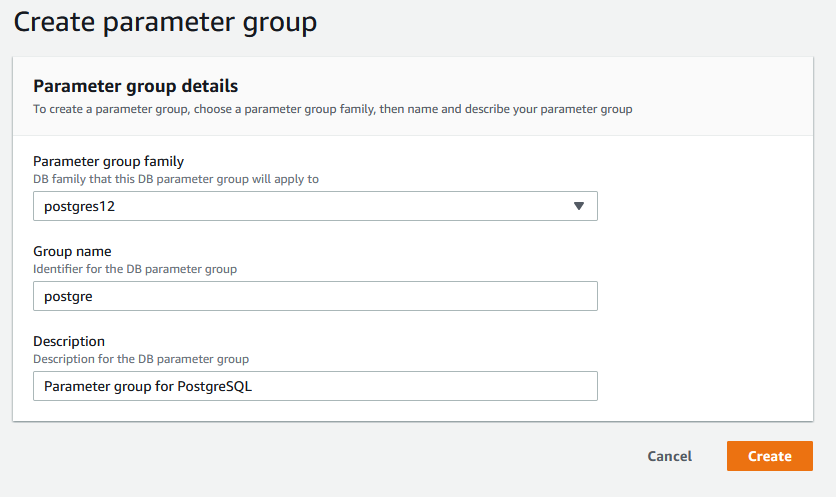

{
    "title": "Amazon RDS",
    "linkTitle": "Amazon RDS",
    "weight": "80"
}Amazon Relation Database Service (Amazon RDS) is a web service that allows youto set up, operate, and scale a relational database in the cloud. It provides cost-efficient, resizable capacity for an industry-standard relational database and manages common database administration tasks.

The DB instance is the basic building block of Amazon RDS and is defined as an isolated database environment in the cloud. A DB instance can contain multiple user-created databases, and you can access it by using the same tools and applications that you use with a stand-alone database instance.

Each DB instance runs a DB engine. For the list of supported database engines in the Amazon RDS environment, refer to [Axway and third-party software support](https://docs.axway.com/bundle/SecureTransport_55_AdministratorGuide_allOS_en_HTML5/page/Content/AdministratorsGuide/introduction/r_st_Axway_and_third-party_software_support.htm) in the *SecureTransport 5.5 Administrator guide*.

## Create database Security Group

First, create a Security Group for your database (either Oracle or PostgreSQL):

1.  Navigate to AWS console -> Services.
2.  Go to the Compute section and select **EC2**.
3.  Go to the Network & Security section and select **Security Groups**.
4.  Click **Create Security Group**.
5.  Depending on your database, provide the security group details.  
    *Oracle*  
    
      
    *PostgreSQL*
      
    
      
6.  After created, select the Security Group and go to Actions -> Add/Edit Tags.
7.  In the **Key** text box type *Name*, and in the **Value** text box enter either *OracleDB* or *PostgreSQL*.
8.  Click **Save**.

## Create option group

If you would like to make an SSL connection to your Oracle DB, you should first create an **Option group**:

1.  Navigate to AWS console -> Services.
2.  Go to the Database section and select **RDS**.
3.  Go to Option groups and click **Create group**.  
      
4.  After the group is created, select it and click **Add option**.
5.  On the **Option** drop-down list, select SSL.
6.  Specify the SSL Port.
7.  Select Security Group for which this option is enabled - select the previously created Database Security Group.
8.  On the Apply immediately options, select **Yes**.  
      

## Create Oracle database

1.  Navigate to AWS Console -> Services.
2.  Go to the Database section and select **RDS**.
3.  Go to Instances and click **Launch DB Instance**.
4.  Select Oracle -> Enterprise Edition.
5.  For Use Case, select **Production**.
6.  Specify the DB Details.  
      
    Add your DB Instance Identifier and Master user credentials.  
      
7.  Click **Next**.
8.  Configure Advanced Settings:
    -   Launch the Database in your VPC.
    -   Choose whether your database to be publicly accessible or no.  
        Select Yes if you want to allow EC2 instances and devices outside the VPC that hosts the DB instance to connect to this DB instance. If you select No, Amazon RDS will not assign a public IP address to the DB instance, and no EC2 instance or devices outside of the VPC will be able to connect. If you select Yes, you must also select one or more VPC security groups that specify which EC2 instances and devices can connect to the DB instance. Learn more about [Amazon RDS VPC](https://docs.aws.amazon.com/AmazonRDS/latest/UserGuide/USER_VPC.Scenarios.html) in the AWS documentation.
    -   Select the Availability Zone from the current region in which you want the DB instance created.
    -   Select the Database Security Group you created as described in the [Create database Security Group](#create) subtopic.

      
      
9.  Add your Database Options:
    -   Set a Database name.
    -   Specify a Database port.
    -   Select the previously created SSL Option Group.
    -   Leave Character set name to the default value: AL32UTF8.

      
    -   Select **Enable Encryption** and follow the instructions to supply your Master key IDs and aliases.
    -   Add your preferences for Monitoring and Maintenance.
10. When you finish with your setup, click **Launch DB instance**.

## Create PostgreSQL database

1.  Navigate to AWS Console -> Services.

2.  Go to the Database section and select **RDS**.

3.  Go to Instances and click **Launch DB Instance**.

4.  Select PostgreSQL -> Choose the version.

5.  For Use Case, select **Production**.

6.  Specify the DB Details – at least 8 CPUs and 64 GB RAM or more.  
    
    

7.  Configure Advanced Settings:  
    

    -   Launch the Database in your VPC.
    -   Choose whether your database to be publicly accessible or no.
    -   Select **Yes** if you want to allow EC2 instances and devices outside the VPC that hosts the DB instance to connect to this DB instance. If you select **No**, Amazon RDS will not assign a public IP address to the DB instance, and no EC2 instance or devices outside of the VPC will be able to connect. If you select **Yes**, you must also select one or more VPC security groups that specify which EC2 instances and devices can connect to the DB instance. Learn more about [Amazon RDS VPC](https://docs.aws.amazon.com/AmazonRDS/latest/UserGuide/USER_VPC.Scenarios.html) in the AWS documentation.
    -   Select the Availability Zone from the current region in which you want the DB instance created.  
        **Note** For high availability and fault tolerance, we recommend you to create a DB replica in different zones in the previous step.
    -   Select the Database Security Group you created as described in the [Create database Security Group](#create) subtopic.

    

    -   Select **Enable Encryption** and follow the instructions to supply your Master key IDs and aliases.

    8\. Add your preferences for Monitoring and Maintenance.

 

## Parameter Groups

You manage your DB engine configuration through the use of parameters in a DB parameter group.

DB parameter groups act as a *container* for engine configuration values that are applied to one or more DB instances.

You cannot modify the parameter settings of a default DB parameter group: you must create your own DB parameter group to change parameter settings from their default value. For more information on the respective database, see [Requirements for Oracle Databases](https://docs.axway.com/bundle/SecureTransport_55_InstallationGuide_allOS_en_HTML5/page/Content/InstallationGuide/prereqs/Requirements_for_Oracle_databases.htm) or [Requirements for PostgreSQL](https://docs.axway.com/bundle/SecureTransport_55_InstallationGuide_allOS_en_HTML5/page/Content/InstallationGuide/prereqs/Requirements_for_PostgreSQL_databases.htm) databases in the *SecureTransport 5.5 Installation Guide*.

### Create a parameter group

1.  Navigate to AWS console -> Services.
2.  Go to the Database section and select **RDS**.
3.  Go to Parameter groups and click **Create parameter group**.
4.  Fill in the fields for the respective database as shown and click **Create**.  
    *Oracle*
      
    
    
      
    *PostgreSQL*
      
    
    
5.  After creation, select the parameter group and go to Parameter group actions and click **Edit**.
6.  Find the parameter that you would like to change and click **Edit parameters**.
7.  Insert the desired value and then click **Save changes**.
8.  Change the following parameters according to the respective database requirements:
      
     *Oracle*
    -   `db_cache_size`: 1GB or larger
    -   `open_cursors`: at least 1000
    -   `processes`: 1000 or more

      
    *PostgreSQL*
    -   `max_connections`: 1000
    -   `shared_buffers`: 1/4 of the available RAM
    -   `effective_cache_size`: 3/4 of the available RAM
    -   `maintenance_work_mem`: at least 512MB
    -   `work_mem`: half of the available RAM
    -   `autovacuum`: should be switched on
    -   `rds.force_ssl`: 1

Learn more about [DB Parameter Groups](https://docs.aws.amazon.com/AmazonRDS/latest/UserGuide/USER_WorkingWithParamGroups.html) in the AWS documentation.

### Assign the parameter group to your database

1.  Navigate to RDS Instances.
2.  Select your database (Oracle or PostgreSQL) and then go to Instance actions -> Modify.
3.  Go to the Database options section and select your **DB parameter group** from the drop-down list.
4.  Save and apply changes immediately.
5.  Restart your database.

**Related topics:**

-   [Connect and configure Oracle DB](connect-oracle)
-   [Connect and configure PostgreSQL](connect-postgre)
-   [Alternative to RDS service](rds-aternative)
