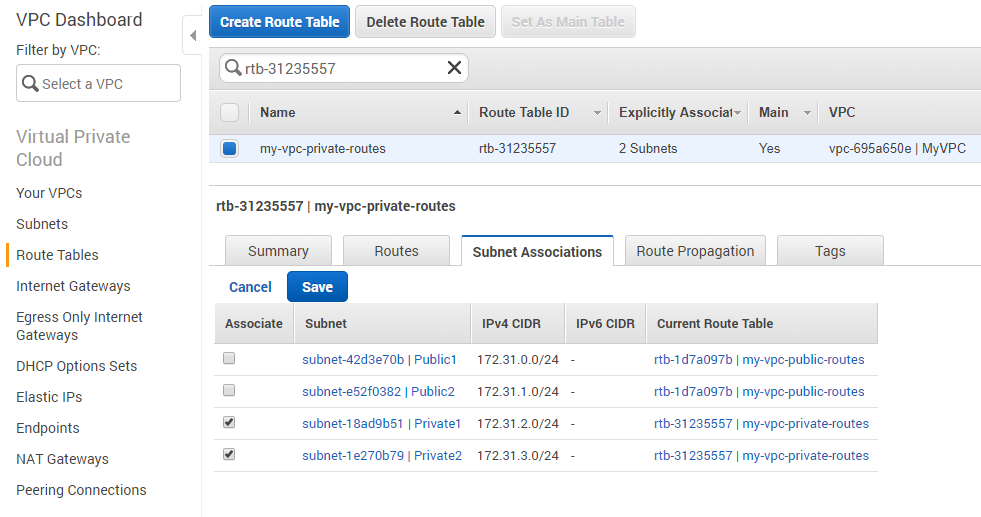

{
    "title": "NAT Gateway and private subnets routing",
    "linkTitle": "NAT Gateway and private subnets routing",
    "weight": "130"
}NAT Gateway in AWS can provide your private instances with access to the Internet for essential software updates while blocking incoming traffic from the outside world.

The private subnets in your VPC should have access to Internet only through an AWS feature called NAT Gateway. The NAT Gateway configuration is optional and you can skip it if you want your instances in the private subnets to be completely restricted from accessing the Internet.

You can use a network address translation (NAT) gateway to enable instances in a private subnet to connect to the Internet or other AWS services, but prevent the internet from initiating a connection with those instances.

Learn more about [NAT on AWS](http://docs.aws.amazon.com/AmazonVPC/latest/UserGuide/vpc-nat.html) in the AWS documentation.

To create a NAT gateway, you must specify a subnet and an Elastic IP address. Make sure that the Elastic IP address is currently not associated with an instance or a network interface.

## Create NAT Gateway

Configure NAT Gateway for private subnets in your VPC:

1.  Navigate to the AWS console -> Services.
2.  Go to the Networking & Content Delivery section and click **VPC**.
3.  Navigate to Virtual Private Cloud -> NAT Gateways -> Create NAT Gateway.  
      
      
4.  On the newly opened page select a public subnet from the **Subnet** drop-down list in which to create the NAT gateway.
5.  Assign an Elastic IP Address to the NAT Gateway.
6.  Click **Create a NAT Gateway**.

Now you need to configure the routing for your private subnets. Enable traffic from your private subnets to Internet by using the NAT Gateway you have created.

## Configure private subnets route table

1.  Navigate to VPC Dashboard -> Subnets.
2.  Select one of your private subnets from the list and navigate to its Summary section.
3.  Click on the name of the Route Table of the subnet.
4.  You are then redirected to your Route Table in the Virtual Private Cloud -> Route Tables subsection.
5.  Add a new rule and for destination type 0.0.0.0/0 (all packets for the internet) and for target choose the NAT Gateway you created as in the previous subtopic.
6.  Save the rules and now the traffic from instances in the private subnets destined to the Internet will be redirected to the NAT Gateway.  
      
      
7.  Save the rules.
8.  Navigate to the Subnet Associations tab and associate your private subnets with the route table and save the changes.



Now traffic from instances in the private subnets destined for the Internet will be redirected to the NAT Gateway.
