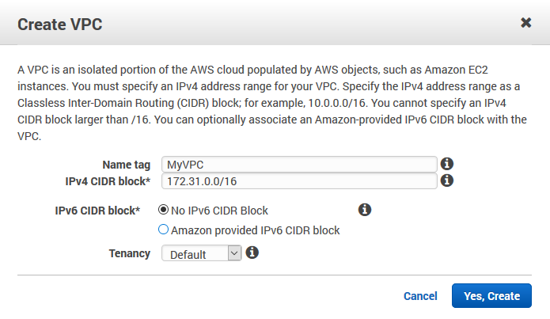

{
    "title": "Create a VPC",
    "linkTitle": "Create a VPC",
    "weight": "60"
}To create a VPC, follow these steps:

1.  Log in to AWS and navigate to the AWS console -> Services.
2.  Under Networking & Content Delivery section, choose VPC.
3.  Navigate to Your VPCs and then click Create VPC.
4.  Fill in the settings and click Yes, Create.

<table cellpadding="0" cellspacing="0">
   <col/>
   <col/>
   <col/>
      <tr>
         <td valign="top">         </td>
         <td valign="top"><b>Note</b>
         </td>
         <td data-mc-autonum="&lt;b&gt;Note&lt;/b&gt;" valign="top">This is an example CIDR block size. You can configure the CIDR block according to your needs.         </td>
      </tr>
</table>

 


