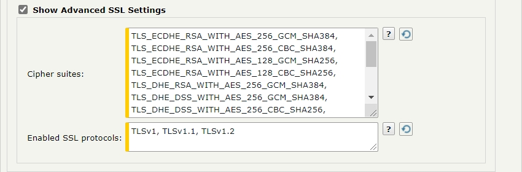

{
    "title": "FTP(S) transfer sites",
    "linkTitle": "FTP(S) transfer sites",
    "weight": "230"
}The *Add Transfer Site* page for FTP(S) sites presents several sets of options.



## General FTP Site settings

The following table describes the general options for a FTP(S) transfer site.

<table cellspacing="0">
   <col/>
   <col/>
   <thead>
      <tr>
         <th>Field</th>
         <th>Description</th>
      </tr>
   </thead>
   <tbody>
      <tr>
         <td colspan="2"><strong>Site Settings</strong>
         </td>
      </tr>
      <tr>
         <td>Server         </td>
         <td>The host name or IP address of the remote server to connect to for file transfers. You cannot enter spaces-only values in this field. For more information, see <a href="../../useraccounts/t_st_create_user_account">Spaces in required fields</a>.         </td>
      </tr>
      <tr>
         <td>Port         </td>
         <td>The port on the remote server to be used for file transfers. You cannot enter spaces-only values in this field. For more information, see <a href="../../useraccounts/t_st_create_user_account">Spaces in required fields</a>.         </td>
      </tr>
      <tr>
         <td>Alternative addresses         </td>
         <td>
            
This set of options allow you to add, delete and set a priority order of alternative endpoints. These endpoints act as backup alternatives to the configured Server-Port Site Settings and are particularly useful in cases of transfer failures. Specifying alternative endpoints as backup servers provides a way to temporarily reroute pending transfers and minimize the risk of transfer failure. As with the Server-Port site settings, the connection to each alternative endpoint is defined by its host name (or IP address) and port number.

            <ul>
               <li>To add an alternative server endpoint, click <b>New Address</b>. The Alternative Addresses table expands with a new row, that allows you to enter a hostname (or IP address), a port number and save these changes.               </li>
               <li>To delete an alternative server endpoint, select the corresponding check-box on the same row and click <b>Delete</b>.               </li>
               <li>To reorder the list of alternative endpoints, click <b>Reorder</b>. A new option (upward and downward arrow) appears next to each entry. You must hover with the mouse pointer over this newly appeared option and the mouse pointer will assume the "move" shape: a four-directional arrow pointer. This indicates which alternative endpoint is in focus. You can now drag &amp; drop it up and down to the order number you want it at. Perform this action with other alternative endpoints until the list is ordered according to your needs. When you are done, click <b>Save Order</b> to keep the newly changed order.                </li>
            </ul>
            
&amp;&amp;&amp; ïïï ùùù

            <ul>
               <li><code>AllHostsOnEachRetry</code> – with this policy SecureTransport iterates through each endpoint, one by one, starting with the first in the list. If connection not successful, SecureTransport will continue trying each endpoint one after another until the maximum number of retries is reached. You can set the maximum retry value by editing the <code>EventQueue.maxRetryCount</code> configuration option.               </li>
               <li><code>OneHostOnEachRetry</code> –   with this policy SecureTransport tries to connect to the first endpoint in the list. If connection not successful, SecureTransport will continue trying that endpoint until the maximum number of retries is reached; and then will move to the next one in the list. Following that same pattern, SecureTransport will try each endpoint until success; or until end of list. You can set the maximum retry value by editing the <code>EventQueue.maxRetryCount</code> configuration option.                </li>
               <li><code>Disabled</code> (default) – this is the default value that keeps the table with endpoints entirely hidden from view.               </li>
            </ul>
         </td>
      </tr>
      <tr>
         <td>Network Zone         </td>
         <td>
            
The network zone that defines the proxies to use for transfers through this site.

            <ul>
               <li>Select <strong>none</strong> to connect directly to the remote FTP server.               </li>
               <li>Select <strong>any</strong> to allow SecureTransport to select the proxy connection using a network zone that enables an SOCKS5 proxy.               </li>
               <li>Select <strong>Default</strong> to use the default network zone proxy configuration. If default network zone is defined, transfers from this transfer site fail.               </li>
               <li>Select a specific network zone to use the proxy configuration defined for that zone.               </li>
            </ul>
            
For more information, see <a href="../../../c_st_setup/c_st_networkzones/t_st_networkzones">Specify TM Server communication ports and IP address for protocol servers on SecureTransport Edge</a>.

         </td>
      </tr>
      <tr>
         <td>Enable Active Connection Mode         </td>
         <td>Determines whether passive or active connection mode is used by SecureTransport for server-initiated transfers over FTP. When selected, Active FTP is used.         </td>
      </tr>
      <tr>
         <td>Download Folder         </td>
         <td>
            
The folder on the remote server from which the file is transferred.

            
To use the expression language to append dates:

            
The download folder will be evaluated using the current date when the transfer site is being executed. For example <code>folder_20210130</code>.

            
Example:

            
<code>folder_${date("yyyyMMdd")}</code>

         </td>
      </tr>
      <tr>
         <td>Download Pattern         </td>
         <td>
            
The pattern used to match file names to determine whether a file is downloaded. Asterisk (<code>*</code>) matches zero or more characters and question mark (<code>?</code>) matches one character.

            
To evaluate the download pattern using dates:

            
The download pattern will be evaluated using the current date when the transfer site is being executed. For example <code>*_20210130.txt</code>. This will match all files ending with <code>_20210130.txt</code>.

            
Example:

            
<code>*_${date("yyyyMMdd")}.txt</code>

         </td>
      </tr>
      <tr>
         <td>Allow Overwrite         </td>
         <td>Taken into account when the site is used by the Send To Partner step. If checked the value of "Upload folder" will be overwritten with the value of "Overwrite upload folder". For more details see <a href="../../../c_st_advanced_routing">Advanced Routing</a>.         </td>
      </tr>
      <tr>
         <td>Upload Folder         </td>
         <td>The folder on the remote server to which files are transferred.         </td>
      </tr>
   </tbody>
</table>

## Transfer Settings for FTP Transfer sites

The *Transfer Settings* options allow you to define various transfer settings with your current transfer site.



<table cellpadding="0" cellspacing="0">
   <col/>
   <col/>
   <col/>
      <tr>
         <td valign="top">         </td>
         <td valign="top"><b>Note</b>
         </td>
         <td data-mc-autonum="&lt;b&gt;Note&lt;/b&gt;" valign="top"> Visibility of this option is controlled with the value set for the <code>TransferSite.AlternativeAddresses.retryPolicy</code> configuration option. It allows you to set a "retry policy" with a list of alternative endpoints (presented in IP address: Port number pairs or hostname) you define on this screen. But before you are able to do so, you must go to <b>Operations &gt; Server Configuration</b> and set the policy type using either of the following values:         </td>
      </tr>
</table>

## Site Login Credentials for FTP Transfer sites

The Site Login Credentials options allow you to define credentials and / or add a certificate for login to the FTP(S) server.



<table cellspacing="0">
   <col/>
   <col/>
   <thead>
      <tr>
         <th>Field</th>
         <th>Description</th>
      </tr>
   </thead>
   <tbody>
      <tr>
         <td colspan="2"><strong>Transfer Settings</strong>
         </td>
      </tr>
      <tr>
         <td>Transfer Mode         </td>
         <td>
            
Specify whether data is transferred as ASCII or binary. You can also choose to have SecureTransport automatically determine the correct transfer mode.

            
For more information about automatically determining transfer mode, see <a href="../../../c_st_advancedaccountadministration/c_st_clientinitiatedandserverinitiatedtransfers/c_st_transfer_mode_for_server-initiated_transfers">Transfer mode for server-initiated transfers</a>.

         </td>
      </tr>
      <tr>
         <td>Upload command         </td>
         <td>
            
Define the FTP command to be used in requests when server-initiated transfers are executed:

    

            
<strong>STOR </strong>- select to use the <em>STOR</em> command for server-initiated transfers.

            
<strong>APPE </strong>- select to use the <em>APPE</em> command for server-initiated transfers.

            
&amp;&amp;&amp; ïïï ùùù
 Upload command is reported to Axway Sentinel and displayed in the Protocol Parameter attribute.          </td>
      </tr>
      <tr>
         <td>Transcode any line terminators in ASCII mode
         </td>
         <td>When checked it forces SecureTransport to transcode any sequence of line terminators when ASCII mode is used.          </td>
      </tr>
      <tr>
         <td>Use FTPS         </td>
         <td>Deselect to use FTP instead of FTPS.         </td>
      </tr>
      <tr>
         <td>Verify certificate for the Site         </td>
         <td>Select to verify that the remote system is trusted. This option is displayed when <strong>Use FTPS</strong> is selected.         </td>
      </tr>
      <tr>
         <td>Clear Command Channel         </td>
         <td>Select to accept and process a Clear Command Channel subcommand. If the user is authorized to perform the command, send a confirmation message, and change the control connection transmission mode to clear text. This option is displayed when <strong>Use FTPS</strong> is selected.         </td>
      </tr>
      <tr>
         <td>TLS Shutdown on CCC         </td>
         <td>
            
Perform a TLS shutdown upon receiving a Clear Command Channel subcommand. This option is displayed when <strong>Clear Command Channel</strong> is selected.

            
&amp;&amp;&amp; ïïï ùùù

         </td>
      </tr>
      <tr>
         <td>Enable FIPS Transfer Mode         </td>
         <td>
            
Restrict FTPS to use only FIPS 140-2 Level 1 certified cryptographic libraries. This option is displayed when <strong>Use FTPS</strong> is selected. 

            
When you enable FIPS transfer mode, the panel expands with an additional field that lets you specify the desired set of cipher suites  to be used in FIPS mode for server-initiated transfers through this site. By default, this set is populated with the cipher suites as defined in the <code>Ftps.FIPS.SIT.Ciphers</code> configuration option. 

            
You can add or remove cipher suites. The supported FIPS cipher suites  from which you can select when adding a new one are listed in <a href="../../../c_st_fipstransfermode/r_st_required_ciphers_cipher_suites">Advertised ciphers and cipher suites</a>. Note that both the sender and the recipient must use supported FIPS ciphers suites. Otherwise,  the transfer will fail.

         </td>
      </tr>
      <tr>
         <td>SITE command         </td>
         <td>Enter a SITE command. You use this command to provide services specific to your system that are not available as FTP commands. EL expressions are supported.         </td>
      </tr>
   </tbody>
</table>

## Post Transmission Send Options for FTP Transfer sites

The Send Options subtab allows you to define post transmission actions on file send success and failure.



<table cellpadding="0" cellspacing="0">
   <col/>
   <col/>
   <col/>
      <tr>
         <td valign="top">         </td>
         <td valign="top"><b>Note</b>
         </td>
         <td data-mc-autonum="&lt;b&gt;Note&lt;/b&gt;" valign="top"><strong>STOR </strong>is the default command for FTP server-initiated transfers.          </td>
      </tr>
</table>

<table cellpadding="0" cellspacing="0">
   <col/>
   <col/>
   <col/>
      <tr>
         <td valign="top">         </td>
         <td valign="top"><b>Note</b>
         </td>
         <td data-mc-autonum="&lt;b&gt;Note&lt;/b&gt;" valign="top">When closing a TLS connection, such as when issuing a CCC command, each party is required to send a <code>close_notify</code> before closing the connection. This is mandated by RFC 2246. If both the client and server do not acknowledge that the TLS connection is ending they may be susceptible to a TLS truncation attack. From a security standpoint, Axway recommends that both TLS shutdowns be checked when configuring the transfer site CCC option. When performing FTP transfers to a remote SecureTransport Server, you must configure <code>Ftp.CCC.TlsShutdownInitiator</code> for the server. As a result the client sends <em>Close notify</em> and the server responds with <em>Close notify</em>, the server-initiated transfer is successful, and the partners are not susceptible to a TLS truncation attack.         </td>
      </tr>
</table>

## Post Transmission Receive Options for FTP Transfer sites

The Receive options subtab allows you to define post transmission actions on file receive success and failure. Click **Receive Options** to view these settings.



<table cellspacing="0">
   <col/>
   <col/>
   <thead>
      <tr>
         <th>Field</th>
         <th>Description</th>
      </tr>
   </thead>
   <tbody>
      <tr>
         <td colspan="2"><strong>Site Login Credentials</strong>
         </td>
      </tr>
      <tr>
         <td>User Name         </td>
         <td>The user name to log in to the FTP server.  You cannot enter spaces-only values in this field. For more information, see <a href="../../useraccounts/t_st_create_user_account">Spaces in required fields</a>.         </td>
      </tr>
      <tr>
         <td>Use Password         </td>
         <td>Select to use a password to log in to the FTP server.          </td>
      </tr>
      <tr>
         <td>Password         </td>
         <td>Password used to log in to the FTP server. Using the toggle provides the ability to switch from literal password to Expression Language input.         </td>
      </tr>
      <tr>
         <td>Certificate         </td>
         <td>
            
A private certificate for SecureTransport to use to log in to the FTP server. You can select a certificate or import a certificate. This field is displayed when <b>Use FTPS</b> is selected.

            
When <b>Use Expression Language</b> is enabled, you can set the certificate dynamically by choosing the scope (account or server level) and providing a valid expression that will be evaluated to the name of an available certificate.

            
By default, the usage of expired X509 certificates is allowed for SIT transfers. To forbid it, set the <code>SIT.allowExpiredCertificates </code>to false

         </td>
      </tr>
   </tbody>
</table>

<table cellspacing="0">
   <col/>
   <col/>
   <thead>
      <tr>
         <th>Field</th>
         <th>Description</th>
      </tr>
   </thead>
   <tbody>
      <tr>
         <td colspan="2"><strong>Send Options</strong>
         </td>
      </tr>
      <tr>
         <td>Send File As         </td>
         <td>Select the check box to specify a file name. You can use the expression language to specify the criteria you want to match. The expression uses the criteria provided to create a new file name from the original file name.         </td>
      </tr>
      <tr>
         <td>On Temporary Failure         </td>
         <td>A temporary failure can occur when the transfer is incomplete and a retry occurs. Select one of the three choices: <strong>No Action</strong>, <strong>Delete Destination File</strong>, or <strong>Move File To</strong>. Selecting <strong>No Action</strong> causes the file to stay in the new location with the file name you specified. If another file with the same name is transferred to this location, the original file is overwritten. Selecting <strong>Delete Destination File</strong> removes the file from the new location. Selecting <strong>Move File To</strong> requires you to specify a directory in the location where you are transferring the files to and to provide an expression used to rename the file.         </td>
      </tr>
      <tr>
         <td>On Failure         </td>
         <td>A failure occurs when the transfer is incomplete and all retry attempts were unsuccessful. Select one of the three choices: <strong>No Action</strong>, <strong>Delete Destination File</strong>, or <strong>Move File To</strong>. Selecting <strong>No Action</strong> causes the file to stay in the new location with the file name you specified. If another file with the same name is transferred to this location, the original file is overwritten. Selecting <strong>Delete Destination File</strong> removes the file from the new location. Selecting <strong>Move File To</strong> requires you to specify a directory in the location where you are transferring the files to and to provide an expression used to rename the file.         </td>
      </tr>
      <tr>
         <td>On Success         </td>
         <td>Select one of the choices: <strong>No Action</strong>, or <strong>Move File To</strong>. Selecting <strong>No Action</strong> causes the file to stay in the new location with the file name you specified. If another file with the same name is transferred to this location, the original file is overwritten. Selecting <strong>Move File To</strong> requires you to specify a directory in the location where you are transferring the files to and to provide an expression used to rename the file.         </td>
      </tr>
   </tbody>
</table>

## Advanced SSL Settings for FTP Transfer sites

Advanced SSL settings allow you to define Cipher suites and SSL protocols with your current FTP(S) Transfer Site. Select **Show Advanced SSL Settings** to expand the pane with available options.



<table cellpadding="0" cellspacing="0">
   <col/>
   <col/>
   <col/>
      <tr>
         <td valign="top">         </td>
         <td valign="top"><b>Note</b>
         </td>
         <td data-mc-autonum="&lt;b&gt;Note&lt;/b&gt;" valign="top">To preserve the original file name when using the <strong>Move File To</strong> option, use the <code>${stenv.target}</code> or <code>${stenv['target']}</code> expressions.         </td>
      </tr>
</table>

## Supported Active / Passive FTP(S) connections

This table describes the supported Active/Passive FTP(S) connection modes for client/server-initiated transfers over FTP(S).

<table cellspacing="0">
   <col/>
   <col/>
   <thead>
      <tr>
         <th>Field</th>
         <th>Description</th>
      </tr>
   </thead>
   <tbody>
      <tr>
         <td colspan="2"><strong>Receive Options</strong>
         </td>
      </tr>
      <tr>
         <td>Receive File As         </td>
         <td>Select the check box to specify a file name. You can use the expression language to specify the criteria you want to match. The expression uses the criteria provided to create a new file name from the original file name when the transfer is received. You can use the SecureTransport-specific variable <code>${stenv.site_target}</code> which takes the value from the remote file path. see <a href="../../../c_st_expressionlanguage">Expression Language</a> for information on SecureTransport-specific variables.         </td>
      </tr>
      <tr>
         <td> On Failure         </td>
         <td>A failure occurs when the transfer is incomplete and all retry attempts were unsuccessful. Select one of the three choices: <strong>No Action</strong>, Delete Source File, or <strong>Move File To</strong>. Selecting <strong>No Action</strong> causes the file to stay in the original location. If another file with the same name is transferred to this location, the original file is overwritten. Selecting Delete Source File removes the file from the original location. Selecting <strong>Move File To</strong> requires you to specify a directory in the location where you are transferring the files from and to provide an expression used to rename the file.         </td>
      </tr>
      <tr>
         <td>On Success         </td>
         <td>Select one of the three choices: <strong>No Action</strong>, Delete Source File, or <strong>Move File To</strong>. Selecting <strong>No Action</strong> causes the file to stay in the original location. If another file with the same name is transferred to this location, the original file is overwritten. Selecting Delete Source File removes the file from the original location. Selecting <strong>Move File To</strong> requires you to specify a directory in the location where you are transferring the files from and to provide an expression used to rename the file.         </td>
      </tr>
   </tbody>
</table>

**Related topics:**

-   [AS2 transfer sites](../r_st_as2transfersites)
-   [Connect:Direct transfer sites](../r_st_connectdirecttransfersites)
-   [File services interface transfer sites](../r_st_fileservicesinterfaceprotocoltransfersites)
-   [Folder Monitor transfer sites](../r_st_foldermonitortransfersites)
-   [Generic HTTP transfer sites](../transfersites-generichttp)
-   [HTTP(S) transfer sites](../transfersites-http)
-   [PeSIT transfer sites](../transfersites-pesit)
-   [SSH transfer sites](../transfersites-ssh)
-   [System to Human transfer sites](../transfersites-s2h)
-   [Manage transfer sites](../t_st_transfersites)
