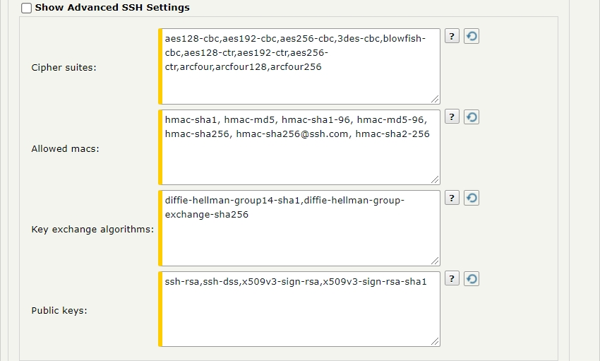

{
    "title": "SSH transfer sites",
    "linkTitle": "SSH transfer sites",
    "weight": "270"
}<table cellpadding="0" cellspacing="0">
   <col/>
   <col/>
   <col/>
      <tr>
         <td valign="top">         </td>
         <td valign="top"><b>Note</b>
         </td>
         <td data-mc-autonum="&lt;b&gt;Note&lt;/b&gt;" valign="top">SSH keys generated with DSA and RSA can be used to authenticate SSH transfer sites.         </td>
      </tr>
</table>

By default, a server-initiated transfer using SSH and a pattern with a wildcard character does not create an extra empty file. To allow a temporary zero-byte file to be created, set the `ZeroByteWildcardPullAllowed` server configuration parameter to `true`.

## Site settings for SSH Transfer sites

The following table describes the site settings options for a SSH protocol transfer site.

<table cellspacing="0">
   <col/>
   <col/>
   <thead>
      <tr>
         <th>Field</th>
         <th>Description</th>
      </tr>
   </thead>
   <tbody>
      <tr>
         <td colspan="2"><strong>Site Settings</strong>
         </td>
      </tr>
      <tr>
         <td>Server         </td>
         <td>The host name or IP address of the remote server to connect to for file transfers. You cannot enter spaces-only values in this field. For more information, see <a href="../../useraccounts/t_st_create_user_account">Spaces in required fields</a>.         </td>
      </tr>
      <tr>
         <td>Port         </td>
         <td>The port on the remote server to be used for file transfers. You cannot enter spaces-only values in this field. For more information, see <a href="../../useraccounts/t_st_create_user_account">Spaces in required fields</a>.         </td>
      </tr>
      <tr>
         <td>Alternative addresses         </td>
         <td>
            
This set of options allow you to add, delete and set a priority order of alternative endpoints. These endpoints act as backup alternatives to the configured Server-Port Site Settings and are particularly useful in cases of transfer failures. Specifying alternative endpoints as backup servers provides a way to temporarily reroute pending transfers and minimize the risk of transfer failure. As with the Server-Port site settings, the connection to each alternative endpoint is defined by its host name (or IP address) and port number.

            <ul>
               <li>To add an alternative server endpoint, click <b>New Address</b>. The Alternative Addresses table expands with a new row, that allows you to enter a hostname (or IP address), a port number and save these changes.               </li>
               <li>To delete an alternative server endpoint, select the corresponding check-box on the same row and click <b>Delete</b>.               </li>
               <li>To reorder the list of alternative endpoints, click <b>Reorder</b>. A new option (upward and downward arrow) appears next to each entry. You must hover with the mouse pointer over this newly appeared option and the mouse pointer will assume the "move" shape: a four-directional arrow pointer. This indicates which alternative endpoint is in focus. You can now drag &amp; drop it up and down to the order number you want it at. Perform this action with other alternative endpoints until the list is ordered according to your needs. When you are done, click <b>Save Order</b> to keep the newly changed order.                </li>
            </ul>
            
&amp;&amp;&amp; ïïï ùùù

            <ul>
               <li><code>AllHostsOnEachRetry</code> – with this policy SecureTransport iterates through each endpoint, one by one, starting with the first in the list. If connection not successful, SecureTransport will continue trying each endpoint one after another until the maximum number of retries is reached. You can set the maximum retry value by editing the <code>EventQueue.maxRetryCount</code> configuration option.               </li>
               <li><code>OneHostOnEachRetry</code> –   with this policy SecureTransport tries to connect to the first endpoint in the list. If connection not successful, SecureTransport will continue trying that endpoint until the maximum number of retries is reached; and then will move to the next one in the list. Following that same pattern, SecureTransport will try each endpoint until success; or until end of list. You can set the maximum retry value by editing the <code>EventQueue.maxRetryCount</code> configuration option.                </li>
               <li><code>Disabled</code> (default) – this is the default value that keeps the table with endpoints entirely hidden from view.               </li>
            </ul>
         </td>
      </tr>
      <tr>
         <td>Network Zone         </td>
         <td>
            
The network zone that defines the proxies to use for transfers through this site.

            <ul>
               <li>Select <strong>none</strong> to connect directly to the remote SSH server.               </li>
               <li>Select <strong>any</strong> to allow SecureTransport to select the proxy connection using a network zone that enables an SOCKS5 proxy.               </li>
               <li>Select <strong>Default</strong> to use the default network zone proxy configuration. If no default network zone is defined, transfers from this transfer site fail.               </li>
               <li>Select a specific network zone to use the proxy configuration defined for that zone.               </li>
            </ul>
            
For more information, see <a href="../../../c_st_setup/c_st_networkzones/t_st_networkzones">Specify TM Server communication ports and IP address for protocol servers on SecureTransport Edge</a>.

         </td>
      </tr>
      <tr>
         <td>Download Folder         </td>
         <td>
            
The folder on the remote server from which the file is transferred.

            
To use the expression language to append dates:

            
The download folder will be evaluated using the current date when the transfer site is being executed. For example <code>folder_20210130</code>.

            
Example:

            
<code>folder_${date("yyyyMMdd")}</code>

         </td>
      </tr>
      <tr>
         <td>Download Pattern Type          </td>
         <td>Select one of two types: <strong>Regular Expression</strong> or <strong>File Globbing</strong>. For regular expression syntax, see <a href="../../../c_st_regularexpressions">Regular expressions</a>. File globbing uses simple wildcards to specify a pattern. A question mark (<code>?</code>) matches any one character. An asterisk (<code>*</code>) matches any number of characters.         </td>
      </tr>
      <tr>
         <td>Download Pattern         </td>
         <td>
            
The pattern used to match file names to determine whether a file is downloaded.

            
Using it together with <strong>File Globbing</strong> Pattern Type selected:

            
The download pattern will be evaluated using the current date when the transfer site is being executed. For example <code>*_20210130.txt</code>. This will match all files ending with <code>_20210130.txt</code>.

            
Example:

            
<code>*_${date("yyyyMMdd")}.txt</code>

            
Using it together with <strong>Regular Expression</strong> Pattern Type selected:

            
The download pattern will be evaluated using the current date when the transfer site is being executed. For example <code>*[a-z]_20210130.txt</code>. This will match all files starting with any combination of letters from <code>a</code> to <code>z</code> and ending with <code>_20210130.txt</code>.

            
Example:

            
*[a-z]_${date("yyyyMMdd")}.txt

         </td>
      </tr>
      <tr>
         <td>Allow Overwrite         </td>
         <td>Taken into account when the site is used by the Send To Partner step. If checked the value of "Upload folder" will be overwritten with the value of "Overwrite upload folder". For more details see <a href="../../../c_st_advanced_routing">Advanced Routing</a>.         </td>
      </tr>
      <tr>
         <td>Upload Folder         </td>
         <td>The folder on the remote server to which files are transferred.         </td>
      </tr>
      <tr>
         <td>Upload Permissions         </td>
         <td>
            
Sets permissions of the remote file during SFTP push. 

            
SecureTransport   changes the file permissions as they are set in the SSH Transfer Site during the transfer.   

         </td>
      </tr>
      <tr>
         <td>Update permissions with Chmod command         </td>
         <td>
            
Determines how SecureTransport changes permissions of a file: using the <code>chmod</code> or  the <code>umask</code> command. This setting  overrides the global setting specified via the <code>Ssh.UpdateFilePermissionsWithChmodCommand</code> option. 

            
The possible values are: 

            
<code>Default</code>- The global setting is applied. 

            
<code>True</code> – The file permissions, specified in the SSH transfer site, are set after transfer ends with <code>chmod</code>.

            
<code>false</code>–  The file handler is opened with specified permissions. The file permissions, specified in the SSH transfer site, are set with <code>umask</code>.

         </td>
      </tr>
   </tbody>
</table>

## Transfer settings for SSH Transfer sites

*Transfer Settings* pane for a SHH protocol transfer site:



The following table describes the transfer settings options for a SSH protocol transfer site.

<table cellpadding="0" cellspacing="0">
   <col/>
   <col/>
   <col/>
      <tr>
         <td valign="top">         </td>
         <td valign="top"><b>Note</b>
         </td>
         <td data-mc-autonum="&lt;b&gt;Note&lt;/b&gt;" valign="top"> Visibility of this option is controlled with the value set for the <code>TransferSite.AlternativeAddresses.retryPolicy</code> configuration option. It allows you to set a "retry policy" with a list of alternative endpoints (presented in IP address: Port number pairs or hostname) you define on this screen. But before you are able to do so, you must go to <b>Operations &gt; Server Configuration</b> and set the policy type using either of the following values:         </td>
      </tr>
</table>

## Site login credentials for SSH Transfer sites

*Site Login Credentials* pane for a SHH protocol transfer site:



The following table describes the site login credentials options for a SSH protocol transfer site.

<table cellspacing="0">
   <col/>
   <col/>
   <col/>
   <thead>
      <tr>
         <th>Field</th>
         <th>Description</th>
      </tr>
   </thead>
   <tbody>
      <tr>
         <td colspan="2"><strong>Transfer Settings</strong>
         </td>
      </tr>
      <tr>
         <td>Transfer Mode         </td>
         <td>Specify whether data is transferred as ASCII or binary. You can also choose to have SecureTransport automatically determine the correct transfer mode. For more information about automatically determining transfer mode, see <a href="../../../c_st_advancedaccountadministration/c_st_clientinitiatedandserverinitiatedtransfers">Client-initiated and server-initiated transfers</a>.         </td>
      </tr>
      <tr>
         <td>Verify Fingerprint for this Site         </td>
         <td>Select this check box to require SecureTransport to verify the fingerprint for the SSH key against the value you specify below. If the values do not match, the connection is refused.         </td>
      </tr>
      <tr>
         <td>Fingerprint         </td>
         <td>
            
The value against which you want to verify the fingerprint from the remote server.

            
If the partner SSH server has both DSA and RSA keys configured, the fingerprint that SecureTransport must verify for a server-initiated transfer depends on FIPS transfer mode. With FIPS transfer mode enabled, enter the fingerprint for the DSA key. With FIPS transfer mode disabled, enter the fingerprint for the RSA key.

            
&amp;&amp;&amp; ïïï ùùù

            
Examples:

            <ul>
               <li><code>MD5:2d:d2:3d:32:d2:24:f2:2s:1a:2s:1a:23:af:e1:4s:3f</code>
               </li>
               <li><code>SHA-1:43:51:43:a1:b5:fc:8b:b7:0a:3a:a9:b1:0f:66:73:a8</code>
               </li>
               <li><code>SHA256:12:5a:32:a1:5b:fc:8b:b7:00:a4:a9:b1:f0:88:73:c9</code>
               </li>
            </ul>
         </td>
      </tr>
      <tr>
         <td>Enable FIPS Transfer Mode         </td>
         <td>
            
Restrict SSH to use only FIPS 140-2 Level 1 certified cryptographic libraries.

            
When you enable FIPS transfer mode, the panel expands with the following fields that let you specify the desired set of SSH ciphers and algorithms for server-initiated transfers through this site: 

            <ul>
               <li>FIPS cipher suites – allowed ciphers for server-initiated transfers through this site in FIPS mode. By default, this set is populated with the cipher suites as defined in the <code>Ssh.FIPS.SIT.Ciphers</code> configuration option.               </li>
               <li>FIPS allowed macs – allowed MAC algorithms for server-initiated transfers through this site in FIPS mode. By default, this set is populated with the MAC algorithms as defined in the 	<code>Ssh.FIPS.SIT.AllowedMacs</code> configuration option.               </li>
               <li>FIPS key exchange algorithms – allowed KEX algorithms for server-initiated transfers through this site in FIPS mode. By default, this set is populated with the KEX algorithms as defined in the 	<code>Ssh.FIPS.SIT.KeyExchangeAlgorithms</code> configuration option.               </li>
               <li>FIPS public keys – allowed public keys for server-initiated transfers through this site in FIPS mode. By default, this set is populated with the public keys  as defined in the	<code>Ssh.FIPS.SIT.PublicKeys</code> configuration option.               </li>
            </ul>
            
All fields are editable.  The supported FIPS ciphers and algorithms from which you can select when adding new ones are listed in <a href="../../../c_st_fipstransfermode/r_st_required_ciphers_cipher_suites">Advertised ciphers and cipher suites</a>. Note that both the sender and the recipient must use FIPS-approved ciphers and algorithms supported by SecureTransport. Otherwise,  the transfer will fail.

         </td>
      </tr>
   </tbody>
</table>

## Network settings for SSH Transfer sites

*Network Settings* pane for a SHH protocol transfer site:



The following table describes the network settings options for a SSH protocol transfer site.

<table cellpadding="0" cellspacing="0">
   <col/>
   <col/>
   <col/>
      <tr>
         <td valign="top">         </td>
         <td valign="top"><b>Note</b>
         </td>
         <td data-mc-autonum="&lt;b&gt;Note&lt;/b&gt;" valign="top">The fingerprint value must start with a formatted hashing algorithm name in the following format: <code>&lt;hashing_algorithm&gt;:&lt;certificate_ssh_fingerprint_hash&gt;</code>         </td>
      </tr>
</table>

## Test SSH Connection

After you have filled in all the required settings, you can check if the connection between the transfer site and the remote partner is configured correctly. The test is performed based on the input on the transfer site page. The functionality is available for saved and non-saved transfer sites.

To initiate a test connection, click the **Test Connection** button located in the top-right corner of the configuration pane. Using the transfer site settings currently specified on the page, SecureTransport will try to connect to the remote partner and display the result.

<table cellspacing="0">
   <col/>
   <col/>
   <thead>
      <tr>
         <th>Field</th>
         <th>Description</th>
      </tr>
   </thead>
   <tbody>
      <tr>
         <td colspan="2"><strong>Site Login Credentials</strong>
         </td>
      </tr>
      <tr>
         <td>User Name         </td>
         <td>Username used to log in to the SSH server. You cannot enter spaces-only values in this field. For more information, see <a href="../../useraccounts/t_st_create_user_account">Spaces in required fields</a>.         </td>
      </tr>
      <tr>
         <td>Use Password         </td>
         <td>Select to use a password to log in to the SSH server.         </td>
      </tr>
      <tr>
         <td>Password         </td>
         <td>Password used to log in to the SSH server.
Switching the toggle provides the ability to use Expression Language for evaluating the password.         </td>
      </tr>
      <tr>
         <td>SSH Key         </td>
         <td>
            
The certificate used to identify the user logging in. You can select a certificate or import a certificate.

            
By default, the usage of SSH keys contained in expired X509 certificates is allowed for SIT transfers. To forbid it, set  the <code>SSH.SIT.allowExpiredCertificates</code> to <code>false</code>.

         </td>
      </tr>
   </tbody>
</table>

The *Result test connection* pane contains the following information:

-   `Connection status` – `success` or `failed`.
-   `Fingerprint verification status` – `success`, `failed` or `not verified`.
    -   `success` – the fingerprint verification during the test connection is successful.
    -   `failed` – the fingerprint verification during the test connection failed.
    -   `not verified` – the fingerprint verification is skipped during the test connection.
-   `Fingerprint` – the fingerprint used in the test connection.
-   `Cipher suite` – the name of the cipher suite used in the test connection.
-   `HMAC` – hash-based message authentication codes used in the test connection.
-   `Key exchange algorithms` – the KEX used in the test connection.
-   `Public key` – the public key used in the test connection.
-   `Send Buffer size` – the size of the send buffer in bytes `(SO_SNDBUF)` used in the test connection.
-   `Receive Buffer size` – the size of the receive buffer in byte `(SO_RCVBUF)` used in the test connection.
-   `Authentication status` – either `success `or `failed`.
-   `SSH key alias` – the SSH key alias used in the test connection.
-   `Session ID` – the Session ID associated with the test connection, represented as a link to the filtered Server Log entries.
-   `Error details` – in the event of an error, displays detailed information on why the test connection failed.

<table cellspacing="0">
   <col/>
   <col/>
   <thead>
      <tr>
         <th>Field</th>
         <th>Description</th>
      </tr>
   </thead>
   <tbody>
      <tr>
         <td colspan="2"><strong>Network Settings</strong>
         </td>
      </tr>
      <tr>
         <td>Connection Read/Write timeout         </td>
         <td>The maximum number of seconds the server waits to read a block of data from the partner server, or write a block of data to the partner server. If not specified, its value is 300 seconds. This option corresponds to the <code>SO_RVCTIMEO</code> and <code>SO_SNDTIMO</code> Socket options.         </td>
      </tr>
      <tr>
         <td>Connection Read Buffer Size         </td>
         <td>
            
The size of the receive buffer in bytes used by the socket open for the transfer. It is used by the platform's networking code as a hint for the size to set the underlying network I/O buffers. Increasing the receive buffer size can increase the performance of network I/O for high-volume connections, while decreasing it can help reduce the backlog of incoming data. This value is also used to set the TCP receive window that is advertised to the remote peer. This option corresponds to the <code>SO_RCVBUF</code>. The value should be a positive integer.

         </td>
      </tr>
      <tr>
         <td>Connection Write Buffer Size         </td>
         <td>The size of the send buffer in bytes used by the socket open for the transfer. It is used by the platform's networking code as a hint for the size to set the underlying network I/O buffers. This option corresponds to the <code>SO_SNDBUF</code>. The value should be a positive integer.         </td>
      </tr>
      <tr>
         <td>Local Filesystem Buffer Size         </td>
         <td>The size of the buffer in bytes used for reading from the local file system when performing the transfer.         </td>
      </tr>
      <tr>
         <td>SFTP Message Block Size         </td>
         <td>The SFTP block size value used for the transfer.         </td>
      </tr>
      <tr>
         <td>Enable TCP_NODELAY         </td>
         <td>Enable or disable Nagle algorithm for the transfer.         </td>
      </tr>
   </tbody>
</table>

## Post transmission Send options for SSH Transfer sites

*Post Transmission Settings - Send Options* pane for a SHH protocol transfer site:



The following table describes the post transmission send settings options for a SSH protocol transfer site.

<table cellpadding="0" cellspacing="0">
   <col/>
   <col/>
   <col/>
      <tr>
         <td valign="top">         </td>
         <td valign="top"><b>Note</b>
         </td>
         <td data-mc-autonum="&lt;b&gt;Note&lt;/b&gt;" valign="top"><b>Test Connection</b> is triggered immediately without any available variables from user login session, file and/or flow metadata or system variables. Because of this, the operation will fail when <b>Expression Language</b> is used in the fields.         </td>
      </tr>
</table>

<table cellpadding="0" cellspacing="0">
   <col/>
   <col/>
   <col/>
      <tr>
         <td valign="top">         </td>
         <td valign="top"><b>Note</b>
         </td>
         <td data-mc-autonum="&lt;b&gt;Note&lt;/b&gt;" valign="top">The <b>Test Connection</b> option is also exposed as a REST API resource.          </td>
      </tr>
</table>

## Post transmission Receive options for SSH Transfer sites

*Post Transmission Settings - Receive Options* pane for a SHH protocol transfer site:



The following table describes the post transmission receive settings options for a SSH protocol transfer site.

<table cellspacing="0">
   <col/>
   <col/>
   <thead>
      <tr>
         <th>Field</th>
         <th>Description</th>
      </tr>
   </thead>
   <tbody>
      <tr>
         <td colspan="2"><strong>Send Options</strong>
         </td>
      </tr>
      <tr>
         <td>Send File As         </td>
         <td>Select the check box to specify a file name. You can use the expression language to specify the criteria you want to match. The expression uses the criteria provided to create a new file name from the original file name.         </td>
      </tr>
      <tr>
         <td>On Temporary Failure         </td>
         <td>
            
A temporary failure can occur when the transfer is incomplete and a retry occurs. Select one of the three choices: <strong>No Action</strong>, <strong>Delete Destination File</strong>, or <strong>Move File To</strong>. Selecting <strong>No Action</strong> causes the file to stay in the new location with the file name you specified. If another file with the same name is transferred to this location, the original file is overwritten. Selecting <strong>Delete Destination File</strong> removes the file from the new location. Selecting <strong>Move File To</strong> requires you to specify a directory in the location where you are transferring the files to and to provide an expression used to rename the file.

         </td>
      </tr>
      <tr>
         <td>On Failure         </td>
         <td>A failure occurs when the transfer is incomplete and all retry attempts were unsuccessful. Select one of the three choices: <strong>No Action</strong>, <strong>Delete Destination File</strong>, or <strong>Move File To</strong>. Selecting <strong>No Action</strong> causes the file to stay in the new location with the file name you specified. If another file with the same name is transferred to this location, the original file is overwritten. Selecting <strong>Delete Destination File</strong> removes the file from the new location. Selecting <strong>Move File To</strong> requires you to specify a directory in the location where you are transferring the files to and to provide an expression used to rename the file.         </td>
      </tr>
      <tr>
         <td>On Success         </td>
         <td>
            
Select one of the choices: <strong>No Action</strong>, or <strong>Move File To</strong>. Selecting <strong>No Action</strong> causes the file to stay in the new location with the file name you specified. If another file with the same name is transferred to this location, the original file is overwritten. Selecting <strong>Move File To</strong> requires you to specify a directory in the location where you are transferring the files to and to provide an expression used to rename the file.

            
Select <strong>Allow Overwrite</strong> to allow the file move to overwrite an existing file. If <strong>Allow Overwrite</strong> is not selected, a file transfer that attempts to overwrite an existing file fails.

         </td>
      </tr>
      <tr>
         <td>Allow Overwrite Existing File         </td>
         <td>When enabled and the rename operation fails because the target file exists, SecureTransport will delete the target file and repeat the rename operation.
         </td>
      </tr>
   </tbody>
</table>

<table cellpadding="0" cellspacing="0">
   <col/>
   <col/>
   <col/>
      <tr>
         <td valign="top">         </td>
         <td valign="top"><b>Note</b>
         </td>
         <td data-mc-autonum="&lt;b&gt;Note&lt;/b&gt;" valign="top">To preserve the original file name when using the <strong>Move File To</strong> option, use the <code>${stenv.target}</code> or <code>${stenv['target']}</code> expression.         </td>
      </tr>
</table>

## Advanced SSH Settings for SSH Transfer sites

Scroll down to the bottom of the screen and select **Show Advanced SSH Settings** to expand the pane with additional options.



The following table describes the Advanced SSH Settings for a SSH protocol transfer site.

<table cellspacing="0">
   <col/>
   <col/>
   <thead>
      <tr>
         <th>Field</th>
         <th>Description</th>
      </tr>
   </thead>
   <tbody>
      <tr>
         <td colspan="2"><strong>Receive Options</strong>
         </td>
      </tr>
      <tr>
         <td>Receive File As         </td>
         <td>Select the check box to specify a file name. You can use the expression language to specify the criteria you want to match. The expression uses the criteria provided to create a new file name from the original file name when the transfer is received. You can use the SecureTransport-specific variable <code>${stenv.site_target}</code> which takes the value from the remote file path. see <a href="../../../c_st_expressionlanguage">Expression Language</a> for information on SecureTransport-specific variables.         </td>
      </tr>
      <tr>
         <td>On Failure         </td>
         <td>A failure occurs when the transfer is incomplete and all retry attempts were unsuccessful. Select one of the three choices: <strong>No Action</strong>, Delete Source File, or <strong>Move File To</strong>. Selecting <strong>No Action</strong> causes the file to stay in the original location. If another file with the same name is transferred to this location, the original file is overwritten. Selecting Delete Source File removes the file from the original location. Selecting <strong>Move File To</strong> requires you to specify a directory in the location where you are transferring the files from and to provide an expression used to rename the file. To preserve the original file name you can use the SecureTransport-specific named variable <code>${stenv.target}</code>.         </td>
      </tr>
      <tr>
         <td>On Success         </td>
         <td>
            
Select one of the three choices: <strong>No Action</strong>, <strong>Delete Source File</strong>, or <strong>Move File To</strong>. Selecting <strong>No Action</strong> causes the file to stay in the original location. If another file with the same name is transferred to this location, the original file is overwritten. Selecting <strong>Delete Source File</strong> removes the file from the original location. Selecting <strong>Move File To</strong> requires you to specify a directory in the location where you are transferring the files from and to provide an expression used to rename the file.

         </td>
      </tr>
      <tr>
         <td> Allow Overwrite Existing File         </td>
         <td>When enabled and the rename operation fails because the target file exists, SecureTransport will delete the target file and repeat the rename operation.
         </td>
      </tr>
   </tbody>
</table>

**Related topics:**

-   [AS2 transfer sites](../r_st_as2transfersites)
-   [Connect:Direct transfer sites](../r_st_connectdirecttransfersites)
-   [File services interface transfer sites](../r_st_fileservicesinterfaceprotocoltransfersites)
-   [Folder Monitor transfer sites](../r_st_foldermonitortransfersites)
-   [FTP(S) transfer sites](../transfersites-ftp)
-   [Generic HTTP transfer sites](../transfersites-generichttp)
-   [HTTP(S) transfer sites](../transfersites-http)
-   [PeSIT transfer sites](../transfersites-pesit)
-   [System to Human transfer sites](../transfersites-s2h)
-   [Manage transfer sites](../t_st_transfersites)
