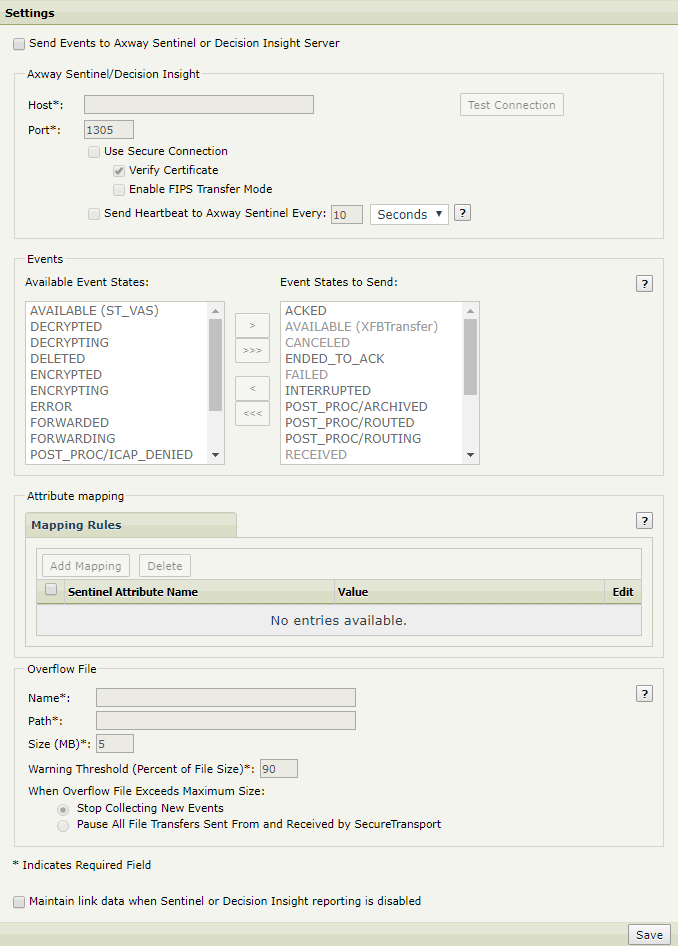

{
    "title": "Configure SecureTransport to send events to Axway Sentinel",
    "linkTitle": "Configure SecureTransport to send events to Axway Sentinel",
    "weight": "270"
}Using the Administration Tool you can configure SecureTransport to [send events](#sendevents) to Sentinel or [maintain link data](#maintainlink) when Sentinel is disabled.

Select **Setup &gt; Axway Sentinel/DI**.

The *Axway Sentinel/Decision Insights Events* page is displayed.



To configure SecureTransport to send events to Sentinel:

<table cellpadding="0" cellspacing="0">
   <col/>
   <col/>
   <col/>
      <tr>
         <td valign="top">         </td>
         <td valign="top"><b>Note</b>
         </td>
         <td data-mc-autonum="&lt;b&gt;Note&lt;/b&gt;" valign="top">The setting applies to all servers in your Enterprise Cluster (EC). Each server must have its own overflow file.         </td>
      </tr>
</table>

<table cellpadding="0" cellspacing="0">
   <col/>
   <col/>
   <col/>
      <tr>
         <td valign="top">         </td>
         <td valign="top"><b>Note</b>
         </td>
         <td data-mc-autonum="&lt;b&gt;Note&lt;/b&gt;" valign="top">Use the <code>AxwaySentinel.ConnectionTimeout</code> server configuration option to set up the connection timeout when Sentinel is unavailable. The default value is 5 seconds. A timeout of zero is interpreted as an infinite timeout and may result in a process hang.         </td>
      </tr>
</table>

1.  Select the **Send Events to Axway Sentinel or Decision Insight Server** check box.  
    The rest of the fields on the screen are enabled and SecureTransport sends events to Axway Sentinel as configured.

2.  In the *Axway Sentinel/Decision Insight* pane, specify the FQDN or IP address of the Axway Sentinel server in the **Host** field and a valid TCP port on the server to which events will be sent in the **Port** field.

3.  (Optional) Select the check box for **Use Secure Connection** to enable sending the selected event to Sentinel over a secured connection.

4.  (Optional) Select the check box for **Verify Certificate** to enable the SSL certificate verification. The **Verify Certificate** check box is selected by default.

5.  (Optional) Select the check box for **Enable FIPS Transfer Mode** to enable sending events to Sentinel over the secure connection in FIPS transfer mode.  
    

    <table cellpadding="0" cellspacing="0">
   <col/>
   <col/>
   <col/>
      <tr>
         <td valign="top">         </td>
         <td valign="top"><b>Note</b>
         </td>
         <td data-mc-autonum="&lt;b&gt;Note&lt;/b&gt;" valign="top">Changes to these settings in Step 3 through Step 6 take effect the next time you restart the Transaction Manager.         </td>
      </tr>
</table>

6.  (Optional) Click the **Test Connection** button. This test indicates whether the port specified on the Axway Sentinel host accepts connections.

7.  (Optional) Select **Send Heartbeat to Axway Sentinel Every** and set the heartbeat interval to send periodic messages to Axway Sentinel to tell it that SecureTransport is running and connected. The default interval is 10 seconds.

8.  In the *Events* pane, select the event states to send to Sentinel.  
    An Event State specifies the current state of a file transfer. If an Event State is not selected to be sent, SecureTransport performs the processing represented by the state, but it does not send the event that reports the state to Axway Sentinel. For the available states, see [Event states](../r_st_sentineleventstates).

9.  In the *Attribute mapping* pane, click the **Add Mapping** button to create a **Sentinel Attribute Name** and **Value** attribute mapping rule. The attributes can also be updated or deleted.  
    The Mapping Rules columns refer to:

    -   **Sentinel Attribute Name** – The Sentinel column where the attribute is reported.
    -   **Value** – The value which is reported in Sentinel under the related column. The value column accepts either real values or SecureTransport expressions.

      
    

    <table cellpadding="0" cellspacing="0">
   <col/>
   <col/>
   <col/>
      <tr>
         <td valign="top">         </td>
         <td valign="top"><b>Note</b>
         </td>
         <td data-mc-autonum="&lt;b&gt;Note&lt;/b&gt;" valign="top">Subscription attributes can be accessed using the following expression: <code>${flow.attributes[‘userVars.ATTRIBUTE_NAME’]}</code>         </td>
      </tr>
</table>

    <table cellpadding="0" cellspacing="0">
   <col/>
   <col/>
   <col/>
      <tr>
         <td valign="top">         </td>
         <td valign="top"><b>Note</b>
         </td>
         <td data-mc-autonum="&lt;b&gt;Note&lt;/b&gt;" valign="top">The value of the DXAGENT_ROUTE_SOURCE_FULL_TARGET variable is the absolute path to the file triggered via Advanced Routing. When performing a push transfer via Advanced Routing over PeSIT, the DXAGENT_ROUTE_SOURCE_FULL_TARGET variable is not populated in  ACK or ENDED_TO_ACK state.         </td>
      </tr>
</table>

10. In the *Overflow file* pane, specify information about the file to be used to store SecureTransport event data when there is no connection between SecureTransport and Axway Sentinel. Changes to these settings take effect the next time the Transaction Manager is restarted. Specify the following information:  
    

    <table cellspacing="0">
   <col/>
   <col/>
   <thead>
      <tr>
         <th>Field</th>
         <th>Description</th>
      </tr>
   </thead>
   <tbody>
      <tr>
         <td>Name         </td>
         <td>The base name of the file to contain buffered SecureTransport event data.         </td>
      </tr>
      <tr>
         <td>Path         </td>
         <td>
            
The path of the directory where the overflow file will be located. You can specify either a local absolute or relative path. If you specify a relative path, it is created within the <code>&lt;FILEDRIVEHOME&gt;</code> directory.

            
Specify a local path, not one in shared storage, because each server in a cluster must have its own overflow file.

         </td>
      </tr>
      <tr>
         <td>Size (MB)         </td>
         <td>
            
The maximum overflow file size in MB. A 1 MB file can store events from about 150-200 transfers. With a fast and dependable connection between the SecureTransport Server and a dependable Sentinel server, 1-10 MB should be sufficient. If the connection is slow or the connection or the Sentinel server might be down, 10-50 MB is better.

            
When the overflow file size exceeds this size, it invokes the action you configure under <strong>When Overflow File Exceeds Maximum Size</strong>.

         </td>
      </tr>
      <tr>
         <td>Warning Threshold         </td>
         <td>Specify a percentage of the maximum file size that, when reached, triggers a warning. The value you enter must be an integer between 1 and 94. When a warning is triggered, an email is sent to the SecureTransport administrator. The email message is formatted using the standard email template, <code>SentinelOverflowFileWarning.xhtml</code>, located in <code>&lt;FILEDRIVEHOME&gt;/conf/mailer-templates/</code>. The recipient of any warning email is the administrator specified in the <em>FTP/HTTP Startup Password Timeout Configuration</em> pane of the <strong>Setup &gt; Miscellaneous</strong> page. For details, see <a href="../../c_st_miscellaneousconfiguration/t_st_miscellaneousoptions">Set the administrator’s email</a>.         </td>
      </tr>
      <tr>
         <td>When Overflow File Exceeds Maximum Size         </td>
         <td>
            
Select the action to take when the overflow files exceed the maximum size you set. Choose one of the following:

            <ul>
               <li><strong>Stop Collecting New Events</strong> – Stop tracking events for Sentinel, but continue to process transfers, run agents and run SecureTransport applications. Use this option in a clustered configuration so that the Sentinel server is not a potential single point of failure.               </li>
               <li><strong>Pause All File Transfers</strong> – Stop tracking events for Sentinel and stop processing transfers, running agents and running SecureTransport applications. Use this option with care because it is operationally equivalent to stopping SecureTransport. To restart transfers, either clear the overflow file or select the other option.               </li>
            </ul>
         </td>
      </tr>
   </tbody>
</table>

11. Click **Save**.  
    Your settings are saved and SecureTransport transmits data about file transfer activities to the Axway Sentinel server you specified.  
     

To configure SecureTransport to maintain link data when Sentinel is disabled:

1.  Leave the **Send Events to Axway Sentinel or Decision Insight Server** check box unchecked.
2.  Select the **Maintain link data when Sentinel or Decision Insight reporting is disabled** check box. The reported data is stored in the SentinelLinkData table.  
    The check box's state is reflected in the `AxwaySentinel.PersistLinkData` server configuration option which accepts boolean values.  

**Related topics:**

-   [Event states](../r_st_sentineleventstates)
-   [Axway Sentinel tracked objects](../r_st_sentineltrackedobjects)
-   [About XFB Transfer tracked objects](../c_st_aboutxfb_to)
-   [PeSIT protocol](../r_st_pesit_protocol)
-   [List of PeSIT states](../r_st_listofpesitstates)
-   [XFB Tracked Object attributes](../r_st_xfb_toattributes)
-   [CycleId calculation](../r_st_cycleid)
-   [Axway Sentinel dashboards](r_st_sentineldashboards.htm)
-   [Axway Sentinel requests](../r_st_sentinelrequests)
