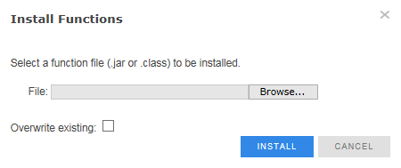

{
    "title": "Install agents or functions",
    "linkTitle": "Install agents or functions",
    "weight": "320"
}After developing an agent, you must install it to use the agent. An agent can be a script file, a Java class file, or JAR file. In a Standard Cluster (SC) and an Enterprise Cluster (EC), each agent must be installed on each node in the cluster individually.

<table cellpadding="0" cellspacing="0">
   <col/>
   <col/>
   <col/>
      <tr>
         <td valign="top">         </td>
         <td valign="top"><b>Note</b>
         </td>
         <td data-mc-autonum="&lt;b&gt;Note&lt;/b&gt;" valign="top">During the install process of Agents or Functions, the recommended file size to be used is up to 40 MB. If the processing time of the uploaded file exceeds 20 seconds the 'Read timed out' error will be displayed.         </td>
      </tr>
</table>

After you have created the external agent file, you must install it in order to use the agent.

<table cellpadding="0" cellspacing="0">
   <col/>
   <col/>
   <col/>
      <tr>
         <td valign="top">         </td>
         <td valign="top"><b>Note</b>
         </td>
         <td data-mc-autonum="&lt;b&gt;Note&lt;/b&gt;" valign="top">During the install process a ^M character is appended to each line of the script file. If you are using a Perl or shell script you need to convert the scripts to a UNIX format before installing.         </td>
      </tr>
</table>

1.  Select **Setup > TM Settings** to display *TM Settings* page.
2.  Select **Install Agents**.  
    The *Install Agents* page is displayed.  
    
    
3.  Browse your local file system and choose the agent’s script file. The agent file formats can be `.jar`, `.class`, `.exe`, `.pl`, and so forth.
4.  Select the **External Java Agent** check box if the external agent you are installing is a `.jar` or `.class` file.
5.  Select the **Overwrite existing** check box if existing agents should be overwritten.
6.  Click **Install**.

After you have created the external function file, you must install it in order to use the function.

1.  Select **Setup > TM Settings** to display *TM Settings* page.
2.  Select **Install Functions**.  
    The *Install Functions* page is displayed.  
    
    
3.  Browse your local file system and choose the function’s script file. The function file formats can be `.jar` and `.class`.
4.  Select the **Overwrite existing** check box if existing functions should be overwritten.
5.  Click **Install**.
