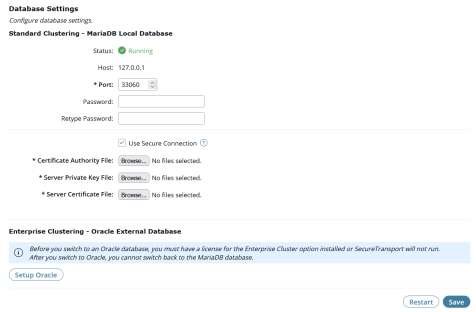

{
    "title": "Change the embedded database configuration",
    "linkTitle": "Change the embedded database configuration",
    "weight": "180"
}If your SecureTransport installation uses an embedded database, you can change the database port or password. The MySQL/MariaDB configuration is stored in the `<FILEDRIVEHOME>/conf/internaldb.conf` file.

Make sure you perform these changes separately, as described in the following subtopics.

<table cellpadding="0" cellspacing="0">
   <col/>
   <col/>
   <col/>
      <tr>
         <td valign="top">         </td>
         <td valign="top"><b>Note</b>
         </td>
         <td data-mc-autonum="&lt;b&gt;Note&lt;/b&gt;" valign="top">SecureTransport administrators with database reconfiguration permissions can change the embedded database port or password and restart the  database service using the   Admin REST API.         </td>
      </tr>
</table>

## Change the embedded database port

1.  Select **Setup > Database Settings**.  
      
    The *Database Settings* page is displayed.  
    
    
2.  Under *Standard Clustering - MariaDB / MySQL Local Database*, type the new port number in the **Port** field.
3.  Click **Save**.
4.  Click **Restart Database Now**.
5.  After the database restart, restart all SecureTransport services.

## Change the embedded database password

<table cellpadding="0" cellspacing="0">
   <col/>
   <col/>
   <col/>
      <tr>
         <td valign="top">         </td>
         <td valign="top"><b>Note</b>
         </td>
         <td data-mc-autonum="&lt;b&gt;Note&lt;/b&gt;" valign="top">After installation, the embedded database password is <code>tumbleweed</code>. For better security, change it as described in the following procedure.         </td>
      </tr>
</table>

1.  Select **Setup > Database Settings**.  
    The *Database Settings* page is displayed.
2.  Under *Standard Clustering - MariaDB / MySQL Local Database*, type the new password in both the **Password** and **Retype Password** fields.
3.  Click **Save**.
4.  Restart all SecureTransport services.

## Change the embedded database connection on MariaDB

Proceed as follows to change the embedded database connection on MariaDB:

1.  Select **Setup** > **Database Settings**.  
    The Database Settings page is displayed.  
      
2.  Secure the database  
    Under Standard Clustering - MariaDB Local Database, check the **Use Secure Connection** checkbox - if you select this checkbox, the connection between SecureTransport and the database server will be encrypted. The procedure for generating the certificates required for an SSL connection to the embedded MariaDB database can be found on the official MariaDB website. If **Use secure connection** is checked, the following are **required** and should also be configured:
    -   **Certificate Authority File**: Browse and select the PEM file to use for the embedded DB configuration.
    -   **Server Private Key File**: Browse and select the PEM file to use for the embedded DB configuration.
    -   **Server Certificate File**: Browse and select the PEM file to use for the embedded DB configuration.

    **Note:** The three Certificate files will be stored under the `<FILEDRIVEHOME>/lib/certs/db/` directory.  
      
3.  **Important**: You must restart all SecureTransport services through their scripts for the changes to take effect.

**Related topics:**

-   [Migrate from embedded database to external Oracle database](../t_st_database)
-   [Direct log data to separate Oracle databases](../t_st_separate_databases)
-   [Change the Oracle database configuration](../t_st_oracle)
-   [Change the external Microsoft SQL Server database](../t_st_sqlserver)
