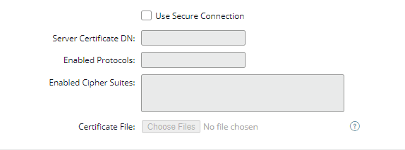

{
    "title": "Change the external Oracle database",
    "linkTitle": "Change the external Oracle database",
    "weight": "210"
}If your SecureTransport installation is using an Oracle database, select **Setup &gt; Database Settings** to perform the following tasks:

-   Update the database configuration
-   Direct Transfer and Server log data to separate Oracle databases
-   Migrate your Oracle database to PostgreSQL

You can also update the database connection parameters and test the connection via the Admin REST API.

## Update Oracle database configuration

1.  Log on to the SecureTransport Administration Tool as user `dbsetup`.
2.  Select **Setup > Database Settings**.   
    The *Database Settings* page is displayed.
3.  Make the necessary updates in the database configuration.  
    
    -   Required settings  
        
        
        -   **Host** – The host name or IP address of the Oracle server
        -   **Port** – The port used to access the server, 1521 is the default
        -   **User Name** – The name of the user authorized to create the SecureTransport schema.
        -   **Password** – The password for the user, not displayed.
        -   **Service Name** – Used to connect to the Oracle server or cluster
    -   **Use Kerberos Authentication**
          
        Check this option to configure SecureTransport to use Kerberos authentication to the Oracle Database.   
        When Kerberos authentication is enabled, the **Username** and **Password** fields are disabled, as SecureTransport will establish a password-less connection to the database using a ticket-granting (TGT) ticket. This feature requires additional configuration actions to be done on both the SecureTransport and the database server. For more information, see [Connect to an Oracle database using Kerberos authentication](../configure-oracle-kerberos).  
        If you want SecureTransport to persist the Kerberos configuration file and synchronize it between nodes, leave the checkbox **Use System Kerberos Configuration File** unchecked.  
        Before changing the database configuration, you need to upload the Kerberos configuration file (`krb5.conf`) on the *Server Configuration Files* page.  
        If you want SecureTransport to refer to the Kerberos configuration file directly, check the **Use System Kerberos configuration file** checkbox. When this option is selected, SecureTransport will not copy the file locally and will not synchronize it between nodes. The specified **Configuration File Path** will be used for establishing a password-less connection to the database. These settings apply to all database components simultaneously. This requires a restart of all SecureTransport services.  
        Finally, specify the absolute path to the Kerberos credentials cache file.  
        **Note:** When the Configuration File Path is updated, the Test Connection option will continue to use the previously set value until the new configuration is saved and all services are restarted.  
        
        
          
        
          
    -   **Use Proxy Authentication**
          
        Select this checkbox to connect to the database through another user. In the **Proxied Username** field, specify the user whose identity and privileges will be assumed by the connecting (proxy) user.  
        
          
    -   **Use Secure connection**
          
        If you select this checkbox, the connection between SecureTransport and the database server will be encrypted.   
        
        
          
        You need to specify the following:
        -   **Server Certificate DN** (optional) – If the server is successfully authenticated (meaning its certificate is trusted), its DN can be checked. If a value is entered in this field, it will be compared with the server certificate DN. If they do not match, the connection won't be successful.
        -   **Enabled Protocols** – List of enabled protocols. TLSv1 is the default protocol.
        -   **Enabled Cipher Suites** – List of the enabled cipher suites.
        -   **Certificate File** – Import a PEM or DER file, or JKS (Java Key Store) keystore containing the trusted certificates.
    -   **Use Custom JDBC URL**
          
         Unchecked by default. When checked, you can specify a custom JDBC URL string for SecureTransport to use to connect to one or multiple Oracle databases. In the URL, you can specify an address list that lists the protocol, host, port, and service name of each database.
        In addition to the standard connection parameters, you can include additional properties to define specific behavior, for example, a connection via SSL. If the custom JDBC URL connects to your database using SSL, make sure the **Use secure connection** checkbox is selected.
4.  Configure SecureTransport to use Kerberos authentication when connecting to the database.
    -   Set **Use Kerberos mode** to **true**
    -   Specify the location of the Kerberos configuration file:  
        a) If you want SecureTransport to persist the Kerberos configuration file and synchronize it between nodes:  
        On fresh install, uncheck the **Use Kerberos configuration file** checkbox, then specify the location of the file. SecureTransport will copy the file locally.  
        If SecureTransport is already installed and running, go to Server Configuration -> Configuration Files and upload the `krb5.conf `file.  
        b) If you want SecureTransport to refer to the Kerberos configuration file directly, check the "Use System Kerberos configuration file" checkbox during installation or database configuration. When this option is selected, SecureTransport will not copy the file locally and will not synchronize it between nodes.
    -   Specify the location of the Kerberos credential cache file.  
        For more information on configuring fresh installations, refer to the SecureTransport 5.5 Installation Guide.
    -   **Caution**: In an Enterprise Cluster setup, execute all the steps on all of the SecureTransport servers  
5.  Click **Test Connection**.  
    If SecureTransport displays a failure message, correct the network, database, or other error reported and try again.
6.  Click **Save**.

<table cellpadding="0" cellspacing="0">   <col/>   <col/>   <col/>      <tr>         <td valign="top">         </td>         <td valign="top"><b>Note</b>         </td>         <td data-mc-autonum="&lt;b&gt;Note&lt;/b&gt;" valign="top">Before a secure connection is enabled, the issuers certificates of the database server certificate, should be imported in the Trusted CA certificates store.         </td>      </tr></table>

**Related topics:**

-   [Direct log data to separate Oracle databases](../t_st_separate_databases)
-   [Migrate from Oracle to PostgreSQL](../migrate_oracle_to_postgre)
