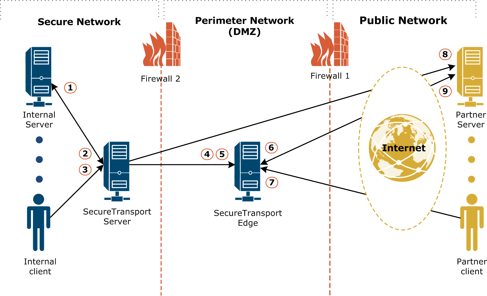

{
    "title": "Streaming deployment",
    "linkTitle": "Streaming deployment",
    "weight": "310"
}The following diagram illustrates a streaming deployment with clients and servers in both the public network and the internal secure network. The arrows show the direction of network connections for all the protocols. Data flows in both directions after the connection is made.



Streaming deployment network connections

Some lines represent two network connections. The connections are labeled as follows:

1.  From the SecureTransport Server to an internal server for a server-initiated transfer
2.  From an internal server to the protocol servers on the SecureTransport Server for a client-initiated transfers
3.  From an internal client to the protocol servers on the SecureTransport Server for a client-initiated transfers
4.  From the TM server on the SecureTransport Server to the protocol servers on the SecureTransport Edge so that the protocol servers can stream client-initiated transfers from partners using the streaming protocol
5.  From the SecureTransport Server to the SOCKS5 proxy server on the SecureTransport Edge for server-initiated transfers
6.  From a partner server to a protocol server on the SecureTransport Edge for a client-initiated transfer
7.  From a partner client to a protocol server on the SecureTransport Edge for a client-initiated transfer
8.  From the SecureTransport Server directly to a partner server for a server-initiated transfer
9.  From the SOCKS5 proxy server on the SecureTransport Edge to a partner server for server-initiated transfers

The diagram does not illustrate the following network connections that you might need to configure depending on the requirements of your deployment:

-   From the TM server to the protocol servers within the SecureTransport Server so that the protocol servers can serve client-initiated transfers from the secure network
-   From the SecureTransport Server to a separate HTTP proxy server for server-initiated transfers
-   From a separate HTTP proxy server to a partner server for server-initiated transfers
-   From the TM server on the SecureTransport Server to the protocol servers and the SOCKS5 proxy server on a SecureTransport Edge in a less restrictive DMZ for internal clients and servers
-   From the TM server on the SecureTransport Server to the protocol servers and the SOCKS5 proxy server on a SecureTransport Edge in a DMZ that has a VPN connection to a specific partner

**Related topic:**

-   [Manage the communication across Transaction Manager, protocol and proxy servers](../t_st_networkzones)
