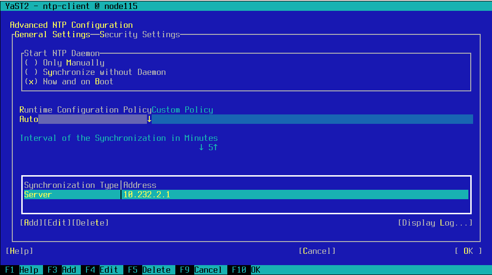

{
    "title": "Configure a SUSE Linux Enterprise High Availability cluster with OCFS2",
    "linkTitle": "Configure a SUSE Linux Enterprise High Availability cluster with OCFS2",
    "weight": "170"
}This section describes the prerequisite tasks to complete before you begin configuring SLEHA cluster with OCFS2:

-   [Enable loading of fiber card driver](#enable)
-   [Initialize multipath](#initiali)
-   [Create multipath.conf file](#create)
-   [Enable multipath](#enable2)
-   [Configure NTP client](#configur)
-   [Configure SSH client](#configur2)

### Enable loading of fiber card driver

Comment out or remove the line containing `blacklist qla2xxx` in `/etc/modprobe.d/50-blacklist.conf`. If no other changes are made this, should be the last line in the file.

### Initialize multipath

Depending on the number of your fiber cards and number of LUNs exported on SAN, block devices initialized by the OS may vary. In this case, there is only one called `sdb`.

Run the following command:

<table cellspacing="0">
   <col/>
   <tbody>
      <tr>
         <td>
            
<code>multipath -ll</code>

         </td>
      </tr>
   </tbody>
</table>

If there is no output or not every block device representing SAN is listed, initialize each block device as:

<table cellspacing="0">
   <col/>
   <tbody>
      <tr>
         <td>
            
node115:~ # multipath /dev/sdb

            
create: 360014056e1d398a52894c8e99d7de877 undef LIO-ORG,IBLOCK

            
size=2.0G features='0' hwhandler='1 alua' wp=undef

            
`-+- policy='service-time 0' prio=50 status=undef

            
  `- 3:0:0:0 sdb 8:16 undef ready running

         </td>
      </tr>
   </tbody>
</table>

A device named `dm-name-360014056e1d398a52894c8e99d7de877` should now appear in `/dev/disk/by-id`.

If you have more than one device, repeat the task for each of the rest.

### Create multipath.conf file

Create the file `/etc/multipath/multipath.conf` with the following content

`blacklist {`  
`       devnode "^sda[0-9]*"`  
`}`

<table cellpadding="0" cellspacing="0">
   <col/>
   <col/>
   <col/>
      <tr>
         <td valign="top">         </td>
         <td valign="top"><b>Note</b>
         </td>
         <td data-mc-autonum="&lt;b&gt;Note&lt;/b&gt;" valign="top">If you are planning to decrease the watchdog timeout, you may need to decrease the multipath timeouts. The default value of <code>max_polling_interval</code> is 5. The default value of <code>max_polling_interval</code> is <code>4 * polling_interval</code>.  It should be less than the watchdog timeout.         </td>
      </tr>
</table>

### Enable multipath

Run `yast multipath` and select **Use multipath**.



Press Finish and reboot the appliance. If after the restart your system enters in Emergency mode, provide root password and verify your multipath configuration.

### Configure NTP client

Run `yast ntp` and configure your local ntp servers. Select **Now and on Boot** for NTP startup.



### Configure SSH client

Add records for every node in `/etc/hosts` file.

Edit, or create if not present `/root/.ssh/config`. Add port 10022 as a default SSH port on Axway Appliance. For example, if there are two nodes:

<table cellspacing="0">
   <col/>
   <tbody>
      <tr>
         <td><code>Host st-appliance1 st-appliance2</code><code> Port 10022</code>
         </td>
      </tr>
   </tbody>
</table>

 

The steps in the following topics need to be performed to configure a SUSE Linux Enterprise High Availability (SLEHA) OCFS2 cluster using the optional SAN card on SecureTransport5.5 Virtual Appliance:

-   [Setup SLEHA with OCFS2 using multicast on the first node](f_configure_first_node) - Provides configuration instructions for setting SLEHA with OCFS2 using multicast on the first node of a cluster.
-   [Setup N-th node in a cluster using multicast](f_setup_nth_node) - Provides configuration instructions for setting up the N-th node in a cluster using mulicast.
-   [Setup SLEHA cluster to use unicast](setup_sleha_cluster) - Provides configuration instructions for setting up a SLEHA cluster to use unicast.
-   [Verify cluster configuration](verifiy_cluster) - Provides a procedure for checking the cluster configuration.
-   [Remove a node from a SLEHA cluster](f_remove_node) - Provides configuration instructions for removing a node from a SLEHA cluster.
-   [Test STONITH configuration](test_stonith_configuration) - Provides a procedure for testing the STONITH configuration.

 

For additional SUSE configuration information, refer to the following links:

-   SUSE Linux Enterprise High Availability Extension 12 SP5 High Availability Guide - <https://documentation.suse.com/sle-ha/12-SP5/single-html/SLE-HA-guide/index.html>
-   Manual Cluster Setup (YaST) - <https://documentation.suse.com/sle-ha/12-SP5/single-html/SLE-HA-guide/index.html#sec-ha-install-manual>
