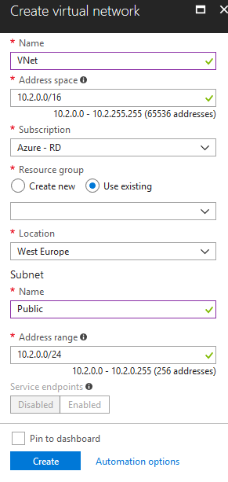

{
    "title": "Create a virtual network",
    "linkTitle": "Create a virtual network",
    "weight": "50"
}<table cellspacing="0">
   <col/>
   <col/>
   <tbody>
      <tr>
         <td>
            
To create a VNet, follow these steps:

<ol>
               <li value="1">Log in to the Azure Portal and navigate to the <strong>Create a resource</strong>.               </li>
               <li value="2">Under the "Azure Marketplace" section, choose <strong>Networking</strong>.               </li>
               <li value="3">Under the "Featured" section, choose <strong>Virtual Network</strong>.                </li>
               <li value="4">Fill in the settings and click <strong>Create</strong>.               </li>
</ol>
            
<table cellpadding="0" cellspacing="0">
   <col/>
   <col/>
   <col/>
      <tr>
         <td valign="top">         </td>
         <td valign="top"><b>Note</b>
         </td>
         <td data-mc-autonum="&lt;b&gt;Note&lt;/b&gt;" valign="top">The image provides an example Address space. You can configure the Address space according to your needs.         </td>
      </tr>
</table>

         </td>
         <td>

         </td>
      </tr>
   </tbody>
</table>
