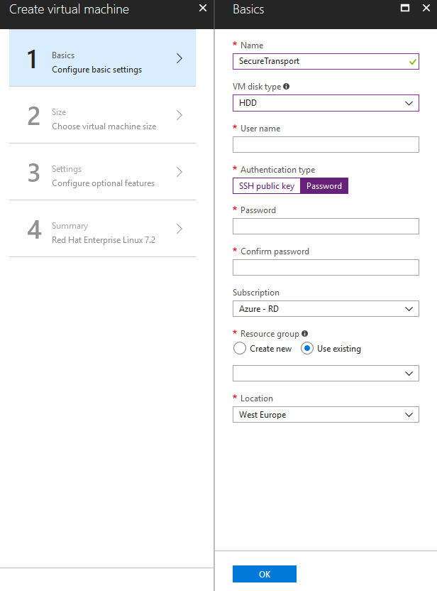

{
    "title": "Launch VM instances",
    "linkTitle": "Launch VM instances",
    "weight": "70"
}For the purpose of the described setup, we need seven RHEL instances in total:

-   Two SecureTransport Servers – in the first Private Subnet
-   Two SecureTransport Edges – in the Public Subnet
-   Two GlusterFS Servers – in the first Private Subnet
-   One instance to administer and access the above instances – Administration Host in one of the public subnets

To launch a VM instance, follow these steps:

1.  Navigate to the Azure Portal and click **Create a resource**.

2.  Under the "Azure Marketplace" section, select **Compute**.

3.  Under the "Featured" section, select **Red Hat Enterprise Linux**.

4.  Fill in the **Basics**:
    1.  Give your VM a unique name
    2.  Select disk type: HDD or SSD
    3.  Select Authentication type: SSH public key or Password
    4.  Select your Subscription
    5.  Select existing or create a new Resource group
    6.  Select your Location

5.  Click **OK**.  
    

6.  Choose a Size according to the *Minimum UNIX hardware requirements* in the SecureTransport 5.5 Installation Guide.

    **Note:** SecureTransport in Azure has been verified with *D4S\_V3 Standard* image for all RHEL instances.

7.  Configure Settings
    -   **High availability:** Select the respective Availability Zone for each VM.
    -   **Disk type:** Choose between *HDD* and *SSD*.
    -   **Use managed disks:** Choose between *Yes* and *No*.
    -   **Virtual Network:** Select your previously created Virtual Network or create a new one.
    -   **Subnet:** Select your previously created subnet.
    -   **Public IP address:** Select *None*.
    -   **Network security group:** Select previously created NSG or create a new one.
    -   **Extensions:** You can add new features, like configuration management or antivirus protection.
    -   **Enable Auto-shutdown:** Choose between *Off* and *On*.
    -   **Boot diagnostics:** Choose between *Enabled* and *Disabled*.
    -   **Guest OS diagnostics:** Choose between *Enabled* and *Disabled*.
    -   **Diagnostics storage account:** Choose existing or create a new one.

8.  Review the Summary and click **Create**.
