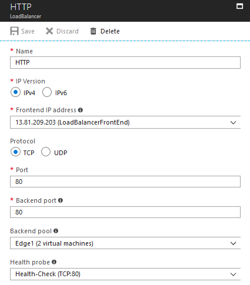

{
    "title": "Set up basic Load Balancer",
    "linkTitle": "Set up basic Load Balancer",
    "weight": "140"
}Azure Load Balancer delivers high availability and network performance to your applications. It is a Layer 4 (TCP, UDP) load balancer that distributes incoming traffic among healthy instances of services defined in a load-balanced set. Azure Load Balancer supports two different types: Basic and Standard. We have verified Basic Load Balancer.

When you create a load balancer in a VNet, you can make it an internal load balancer or an Internet-facing load balancer. You create an Internet-facing load balancer.

When you create your load balancer, you configure Frontend IP, Load Balancing rules, health probes, and register back-end instances. You configure a Load Balancing rule by specifying a protocol and a port for front-end (client to load balancer) connections, and a protocol and a port for back-end (load balancer to back-end instances) connections. You can configure multiple rules for your load balancer.

Follow these steps to create a Basic Load Balancer redirecting requests to SecureTransport Edge instances in Azure VNet:

1.  Log in to **Azure portal -> Create a resource**.
2.  Under **Azure Marketplace** section select **Networking**.
3.  Under **Featured** section select **Load Balancer**.
4.  Fill in the Basic settings:
    1.  Enter Load Balancer name.
    2.  Select **Type**: *Public*.
    3.  **Choose a** **Public IP address** - Select existing or create a new one.
    4.  Select your **Subscription**, **Resource group** and **Location**.
    5.  Click **Create**.

After creating the Load Balancer, you must configure Health probes, Backend pools and Load Balancing rules.

## Configure Health probes

1.  Navigate to your Load balancer settings -> **Health probes**.
2.  Click **+Add**.
3.  Give your probe a **Name**, **Protocol**, **Port**, **Interval** and **Unhealthy threshold**.

**Note:** Create a Health probe for each Load Balancing rule specifying the port and protocol.



## Add a Backend pool

1.  Navigate to your Load balancer settings -> **Backend pools**.
2.  Click **+Add**.
3.  Fill in the Backend pool settings:
    1.  Give it a unique name.
    2.  Select both SecureTransport Edge Instances as a **Target virtual machine**.
    3.  Select each SecureTransport Edge **Network IP Configuration**.
4.  Click **OK**.

## Add Load Balancing rules

1.  Navigate to your Load balancer settings -> **Load Balancing rules**.
2.  Click **+Add**.
3.  Fill in the Load Balancing rule settings:
    1.  Provide a unique name.
    2.  Select an **IP version**.
    3.  Select **Frontend IP address** from the drop-down menu.
    4.  Select a **Protocol**.
    5.  Select a **Port** on which the Load Balancer will be accessed.
    6.  Select a **Backend Port** to route traffic.
    7.  Select a **Backend pool** - target of the load balancer traffic.
    8.  Select a **Health probe** for the Load balancing rule.
    9.  Select **Session persistence:** *Client IP and protocol*.
    10. Configure **Idle timeout (minutes)**.
    11. Select **Floating IP**.

**Note:** For each Load balancing rule select the Health probe that corresponds to the rules protocol and port.



<table cellpadding="0" cellspacing="0">
   <col/>
   <col/>
   <col/>
      <tr>
         <td valign="top">         </td>
         <td valign="top"><b>Note</b>
         </td>
         <td data-mc-autonum="&lt;b&gt;Note&lt;/b&gt;" valign="top">The Load balancing rules in the screenshot are configured with default ports or ports specific for the test setup. Please change/add rules according to your specific setup.         </td>
      </tr>
</table>

<table cellpadding="0" cellspacing="0">
   <col/>
   <col/>
   <col/>
      <tr>
         <td valign="top">         </td>
         <td valign="top"><b>Note</b>
         </td>
         <td data-mc-autonum="&lt;b&gt;Note&lt;/b&gt;" valign="top">Check the <strong>FTP does not work through the firewall</strong> section in the SecureTransport<i> </i>5.5<i> Administrator's guide</i> if you want to configure FTP listeners.         </td>
      </tr>
</table>

Now, your load balancer is ready to fetch requests and distribute them across your SecureTransport Edge instances.

If you would like to use a friendly DNS name to access your load balancer, instead of the default DNS name automatically assigned to your load balancer, you can create a custom domain name.
