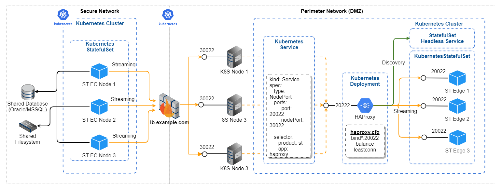

{
    "title": "Scale the deployment",
    "linkTitle": "Scale the deployment",
    "weight": "100"
}This section provides instructions on how to scale up and scale down a Server or Edge node in the Enterprise Cluster. Topics herein cover the automatic discovering feature for Edges, and supplies instructions and guidelines for manual and autoscaling in your cluster.

## SecureTransport Edge automatic discovering mechanism

For better understanding of the automatic discovering of Edges, you can observe that same high-level diagram of the Streaming setup, discussed in the [Deployment topology](../deployment-topology) topic.



The setup example as shown on the Streaming Protocol deployment diagram is outlined in the following procedure.

**Prerequisites**

-   A 3-node Kubernetes (K8S) Cluster is deployed in the DMZ network and all nodes are alive
-   The HAProxy Pod is deployed on **K8S Node 1** and is exposed using **Kubernetes Node Port Service** that maps port `30022`on each K8S Custer node to port `20022` inside the **HAProxy pod**.

1.  Deploy one Edge Pod in SecureTransport Edge StatefulSet: **ST Edge 1**  
    
    -   It has SFTP service enabled and the service starts the Streaming Server on `0.0.0.0:20022` inside the Pod
    -   The Pod is deployed on **K8S Node 3** (pod may be deployed on any of the 3 nodes)
    -   The HAProxy Pod uses the ST Edge StatefulSet Headless Service to discover the new Edge Pod
2.  Deploy one SecureTransport Server Pod (ST EC Node) in its StatefulSet in the K8S Cluster in the Secure Network (**ST EC Node 1**)  
    
    -   By default only the Admin and TM services are started
    -   The number of Streaming Connections specified via the configuration files (supplied as Kubernetes secrets) is set to 10
3.  Log in to the SecureTransport Server Administrator's Tool and configure a new Network Zone.  
    
    -   Specify the FQDN to `lb.example.com` and sets the SSH Streaming Port to 30022 (the HAProxy's NodePort Service)
    -   After saving the Network Zone configuration the TM inside SecureTransport EC Node 1 tries to establish 10 streaming connections to the FQDN/Port specified in the Network Zone
        -   The Firewall/LB will load balance the 10 connections between all K8S nodes but in the end they are all routed to the HAProxy Pod on K8S Node 1
        -   HAProxy routes all 10 connections to the only running Edge Pod (ST Edge 1)
        -   Streaming is established and the Edge is functional
4.  Now that the TM has established a streaming connection to an Edge in that Network Zone, a process is started that constantly queries the Edge via the Streaming connections on current number of Edges.  
    
    -   The currently running Edge replies "There is one Edge here" and since the TM has 10 streaming connections established he does not need to do anything at this point
    -   Note: the TM picks one of the established streaming connections to query about the number of Edges. In the end any of the running edges may answer the question.

### Add a new Edge

Use the Streaming deployment diagram for that same

-   The SecureTransport Edge StatefulSet is scaled to 2 replicas (**ST Edge 2** pod is started)
-   The HAProxy Pod discovers the new Edge Pod
-   The TM running inside the **ST EC Node 1** pod queries **ST Edge 1** over the Streaming Protocol: "How many Edges are there?"
-   **ST Edge 1** replies: 2
-   The TM checks if there are 2x10=20 established Streaming connections - but there are only 10. So another 10 must be established
-   The TM tries to establish 10 additional streaming connections to `lb.example.com:30022`
-   The HAProxy redirects all 10 connections to the new Edge because of the "least connections" algorithm
-   The **ST Edge 2** pod is now operational

### Add a new EC server node

-   The ST EC StatefulSet is scaled to 2 replicas (**ST EC Node 2** pod is started)
    -   The node automatically joins the Enterprise Custer with ST EC Node 1 pod
    -   The TM reads the Network Zone configuration from the shared Database
    -   The TM tries to establish 10 streaming connections to the FQDN/Port specified in the Network Zone (l`b.example.com:30022`)
-   HAProxy distributes the 10 connections between the 2 running Edges so each of them gets 5 new streaming connections
-   The TM running inside the **ST EC Node 2** pod queries over the Streaming Protocol "How many Edges are there?"
    -   One of the ST Edge Pods answers: 2
-   The TM running inside the **ST EC Node 2** tries to establish 10 additional streaming connections to `lb.example.com:30022`
-   HAProxy distributes the 10 connections between the 2 running Edges so each of them gets 5 new streaming connections
-   In the end each ST Edge Pod gets 20 Streaming connections

## Manually scale nodes up or down

Kubernetes can scale up (or down) one or more instances of a node with a single command:

    kubectl scale statefulset <your-statefulset> -n <your-namespace> --replicas=<total-desired-number-of-nodes>

In order to scale up a SecureTransport Server node fill in your configured EC StatefulSet. Similarly, with SecureTransportEdge node, use the Edge StatefulSet.

Fill in your namespace if you have it configured or remove the option if you don't have one. The `--replicas` value must equal the total number of nodes you wish to scale-up , it includes previously running instances. For example if you have a single running instance of a node and fill `--replicas=3` Kubernetes will scale-up two additional nodes. It can also scale-up nodes without having a running instance of that node.

Executing the command will tell Kubernetes to scale-up nodes one by one. The new instances of EC nodes will be created as they become in ready state in a matter of seconds, but will be functional after their average time to start. The new instances of Edge nodes will be created one by one after each one of them is in ready state.

-   It is recommended to have only one Server StatefulSet in the internal Kubernetes cluster, with multiple Edge StatefulSets (if needed) in the DMZ Kubernetes cluster.
-   Multiple Edges in the SecureTransport configuration are supported only when a separate zone is configured for each Edge. See section [Multiple network zones](../additional-network-zones) for further information.
-   Changes in configuration which is dynamically reloaded is not replicated if there more than one Edge. See section [Initial deployment](../initial-deployment) for further information.
-   In multiple (more than one) Edge deployments, HTTP, FTP and SSH sessions established on the Edge side cannot be killed via the Server Usage monitor on the SecureTransport Server. The administrator can manipulate via the Server Usage monitor only the local sessions of each SecureTransport Edge.

## Automatically scale nodes

SecureTransport Servers and Edges can be scaled based on average CPU load using the Kubernetes Horizontal pod autoscaler. In order to enable the autoscaler the following command should be executed.

    kubectl autoscale statefulset <statefulset> -n <st-namespace> --cpu-percent=70 --min=2 --max=10

Where `--cpu-percent` is a value of average CPU load on all of the nodes, `--min` is the minimum required number of pods, `--max` is the maximum number of pods to deployed.

Depending of the hardware used you can adjust the above values as per your needs.

In order to stop the autoscaling the following command should be executed.

    kubectl delete hpa <statefulset> -n <st-namespace>

It is recommended to deploy the HPA (Horizontal Pod Autoscaler) after the desired minimum nodes are deployed, as during startup SecureTransport services use large amount of processing power and iniitially the StatefulSet can be scaled incorrectly.

*next topic:* [Multiple network zones](../additional-network-zones)
