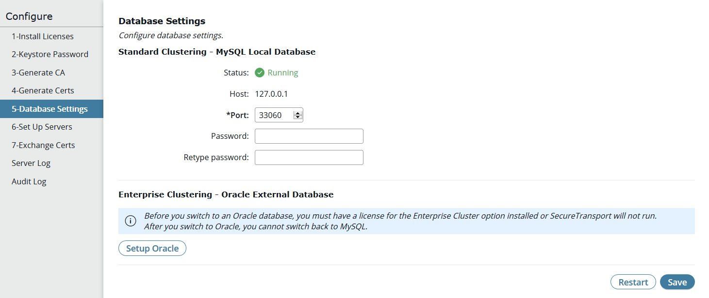

{
    "title": "Database settings",
    "linkTitle": "Database settings",
    "weight": "90"
}If you are using the embedded database, select **Configure &gt; 5-Database Settings** to perform the following tasks:

-   Change the port or password for the embedded database for a SecureTransport Edge or a SecureTransport Server

<!-- -->

-   Migrate data from the embedded database to an external database

To change a stand-alone or clustered SecureTransport Server to different Oracle database or to direct log data to separate external Oracle databases, refer to the *SecureTransport Administrator's Guide*.



<table cellpadding="0" cellspacing="0">
   <col/>
   <col/>
   <col/>
      <tr>
         <td valign="top">         </td>
         <td valign="top"><b>Note</b>
         </td>
         <td data-mc-autonum="&lt;b&gt;Note&lt;/b&gt;" valign="top">When you log in to the Administration Tool using the admin account, you can access this page by selecting <strong>Setup &gt; Database Settings</strong>.         </td>
      </tr>
</table>

## Change the embedded database port or password

If this SecureTransport installation uses the embedded database, the database has the default password `tumbleweed` after installation. To secure the system, change the database password. You can also change the database port.

1.  Select **Configure > 5-Database Settings**.
2.  Under *Standard Clustering - MySQL Local Database* or *Standard Clustering - MariaDB Local Database*, type the new port number in the **Port** field.
3.  Under *Standard Clustering - MySQL Local Database* or *Standard Clustering - MariaDB Local Database*, type the new password in both the **Password** and **Retype Password** fields.
4.  Click **Save**.
5.  If you changed the port, click **Restart Database Now**.
