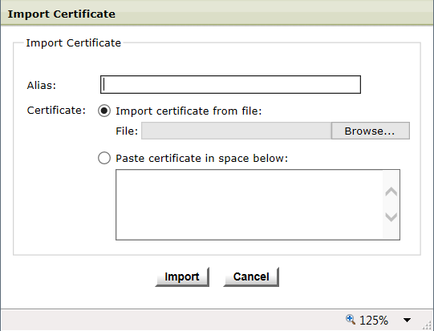

{
    "title": "Exchange CA certificates",
    "linkTitle": "Exchange CA certificates",
    "weight": "110"
}The Setup step 7 pertains only to a two-tier architecture, where both a SecureTransport Edge and SecureTransport Server are being configured.

In a two-tier deployment, the SecureTransport Edge and SecureTransport Server authenticate each other through the use of certificates. These certificates have already been created and specified in previous steps. In this step, a trust relationship between the two servers must be set up. This setup involves exchanging certificates between SecureTransport Edge and SecureTransport Server.

To complete this step, you must be able to access both the SecureTransport Server and SecureTransport Edge Administration Tool. Use a separate browser window to open each Administration Tool.

<table cellpadding="0" cellspacing="0">
   <col/>
   <col/>
   <col/>
      <tr>
         <td valign="top">         </td>
         <td valign="top"><b>Note</b>
         </td>
         <td data-mc-autonum="&lt;b&gt;Note&lt;/b&gt;" valign="top">When you log in to the Administration Tool using the admin account, you can access this page by selecting <strong>Setup &gt; Certificates &gt; Trusted CAs</strong>.         </td>
      </tr>
</table>



## Export the SecureTransport Server or Edge CA certificate

Use the following steps to export the CA certificate from the SecureTransport Server or Edge.

1.  Go to **Configure > 7-Exchange Certs**.
2.  From the list of trusted CAs, click the alias that matches the CA certificate set up for the SecureTransport Server or Edge in **Configure > 2-Generate CA**.  
    The *View Certificate* dialog box is displayed.  
    
    
3.  Click **Export** in the *View Certificate* dialog box.
4.  Save the file to a location in the local system.
5.  Click **Close**.

If necessary, you can import the CA certificate file to Edge (or SecureTransport Server, where applicable).

## Import the SecureTransport Server or Edge CA certificate

A X509 certificate can be imported as a trusted CA in the form of a X509 DER or PEM encoded file. Make sure the certificate is valid and configured to validate certificates before you import it. The CA attribute in the X509v3 extension section of the certificate must be true.

<table cellpadding="0" cellspacing="0">
   <col/>
   <col/>
   <col/>
      <tr>
         <td valign="top">         </td>
         <td valign="top"><b>Note</b>
         </td>
         <td data-mc-autonum="&lt;b&gt;Note&lt;/b&gt;" valign="top">SecureTransport protocol servers and services do not require restart after importing, overwriting, or deleting a trusted CA.         </td>
      </tr>
</table>

Use the following steps to import the CA certificate from the SecureTransport Server to the SecureTransport Edge or vice versa.

1.  Go to **Configure > 7-Exchange Certs**.
2.  Click **Import**. The *Import Certificate* dialog box is displayed.  
    
    
3.  Enter an **Alias** for the imported certificate. Ensure the alias is unique and different from any other trusted CA aliases
4.  To import the certificate file:
    1.  Select **Import certificate from file** and click **Browse** to locate the file on your local system.
    2.  Or select **Paste certificate in space below** to copy and paste the certificate contents.
    3.  Click **Import** to import the certificate to the Edge server.
5.  Click **Close** in the *Import Certificate* dialog box.  
    The newly imported certificate appears in the **Trusted CA Certificates** list.

 

The following topics provide how-to instructions for importing and exporting SecureTransport Server and Edge CAs:

-   [Export the SecureTransport Server CA certificate](exporting_the_securetransport_server_ca_certificate.htm) - Provides how-to instructions for exporting the SecureTransport Server CA certificate.
-   [Import the SecureTransport Server CA certificate](importing_the_securetransport_server_ca_certificate.htm) - Provides how-to instructions for importing the SecureTransport Server CA certificate.
-   [Export the SecureTransport Edge CA certificate](exporting_the_securetransport_edge_ca_certificate.htm) - Provides how-to instructions for exporting the SecureTransport Edge CA certificate.
-   [Import the SecureTransport Edge CA certificate](importing_the_securetransport_edge_ca_certificate.htm) - Provides how-to instructions for importing the SecureTransport Edge CA certificate.
