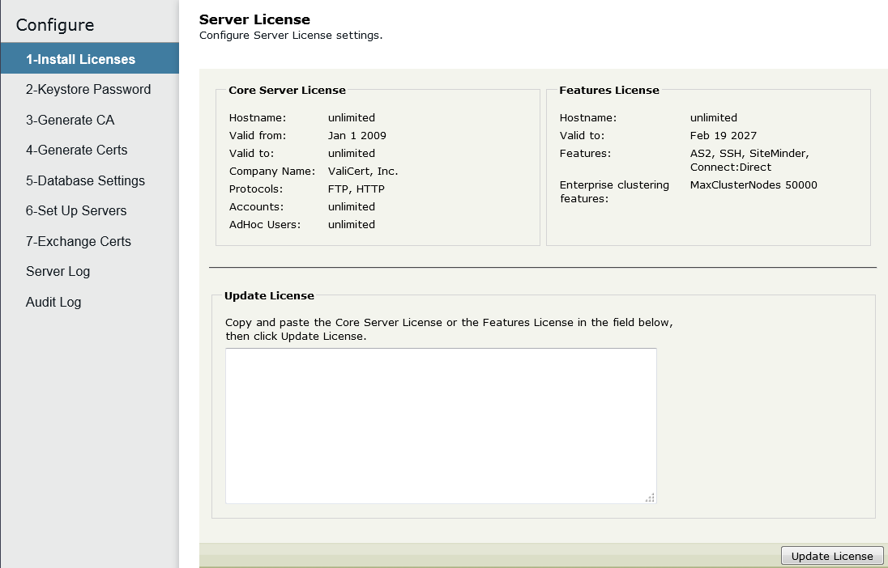

{
    "title": "Install licenses",
    "linkTitle": "Install licenses",
    "weight": "50"
}Setup step 1 requires you to install your licenses: *core server license* and *features license*.

The *core server license* specifies the number of accounts allowed and the number of ad hoc users allowed. It also limits the license to a specified host and date range. The *features license* limits the type of external database server and specifies if the AS2, SSH, and Connect:Direct protocols are allowed, if SiteMinder integration is allowed, if the Enterprise Cluster (EC) option is included, and the number of Enterprise Cluster nodes allowed.

The FTP and HTTP protocols are included in the core license. For other features, contact your local account executive or supplier.

Contact Axway Global Support to obtain text files containing the core server license and the features license for your authorized features. For contact information, see [Get more help](get_more_help2.htm).

<table cellpadding="0" cellspacing="0">
   <col/>
   <col/>
   <col/>
      <tr>
         <td valign="top">         </td>
         <td valign="top"><b>Note</b>
         </td>
         <td data-mc-autonum="&lt;b&gt;Note&lt;/b&gt;" valign="top">The installation of licenses is the only setup step you perform on the second and subsequent servers in an Enterprise Cluster.         </td>
      </tr>
</table>

## Install server license

Use the **Server License** page to install SecureTransport licenses.

1.  Select **Configure > 1-Install Licenses**.  
    The *Server License* page is displayed.  
    
    
2.  Open the text file containing the core server license information.
3.  Copy the entire contents of the file to the clipboard.
4.  Paste the copied contents of the file into the **Update License** text area and click **Update License**.  
    The core server license information is displayed.  
    
    

### Ad hoc user license

Ad hoc users is a feature, part of the core server license. Ad hoc users have the capability to compose, send, reply to, or forward email messages using ST Web Client or one of the Axway Email Plug-ins. There are four categories of ad hoc user licenses:

-   **Unlimited ad hoc user licenses**: If your company has purchased an unlimited number of ad hoc user licenses, then the display shows "unlimited" for the number of ad hoc users.
-   **One ad hoc user license for each account license**: If your company has purchased one ad hoc user license for each account license, then the display shows the same number of licenses for Accounts and for ad hoc users.
-   **Fewer ad hoc user licenses than account licenses**: If your company has purchased fewer ad hoc user licenses than account licenses, then the display shows the maximum number of users that can compose, send, reply to, or forward messages using ST Web Client or one of the Axway Email Plug-ins. One ad hoc user license is consumed the first time a user performs one of these actions.
-   **No ad hoc user licenses**: If your company did not purchase any ad hoc user licenses, then end users cannot use ad hoc file transfers. The display does not include the line with ad hoc users.

## Install features license

1.  Open the text file containing the feature server license information.
2.  Copy the entire contents of the file to the clipboard.
3.  Paste the copied contents of the file into the **Update License** text area and click **Update License**.  
    The features license information is displayed.  
    
    

The Connect:Direct license is only shown when the Connect:Direct protocol is enabled.
