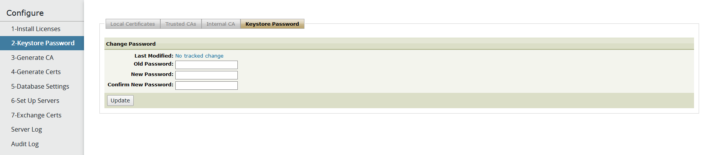

{
    "title": "Change the keystore password",
    "linkTitle": "Change the keystore password",
    "weight": "60"
}Setup step 2 requires you to change the default keystore password.

SecureTransport contains a keystore of encrypted X509 and PGP private and public keys created and used within SecureTransport. A default keystore password is set during installation. For greater security, change the keystore password from the default one before you generate an internal certificate.

Follow these steps to change the keystore password:

1.  Select **Configure > 2-Keystore Password**.  
    The *Keystore Password* pane is displayed.  
    
    
2.  Enter the old keystore password in the **Old Password** field. Leave this field empty if this is the first time you are changing the keystore password and SecureTransport uses the default.
3.  Enter a new password and re-enter the password in the **Confirm New Password** field.
4.  Click **Update** to change the password.  
    A message in the **Keystore Password** tab confirms that the password was changed successfully.

<table cellpadding="0" cellspacing="0">
   <col/>
   <col/>
   <col/>
      <tr>
         <td valign="top">         </td>
         <td valign="top"><b>Note</b>
         </td>
         <td data-mc-autonum="&lt;b&gt;Note&lt;/b&gt;" valign="top">When you log in to the Administration Tool using the admin account, you can access this page by selecting <strong>Setup &gt; Certificates &gt; Keystore Password</strong>.         </td>
      </tr>
</table>
