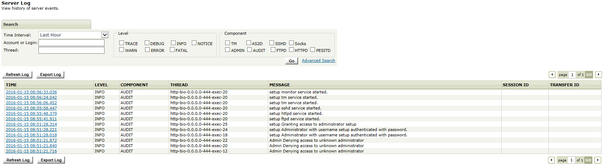

{
    "title": "View server log messages",
    "linkTitle": "View server log messages",
    "weight": "110"
}At any time during the setup process, you can view the log messages SecureTransport has generated by selecting **Server Log**.



For more information about the server log, refer to the *SecureTransport Administrator's Guide*.

<table cellpadding="0" cellspacing="0">
   <col/>
   <col/>
   <col/>
      <tr>
         <td valign="top">         </td>
         <td valign="top"><b>Note</b>
         </td>
         <td data-mc-autonum="&lt;b&gt;Note&lt;/b&gt;" valign="top">When you log into the Administration Tool using the admin account, you can access this page by selecting <strong>Operations &gt; Server Log</strong>.         </td>
      </tr>
</table>
