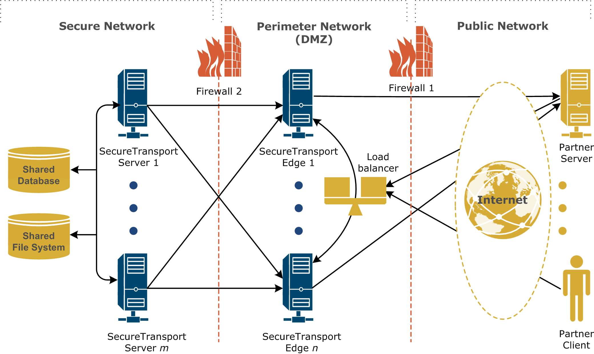

{
    "title": "Security architecture",
    "linkTitle": "Security architecture",
    "weight": "110"
}Global architecture of SecureTransport as identified in the Threat Modeling process.



For the database in the diagram, sensitive parameters, such as passwords and keys, are encrypted.

An Enterprise Cluster diagram.


