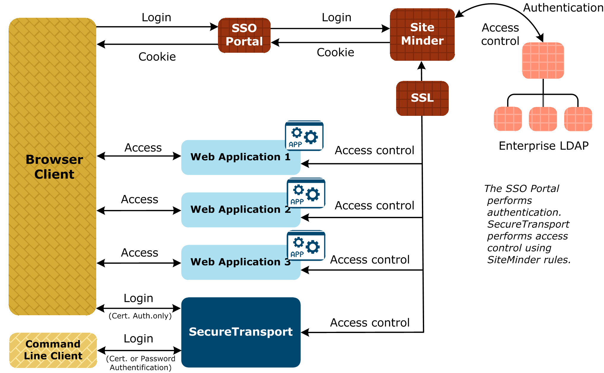

{
    "title": "Security features",
    "linkTitle": "Security features",
    "weight": "70"
}This product contains the following security features:

-   Secure connections, see [Secure connections](#secure)
-   Password management, see [Password management](#password)
-   Certificate management, see [Certificate management](#certific)
-   Identity and access management, see [Identity and Access Management](#identity)
-   Other security features, see [Other security features](#other)

## Secure connections

The following secure connections are available:

-   Connections between the UI and the server are TLS secured.

-   Outbound connection over any supported protocols (FTP, HTTP, AS2, PeSIT) can be SSL\\TLS secured. SFTP and SCP implement Forward Secrecy and are secured via the SSH protocol by default.  
    

    <table cellpadding="0" cellspacing="0">
   <col/>
   <col/>
   <col/>
      <tr>
         <td valign="top">         </td>
         <td valign="top"><b>Note</b>
         </td>
         <td data-mc-autonum="&lt;b&gt;Note&lt;/b&gt;" valign="top">Cookies issued over HTTPS use the HTTP Strict Transport Security (HSTS) flag. Additionally, HSTS and HTTPOnly headers are added to the issued cookies for the administrator and end-user HTTP listeners.         </td>
      </tr>
</table>

-   Inbound connections over any supported protocols can be TLS secured. SFTP and SCP use transport security by default and don’t need to be secured explicitly.

-   Connections to LDAP servers can be TLS secured.

-   Connections to ICAP servers can be TLS secured.

-   Connection to Sentinel can be TLS secured.

-   Connections to external Microsoft MSSQL 2014, Oracle 11g, and Oracle 12c databases are TLS secured.

## Password management

The following password features are available:

-   Locally stored passwords for administrators and end users are stored hashed using the PBKDF2 key derivation function. The number of iterations can be set using the `Security.Passwords.PBKDF2.Iterations` server configuration option. Default value: 1000.
-   The passwords for transfer sites, and internal servers integrated with SecureTransport like LDAP, external database, Sentinel server, SSO server, ICAP server, etc. are encrypted using the secret (taeh) file.

## Certificate management

Certificate management can either be performed internally in the product or using a supported Hardware Security Module (HSM) with several limitations.

### HSM

SecureTransport supports HSM key management of local certificates. Storing any other type of certificates on HSM is not supported. Only the FTP and HTTP protocol servers can be configured with HSM support.

### When not using HSM

Certificates are stored in JKS keystore persisted in the database.

-   The revocation list and certificate path are not checked.

## Identity and Access Management

Identity and Access Management can either be performed internally in the product using SSO (SiteMinder) or LDAP.

### Internally

The following features are available:

-   Passwords are stored internally in the database and are hashed using PBKDF2.
-   Flexible access restrictions and permission can be configured on per user basis or on a larger scale – user classes and group id.

### SiteMinder

SecureTransport can be integrated into a SiteMinder SSO environment and use SiteMinder to authenticate and authorize all supported client protocols. For more information, refer to the *SiteMinder integration* chapter in the *SecureTransport Administrator's Guide*.



### LDAP

SecureTransport can be configured to use Lightweight Directory Access Protocol (LDAP) servers to authenticate users and to set up the user session. For more information, refer to the *LDAP integration* chapter in the *SecureTransport Administrator's Guide*.

## Other security features

The following features are available:

-   ICAP - For more information, refer to the *ICAP settings* section in the *Setup* chapter of the *SecureTransport Administrator's Guide*.
-   Email/SNMP/Sentinel notifications on various events - For more information, refer to the *Manage accounts* chapter in the *SecureTransport Administrator's Guide*.
-   DMZ support - For additional information, refer to the *Transaction Manager protocol and proxy server communication section* in the *Setup* chapter of the *SecureTransport Administrator's Guide*.
