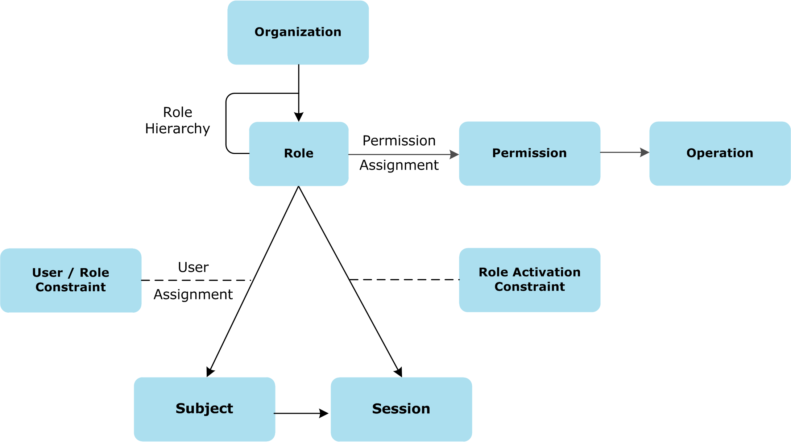

{
    "title": "The RBAC model",
    "linkTitle": "The RBAC model",
    "weight": "100"
}This product implements an RBAC model to manage identity and access control. This model is based on the concept that there are actually few roles within an organization, and instead of assigning access to each individual resource, the permission can be assigned to roles, and then those roles assigned to users. This process makes it much easier to manage permissions. It is not necessary to review the complete list of users each time a new resource is added, but only to review the list of roles. In the same way it is not necessary to review the complete list of resources each time a new user is added, but only to review the list of roles.

The following diagram illustrates an RBAC model.



The following describes how the RBAC model works:

-   A role is a list of permissions (or privileges).
-   A permission is the right to execute one or multiple actions on one resource.
-   When using a permission, it becomes an operation.
-   Roles can be grouped to create hierarchical roles.
-   Roles belong to an organization.
-   When assigning a role to a subject (or user), it is possible to create a User/Role constraint to limit the scope of the role for this subject.
-   To define these constraints, attributes can be associated with Resources.
-   When the subject starts using a role, a session is created. When creating the session, it is possible to limit the scope of the role for this particular session through a role activation constraint.

For example:

-   A role is delegated administrator
-   Permissions are Manage Business Units
-   Operations on resource are: Create, Read, Update, Delete
-   A resource is a Business Unit
-   The User/Role constraint is a concrete Delegated Administrator
-   The constraint is added when assigning this role to a subject (User)
