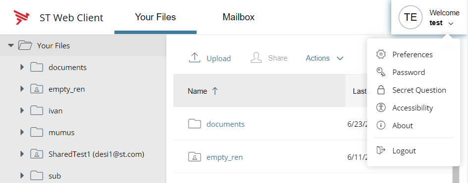

{
    "title": "Set secret question and account preferences ",
    "linkTitle": "Set secret question and account preferences ",
    "weight": "60"
}The controls for these actions are all located in the account preferences menu. All available options are intuitive and simple to operate. This section provides brief instructions on account-related actions such as:

-   Set preferences
-   Reset password
-   Set a secret question-answer pair
-   Reset your ST Web Client password
-   View Accessibility controls
-   View product version
-   Log out

Click on the downward arrow button to open the menu with account settings and then on the option you want to configure:



## Set preferences

The Preferences allow you to change the language of ST Web Client, as well as the transfer mode: Binary (recommended) vs. ASCII text (in some cases required for XML, HTML, or TXT files).

Click **Save** to apply your changes.

## Reset password

<table cellpadding="0" cellspacing="0">
   <col/>
   <col/>
   <col/>
      <tr>
         <td valign="top">         </td>
         <td valign="top"><b>Note</b>
         </td>
         <td data-mc-autonum="&lt;b&gt;Note&lt;/b&gt;" valign="top">This functionality does not apply to LDAP and SSO users.         </td>
      </tr>
</table>

To change your password, you must enter your current password and then type and re-type in your new password .

Click **Save** to apply your changes.

## Select a secret question

The answer to your selected secret question acts as a security step to ensure that you are entitled to reset your password.

Click the option in the menu to display the *Secret question* box. You must enter your current password, then select a question from the available list and type in your answer. Your answer can be any string you enter. On password reset (or forgotten password) procedure, you must supply this answer to your selected question.

When you are done, click **Save** to apply your changes. Your ST Web Client session is started.

<table cellpadding="0" cellspacing="0">
   <col/>
   <col/>
   <col/>
      <tr>
         <td valign="top">         </td>
         <td valign="top"><b>Note</b>
         </td>
         <td data-mc-autonum="&lt;b&gt;Note&lt;/b&gt;" valign="top">The  secret question feature must be enabled on your system to allow using its functionality in ST Web Client.         </td>
      </tr>
</table>

## Accessibility

Click **Accessibility** to view the keyboard controls for navigation and usage within the ST Web Client.

## About: ST Web Client version

Click **About** to view the ST Web Client version you are using.

## Log out from ST Web Client

Click **Logout** to end your log-in session and leave ST Web Client.

 

next topic: [Manage files and folders](../../02-manage_files_and_folders)
