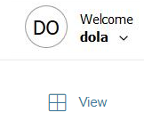

{
    "title": "Get started with ST Web Client",
    "linkTitle": "Get started with ST Web Client",
    "weight": "40"
}The ST Web Client provides basic in-browser secure file transfer and email client capabilities to end users. Basically put, the file transfer processes in ST Web Client involve some or all of the following actions:

-   upload files to selected folders
-   share these folders with selected users
-   download files from selected folders, shared with you
-   send /receive emails and email notifications associated with file transfers and folder sharing

This section covers the following subtopics:

-   Prerequisites
-   [Sign in to ST Web Client](#sign)
-   [Get to know the ST Web Client user interface](#get)

## Prerequisites

To be able to access ST Web Client, you will need:

-   an appropriate device connected to the Internet with one of the following supported web browsers:  
    
    -   Microsoft Internet Explorer 11
    -   Microsoft Edge - latest version
    -   Mozilla Firefox - latest version
    -   Apple Safari - latest version
    -   Google Chrome - latest version
-   a URL supplied to you by your company for ST Web Client connection to respective SecureTransport service. This URL is usually in the format: `https://st.example.com:443`
-   either a sign-in credentials (user ID and password) to the ST Web Client, or a specially produced certificate for your user. The credentials and / or certificates are issued and supplied to you by your company.

After you have everything prepared, you can go on and sign in to the ST Web Client

## Sign in to ST Web Client

You can sign in to ST Web Client via user account credentials or via a certificate.

### Sign in using account credentials

<table cellpadding="0" cellspacing="0">
   <col/>
   <col/>
   <col/>
      <tr>
         <td valign="top">         </td>
         <td valign="top"><b>Note</b>
         </td>
         <td data-mc-autonum="&lt;b&gt;Note&lt;/b&gt;" valign="top">This functionality does not apply to SSO users.         </td>
      </tr>
</table>

To sign in to ST Web Client, open the login ST Web Client Sign-in page using the link supplied to you and enter the *User ID* and *Password* credentials (also supplied to you) and click the **Sign in** button. Your ST Web Client session is started.

**Note**: Some features and screens depend on server settings and may not be available. For further information, contact your administrator.

In case you have a user account prepared but have lost your password, contact your SecureTransport administrator.

### Sign in using a certificate

Your organization provide you with your certificate plus instructions to set up your sign-in process.

There is also a combined sign-in process that uses both methods: credentials and a certificate. Again, your organization must provide you with more information.

## Get to know ST Web Client

On your first sign-in session you will see the simple user interface of the ST Web Client. It present two major pages, accessible via the corresponding tab buttons: *Your Files* and *Mailbox*.

-   Your files - provides the controls necessary to create, view and share folders, including the ones shared with you.
-   Mailbox - provides a basic security-oriented email web client.

Simply put, ST Web Client is about sharing folders and exchanging emails with other users. To facilitate these processes, your organization can prepare an Address Book with all your collaboration contacts. It comes useful for quick selection of contacts for exchanging emails and sharing folders.

### *Your files* page

Usually when you open the ST Web Client for the first time, *Your files* page is empty. This means that you have not yet created and shared folders and other users have not shared folders with you.

*Your files* page is separated into a left-hand panel, which contains your folder structure and the right-hand panel which displays the contents of a selected folder.



On the left you see quick navigation links within your parent folder: 'Your files', and the right-hand area shows all its content: folders and files. On the bottom right you can see the total number of items in *Your Files*: all folders and files; followed by the total amount of storage they consume.

For more information, see [Manage folders and files](../02-manage_files_and_folders).

### *Mailbox* page

The Mailbox page provides basic emailing capabilities and is commonly used for sending files via email. You also have the option to protect your emails with a specific secret question-answer pair.



Like the *Your files* page, the screen is organized in a left-hand panel with your email folders; and the right-hand area that displays the contents of a selected folder plus controls to compose new emails or perform additional actions, like add a new folder or subfolder in your email. For more information, see [Manage Mailbox](../03-manage_mail).

#### Toggle view format

You can toggle your view format on both pages (*Your Files* or *Mailbox*) from list format to thumbnail format:



### Account preferences menu

Access the Welcome menu via the respective button on the top left corner. The menu allows you to set account-related configurations (like your secret question) and ST Web Client preferences as well as log out of the ST Web Client.

**Related topics**

-   For information on folder sharing and sending of files, see [Manage folders and files](../02-manage_files_and_folders).
-   For information on email handling and management in the ST Web Client, see [Manage Mailbox](../03-manage_mail).
-   next topic: [Set secret question and account preferences](011-account-actions)
