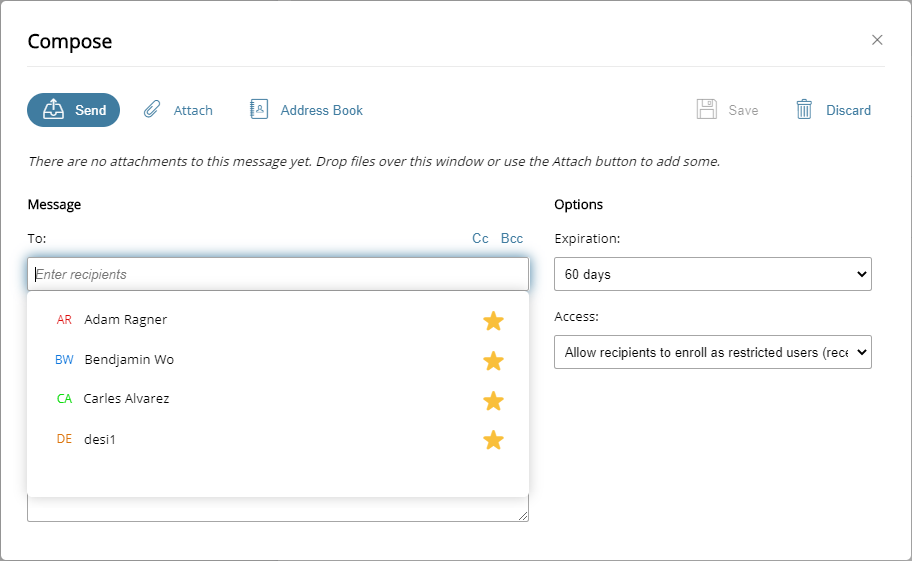

{
    "title": "Manage mail",
    "linkTitle": "Manage mail",
    "weight": "60"
}<table cellpadding="0" cellspacing="0">
   <col/>
   <col/>
   <col/>
      <tr>
         <td valign="top">         </td>
         <td valign="top"><b>Note</b>
         </td>
         <td data-mc-autonum="&lt;b&gt;Note&lt;/b&gt;" valign="top">If the <em>Mailbox</em> feature is not available, contact your system administrator.         </td>
      </tr>
</table>

You can send and receive emails with ST Web Client, similar to any other email client. You can save a message to your Draft folder, move emails to different folders, forward or reply to all, and discard messages. You can also create and manage email folders.

## Compose mail

To compose an email message:

1.  From the *Mailbox* pane, click **Compose**. The *Compose* pane opens.  
    
    
2.  Enter the email address of the recipient or select a name or group from the Address Book. For details, see [Address Book](../02-manage_files_and_folders/021-address_book).
3.  Enter a subject and compose the message.
4.  (optional) Attach a file. Select **Attach** and select the file or drag a file from your computer and drop it on the *Compose* pane. The name of the file is displayed.
5.  Select the email expiration time period for message from the **Expiration** drop-down menu.
6.  Select the user access restrictions for the message from the **Access** drop-down menu. The options are:
    -   **Send attachment link only** - A link to the attachment will be sent to the receiver.
    -   **Protect attachment link with a security question** - The receiver will have to answer the security question to access the link.
7.  Once the body of the email is composed, expiration and access are set, and the desired attachments are added, click **Send** or click **Discard** to delete the open email.  
    When you click **Send**, the status of the email will be verified before *Compose* pane closes. If the email is blocked, a blocked message alert will be displayed.

To save a draft of the email, click **Save**.

## Received emails and attachments

Received mails always enter the *Inbox* folder. Therefore, initially, all attachments are in that folder as well. You can move attachments to desired folders:

1.  From the *Mailbox* pane, select the *Inbox* folder.
2.  Click the desired email to open.
3.  Click the attachments and save them to the desired folder.

## Create or delete mailbox folders

The Mailbox structure in folders is flat: this means that any folder you create is on the same level as that of the *Inbox*, for example. You are not allowed to have subfolders.

To create a mailbox folder:

1.  From the *Mailbox* pane, select **Create folder** on the *Actions* menu. The *Create folder* pane is displayed.

<!-- -->

1.  Enter the **Folder name**.
2.  Click **Create**.

### Delete mailbox folders

To delete a mailbox folder:

1.  From the *Mailbox* pane, select the folder you want to delete.
    Press **Ctrl** or **Shift** on your keyboard and use your mouse left-click to select multiple folders.

<table cellpadding="0" cellspacing="0">
   <col/>
   <col/>
   <col/>
      <tr>
         <td valign="top">         </td>
         <td valign="top"><b>Tip  </b>
         </td>
         <td data-mc-autonum="&lt;b&gt;Tip  &lt;/b&gt;" valign="top">You can also right-click on the folder.         </td>
      </tr>
</table>

1.  Select **Delete** from the *Actions* menu.
2.  Confirm the deletion.
