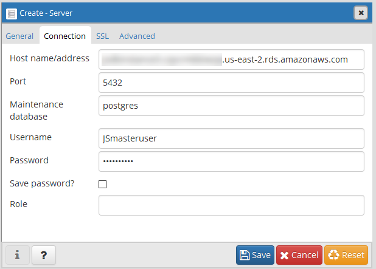

{
    "title": "Connect and configure PostgreSQL",
    "linkTitle": "Connect and configure PostgreSQL",
    "weight": "110"
}Follow these instructions if you will be using PostgreSQL with your SecureTransport deployment. If you will be using Oracle DB, see [Connect and configure Oracle DB](../connect-oracle) .

## Connect to your PostgreSQL database

Connect to a PostgreSQL DB instance using pgAdmin

1.  Find the endpoint (DNS name) and port number for your DB Instance.
    1.  Open the RDS console and then choose Databases to display a list of your DB instances.
    2.  Choose the PostgreSQL DB instance name to display its details.
    3.  On the Connectivity & security tab, copy the endpoint. Also, note the port number. You need both the endpoint and the port number to connect to the DB instance.

      
    
    
2.  Install [pgAdmin](http://www.pgadmin.org/). You can download and use pgAdmin without having a local instance of PostgreSQL on your client computer.
3.  Launch the pgAdmin application on your client computer.
4.  On the **Dashboard** tab, choose **Add New Server**.
5.  In the Create - Server dialog box, type a name on the General tab to identify the server in pgAdmin.
6.  On the Connection tab, type the following information from your DB instance:
7.  For **Host**, type the endpoint, for example mypostgresql.c6c8dntfzzhgv0.us-east-2.rds.amazonaws.com.
8.  For **Port**, type the assigned port.
9.  For **Username**, type the user name that you entered when you created the DB instance.
10. For **Password**, type the password that you entered when you created the DB instance.  
    
    
      
    **Note** The PostgreSQL user in AWS RDS does not have superuser rights.
11. Click **Save**.
12. To access a database in the pgAdmin browser, expand Servers, the DB instance, and Databases. Choose the DB instance's database name.
13. To open a panel where you can enter SQL commands, choose Tools, Query Tool.

### Connect to a PostgreSQL DB instance over SSL

1.  Download the certificate. For information about downloading certificates, see [Using SSL/TLS to encrypt a connection to a DB instance](https://docs.aws.amazon.com/AmazonRDS/latest/UserGuide/UsingWithRDS.SSL.html) in the AWS documentation.
2.  Import the certificate into your operating system. For sample scripts that import certificates, see [Sample script for importing certificates into your trust store](https://docs.aws.amazon.com/AmazonRDS/latest/UserGuide/UsingWithRDS.SSL-certificate-rotation.html#UsingWithRDS.SSL-certificate-rotation-sample-script) in the AWS documentation.
3.  Connect to your PostgreSQL DB instance over SSL.

## Create tables and set ownership of the PostgreSQL Database

<table cellspacing="0">
   <col/>
   <tbody>
      <tr>
      </tr>
   </tbody>
</table>

1.  Create "user/login":  
    

    <table cellspacing="0">
   <col/>
   <tbody>
      <tr>
         <td>
            
CREATE ROLE user/login WITH

            
   LOGIN

            
   NOSUPERUSER

            
   NOCREATEDB

            
   NOCREATEROLE

            
   INHERIT

            
   NOREPLICATION

            
   CONNECTION LIMIT -1

            
   PASSWORD 'xxxxxx';

         </td>
      </tr>
   </tbody>
</table>

2.  Grant privileges to user:  
    

    <table cellspacing="0">
   <col/>
   <tbody>
      <tr>
         <td>GRANT "user/login" TO postgres;         </td>
      </tr>
   </tbody>
</table>

3.  Create tablespaces the following tablespaces:

    -   st\_data

    <table cellspacing="0">   <col/>   <tbody>      <tr>         <td>CREATE TABLESPACE st_data            
OWNER postgres
            
GRANT CREATE ON TABLESPACE st_data TO ‘user/login’;
         </td>      </tr>   </tbody></table>

    -   st\_filetracking

    <table cellspacing="0">   <col/>   <tbody>      <tr>         <td>            
CREATE TABLESPACE st_filetracking
            
OWNER postgres
            
GRANT CREATE ON TABLESPACE st_filetracking TO ‘user/login’;
         </td>      </tr>   </tbody></table>

    -   st\_serverlog

    <table cellspacing="0">   <col/>   <tbody>      <tr>         <td>            
CREATE TABLESPACE st_serverlog
            
OWNER postgres
            
GRANT CREATE ON TABLESPACE st_serverlog TO ‘user/login’;
         </td>      </tr>   </tbody></table>

4.  create database  
    

    <table cellspacing="0">
   <col/>
   <tbody>
      <tr>
         <td>
            
CREATE DATABASE 'dbname'

            
   WITH

            
   OWNER = 'user/login'

            
   ENCODING = 'UTF8'

            
   CONNECTION LIMIT = -1;

         </td>
      </tr>
   </tbody>
</table>
