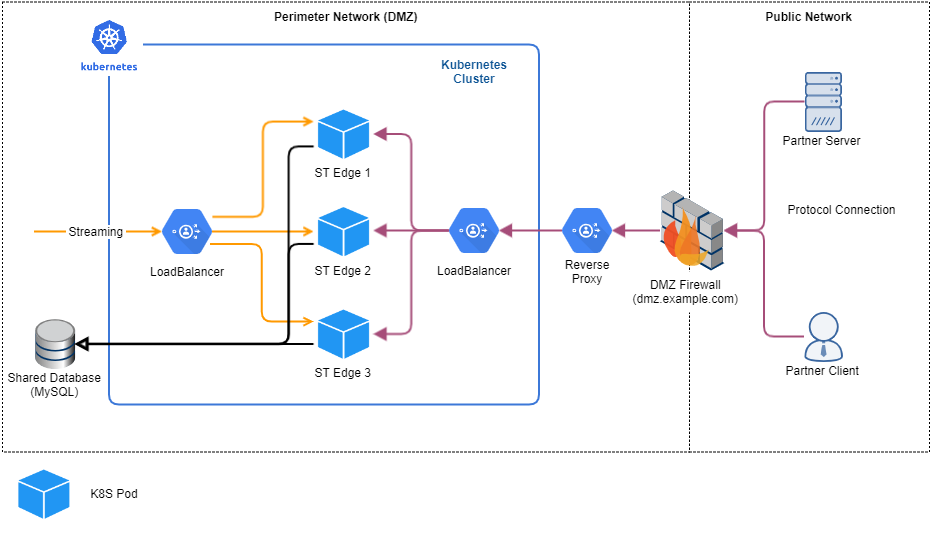

{
    "title": "Configure the deployment",
    "linkTitle": "Configure the deployment",
    "weight": "90"
}At this point you have deployed one Edge, one Server and have established the streaming. At this stage the deployment is usable but some features require specific configurations in a containerized environment. This topic will cover the configurations of the following functionality:

-   AS2 Asynchronous Receipts
-   FTP Passive Mode
-   SOCKS Proxy configuration
-   SecureTransport plugins

## AS2 Asynchronous Receipts

If you want to use AS2 asynchronous receipts you must configure Asynchronous Receipt Receiver from the *Administration Tool -> Setup -> AS2 Settings -> Asynchronous Receipt Receiver*. The settings should be configured on both backend and edge pointing to the external load balancer FQDN and its port which redirects the traffic to the SecureTransport Servers/Edges.

## FTP Passive Mode

Configuring Passive FTP with multiple FTP servers is a complicated task. The Passive FTP protocol has the following usage pattern:

-   An FTP Client initiates a connection on the control/command channel (usually port 21)
-   The load balancer redirects the client to one of the alive FTP servers
-   The FTP Client authenticates and issues the PASV command to enable Passive Mode
-   The FTP server replies with IP and Passive Port from its range
-   The FTP server starts listening on the Passive Port and waits for the FTP Client to connect
-   The FTP client opens the Data Channel by connecting to the IP and Port received in the PASV command
-   The FTP client starts the file transfer

The biggest challenge is ensuring that the control channel and data channel connections will reach the same server for a given FTP Client. Configuring Passive FTP when there are multiple FTP Servers involved:

1.  "Sticky Sessions"  
    
    -   This configuration requires only a Load Balancer but it must have access to the real FTP Client Source IP
    -   Configuring Sticky Sessions on the LB ensures that the FTP client will communicate with the same FTP server over the control and data channels
    -   In this setup the Passive Port range on all FTP Servers must be the same
2.  "Unique Passive Port Ranges"   
    
    -   This configuration requires a Load Balancer and some Firewall rules
    -   The load balancer does not need to know the real FTP client source IP
    -   The proper routing of the data channel happens by using different Passive Port ranges on each FTP Server (30001-30100, 30101-30200, 30201-30300, etc)
    -   In order to route the FTP Client request properly, the firewall must have a set of rules that redirect the client requests to a specific FTP server based on the destination port specified in the request

When SecureTransport is deployed as a container, only the "Sticky Sessions" approach can be implemented because when the SecureTransport Edges are deployed in Kubernetes as StatefulSet(s), all pods share the same configuration (i.e. the same Passive FTP port range).

The diagram below shows a sample deployment that can handle Passive FTP in Kubernetes.



To configure Passive FTP connections with Sticky sessions, a Reverse proxy must be deployed outside of the Kubernetes cluster, which will forward the client IP address to the internal load balancer.

Without the Reverse Proxy, the FTP clients will connect to the Kubernetes NodePort service of the Load Balancer pod(s) to open the FTP command channel. Packets sent to Services with Type NodePort are source NAT’d by default so the client IP is lost and the sticky session routing cannot be performed. See the [official Kubernetes documentation](https://kubernetes.io/docs/tutorials/services/source-ip/ "Kubernetes documentation: Source IP") for more info.

To successfully implement Passive FTP in a Containerized Deployment, the following components are required:

1.  **Reverse Proxy** (HAProxy, for example) must be deployed outside the Kubernetes cluster
    -   Requires access to the real client IP address (in some environments the Reverse Proxy must be deployed on the DMZ firewall)
    -   Must support the Proxy protocol that allows forwarding the real client source IP address to the Load Balancer down the chain
2.  **Load Balancer** (HAProxy, for example) must be deployed inside the Kubernetes Cluster:
    -   Must keep an up to date list of available Edge Pods as the K8S StatefulSet scales up or down
    -   Understands the Proxy protocol and performs "Sticky Session" routing based on real client source IP address forwarded by the Reverse Proxy

You can find more information with sample HAProxy and Kubernetes manifest in the [Deployment prerequisites](../deployment-prerequisites).

### Configuration in SecureTransport

To achieve the above-mentioned setup some configuration must also be applied on SecureTransport.

-   Configure the port of the FTP server to be the same as the NodePort service. The FTP port must be the same across load balancers and the reverse proxy.
-   Configure the passive port range to which the FTP clients will open data channel – it must be configured on the FTP server via the *Administration Tool -> Server control page -> “FTP Default” server settings -> FTP Passive Mode*. Set start port and number of following ports to be opened. The range must be the same as the one configured on the load balancer as well as on the external reverse proxy.
-   In order for the FTP clients to "know" on which address they should open the data channel, the "FTP Passive Mode Address Rules" must be configured on SecureTransport via the *Administration Tool -> Setup -> FTP Settings -> FTP Passive Mode Address Rules*. Create an entry with “\*” for user class and the FQDN of the external load balancer as Passive Address. Click **Add** and **Save** in order to preserve the changes.

<table cellpadding="0" cellspacing="0">
   <col/>
   <col/>
   <col/>
      <tr>
         <td valign="top">         </td>
         <td valign="top"><b>Note</b>
         </td>
         <td data-mc-autonum="&lt;b&gt;Note&lt;/b&gt;" valign="top">The above configuration is applicable both for SecureTransport servers and edges if FTP is used.         </td>
      </tr>
</table>

## SOCKS Proxy configuration

In order to set up the SOCKS5 proxy of Edge servers, a NodePort service must be created in the SecureTransport Edge Kubernetes Configuration files. On the external load balancer, a configuration port should be forwarded to the Kubernetes node ports. The SOCKS proxy can be configured in the same zone as the other streaming protocols enabled to the SecureTransport edge servers.

On the SecureTransport edges the IP/FQDN of the default gateway must be configured in the *Administration Tool -> Setup -> Allowed SecureTransport Servers*. The default FQDN/IP is `"10.44.0.0"`

<table cellpadding="0" cellspacing="0">
   <col/>
   <col/>
   <col/>
      <tr>
         <td valign="top">         </td>
         <td valign="top"><b>Note</b>
         </td>
         <td data-mc-autonum="&lt;b&gt;Note&lt;/b&gt;" valign="top">This way the authentication of allowed ST servers is not secure. Every request will be accepted as authenticated as the client IP cannot be retrieved from the Kubernetes Node port service. Please use at your own risk.         </td>
      </tr>
</table>

## Configure plugins for SecureTransport

Plugins can be enabled in docker easily be mounting the `FDH/plugins` directory to a shared directory containing all the plugins you want to deploy. This way the configuration and plugins will be preserved on container restart. You can mount the directory containing the desired plugins as Kubernetes using NFS or any other shared file system.

Example which can be applied in the SecureTransport Server Kubernetes configuration file:

<table cellspacing="0">
   <col/>
   <tbody>
      <tr>
         <td>
            
volumes:

            
- name: plugins-volume

            
nfs:

            
server: &lt;NFS-server&gt;

            
path: &lt;absolute-path-to-plugins-directory&gt;

            
volumeMounts:

            
- name: plugins-volume

            
mountPath: /home/stuser/Axway/SecureTransport/plugins

         </td>
      </tr>
   </tbody>
</table>

<table cellpadding="0" cellspacing="0">
   <col/>
   <col/>
   <col/>
      <tr>
         <td valign="top">         </td>
         <td valign="top"><b>Note</b>
         </td>
         <td data-mc-autonum="&lt;b&gt;Note&lt;/b&gt;" valign="top">The padding pattern of the Kubernetes configuration file must be followed.          </td>
      </tr>
</table>

Note that mounting directory will override the contents of the plugins directory present in the SecureTransport image. Please back up the files using the following command and place them in the persistent storage directory which will be mounted.

<table cellspacing="0">
   <col/>
   <tbody>
      <tr>
         <td>
            
mkdir /tmp/plugins_folder

            
chmod 770 /tmp/plugins_folder

            
docker run --rm --entrypoint '' -v /tmp/plugins_folder/:/tmp/plugins_folder securetransport-server:5.5 /bin/bash -c 'cp -R $ST_HOME/plugins /tmp/plugins_folder'

         </td>
      </tr>
   </tbody>
</table>

## Supported SecureTransport environment variables in containers

<table cellspacing="0">
   <thead>
      <tr>
         <th>Parameter</th>
         <th>Description</th>
      </tr>
   </thead>
   <tbody>
      <tr>
         <td>
            
ST_CORE_LICENSE

         </td>
         <td>The contents of the SecureTransport Core license          </td>
      </tr>
      <tr>
         <td>
            
ST_FEATURE_LICENSE

         </td>
         <td>The contents of the SecureTransport Feature license          </td>
      </tr>
      <tr>
         <td>
            
ST_CONTAINER_CONFIG_PATH

         </td>
         <td>The location of the SecureTransport Configuration file (to enable/disable/configure SecureTransport services)         </td>
      </tr>
      <tr>
         <td>
            
ST_START_SCRIPTS_CONF_PATH

         </td>
         <td>The location inside the container of the file that specifies the JVM settings for the running services         </td>
      </tr>
   </tbody>
</table>

*next topic:* [Scale the deployment](../scale-deployment)
