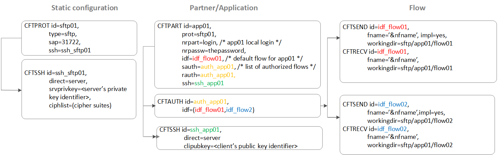

{
    "title": "Configure the Transfer CFT SFTP server",
    "linkTitle": "Configure the Transfer CFT SFTP server",
    "weight": "160"
}T**he supported operating systems are listed in the** [Platform features](../../../datasheet) **table.**

This section describes how to set up Transfer CFT to use as a server with the SFTP protocol.

To set up the Transfer CFT as server:

1.  Set the partner protocol to SFTP.
2.  Add the key in the PKI database.
3.  Define the SSH parameter connection for SFTP.
4.  Define a partner to use in a flow.
    -   Add the desired amount of authentication.
    -   Define a default flow model identifier.
5.  Create send and receive templates.

## Set the protocol (CFTPROT) to use with the partner

The following parameters are used for SFTP protocol:

-   TYPE: SFTP
-   SAP: TCP/IP port for the SFTP server
-   SSH: Link to a CFTSSH object (DIRECT=SERVER)
-   NET: Link to a CFTNET definition

Example

<table cellspacing="0">
   <col/>
   <tbody>
      <tr>
         <td>
            
CFTPROT id       = SFTP,

<blockquote>
            
 TYPE = 'SFTP', 

            
SSH = 'SSH_DEFAULT', 

            
SAP = '1763',

            
NET = NET0,

</blockquote>
            
    ...

         </td>
      </tr>
   </tbody>
</table>

## Add the server key in the PKI database (PKIKEYGEN or PKIKEY)

You can use either the PKIKEYGEN command or the PKIKEY command to add the server key in the database. For more information, see [Generate and manage keys](../new_pki_keys_use).

Example

<table cellspacing="0">
   <col/>
   <tbody>
      <tr>
         <td>
            
PKIKEYGEN id=MY_KEY, keylen=2048

         </td>
      </tr>
   </tbody>
</table>

## Define the SSH server profile (CFTSSH)

This section you use CFTSSH to define a SSH profile in Transfer CFT. The CFTSSH definition contains the SSH parameter connection for SFTP in server mode.

-   ID: Identifier of the object
-   DIRECT=SERVER
-   SRVPRIVKEY: Key Id containing the server private key (RSA) to use with key authentication.
    -   If SRVPRIVKEY(CFTSSH direct=server) is not set, Transfer CFT cannot start, and the message displays CFTN05E SFTP bind() failed: ECDSA, DSA, or RSA host key file must be set.

Example

<table cellspacing="0">
   <col/>
   <tbody>
      <tr>
         <td>
            
CFTSSH id = SSH_DEFAULT,

<blockquote>
            
DIRECT = SERVER,

            
SRVPRIVKEY = MY_KEY,

            
...

</blockquote>
         </td>
      </tr>
   </tbody>
</table>

## Define a partner (CFTPART) for a flow

A CFTPART object represents an application, with one SFTP user per application (CFTPART = one application). To define a CFTPART object in server mode using SFTP:

-   NRPART: Corresponds to the client login. You cannot have 2 partners with the same NRPART value.
-   PROT: Refers to the SFTP protocol

<table cellpadding="0" cellspacing="0">
   <col/>
   <col/>
   <col/>
      <tr>
         <td valign="top">         </td>
         <td valign="top"><b>Note</b>
         </td>
         <td data-mc-autonum="&lt;b&gt;Note&lt;/b&gt;" valign="top">The following sections detail authentication for the partner in flows.          </td>
      </tr>
</table>

## Set the type of authentication

Select the appropriate type of authentication to use from the options listed in this section. For more information, please see [SSH concepts](../sftp_keys_concepts)
(SFTP).

### Password authentication

There are two ways for you to configure how the server will check the client password:

-   Clear text: When NRPASSW=&lt;the user password>, the client password is in clear text.

<!-- -->

-   Uconf definition: When NRPASSW=\_AUTH\_, authentication is specified in uconf:cft.server.authentication\_method is used.

<table cellpadding="0" cellspacing="0">
   <col/>
   <col/>
   <col/>
      <tr>
         <td valign="top">         </td>
         <td valign="top"><b>Note</b>
         </td>
         <td data-mc-autonum="&lt;b&gt;Note&lt;/b&gt;" valign="top">If you do not define NRPASSW, there is no password authentication.         </td>
      </tr>
</table>

<table cellspacing="0">
   <col/>
   <tbody>
      <tr>
         <td>
            
CFTPART id          = USER1,

<blockquote>
            
        prot        = SFTP,
       
        

            
nrpart      = "user1",              

            

        nrpassw     = "TheUser1Password", ...

</blockquote>
            
<![CDATA[
]]>

            
CFTTCP id          = USER1,
        

<blockquote>
            
host        = 127.0.0.1,
       ...

</blockquote>
         </td>
      </tr>
   </tbody>
</table>

When using password authentication

-       

### Key authentication

To configure how the server check the client key (CFTSSH), define:

-   Identifier: CLIPUBKEY can refer to an identifier in the local PKI database.

Which CLIPUBKEY is used for the SSH profile is determined as follows:

-   To use a specific SSH profile, you must define it in CFTPART 
-   If you do not define a specific SSH profile, then the server uses the one defined by default in CFTPROT 

This example illustrates a specific SSH profile (SSH\_USER2 below).

<table cellspacing="0">
   <col/>
   <tbody>
      <tr>
         <td>
            
CFTPART id          = USER2,
        

<blockquote>
            
ssh         = SSH_USER2,
        

            
prot        = SFTP,
        

            
nrpart      = "user2", ...

</blockquote>
            
 

            
        CFTTCP id          = USER2,
        

            
host        = 127.0.0.1, ...       
        

            
 

            
CFTSSH id         = SSH_USER2,
        

<blockquote>
            
direct     = SERVER,
        

            
clipubkey  = USER2,         ...

</blockquote>
         </td>
      </tr>
   </tbody>
</table>

<table cellpadding="0" cellspacing="0">
   <col/>
   <col/>
   <col/>
      <tr>
         <td valign="top">         </td>
         <td valign="top"><b>Note</b>
         </td>
         <td data-mc-autonum="&lt;b&gt;Note&lt;/b&gt;" valign="top">Do not forget that you must import the client's public key in the server's database as shown below:          </td>
      </tr>
</table>

<table cellspacing="0">
   <col/>
   <tbody>
      <tr>
         <td>PKIUTIL pkikey id='USER2', ikname='user2.pub', ikform='ssh'         </td>
      </tr>
   </tbody>
</table>

### Password and key authentication

When using **password and key** authentication:

-   NRPASSW: Use one of the password authentication methods to configure how the server will check the client password, as described [here](#password)
-   CLIPUBKEY: To configure how the server will check the client key, as described [here](#key)

<!-- -->

-   <table cellspacing="0">
   <col/>
   <tbody>
      <tr>
         <td>
            
CFTPART id          = USER3,
        

<blockquote>
            
ssh         = USER3,
        

            
prot        = SFTP,
        

            
nrpart      = "user3", 

            
nrpassw = "TheUser3Password",...

</blockquote>
            
 

            
        CFTTCP id          = USER3,
        

<blockquote>
            
host        = 127.0.0.1, ...       
        

</blockquote>
            
 

            
CFTSSH id         = USER3,
        

<blockquote>
            
direct     = SERVER,
        

            
clipubkey  = USER3,         ...

</blockquote>
         </td>
      </tr>
   </tbody>
</table>

### Define a default flow model for a partner (IDF)

This section describes how to specify a default flow model identifier (IDF) to use if a client does not provide a flow name. In Transfer CFT, this is the CFTPART default IDF.

<table cellspacing="0">
   <col/>
   <tbody>
      <tr>
         <td>CFTPART id=partner,IDF=&lt;default_model_for_this_partner&gt;,…         </td>
      </tr>
   </tbody>
</table>

If the remote path is absolute (root directory), Transfer CFT uses the root directory as the IDF. In this example, flow01 corresponds to the IDF for this partner.

<table cellspacing="0">
   <col/>
   <tbody>
      <tr>
         <td>put LocalFile01.txt /flow01/RemoteFile01.txt         </td>
      </tr>
   </tbody>
</table>

### Define the authorization list for a partner (CFTAUTH)

In the CFTAUTH command, the IDF parameter designates a list
of authorized IDFs for send/receive transfers with a defined partner. You can use these parameters to limit the visibility for a given user, when in server mode, to a logical representation of available flows. The SAUTH/RAUTH in the partner definition refers back to the CFTAUTH ID.

For more information, see [CFTAUTH](../../../c_intro_userinterfaces/web_copilot_ui/flow_def_intro/cftauth).

In the following example, defining a CFTAUTH creates visibility for **flow01** and **flow02** for the user2 client.

<table cellspacing="0">
   <col/>
   <tbody>
      <tr>
         <td>
            
CFTPART ID=user2, IDF=(flow02), NRPART="user2", SAUTH=AUTH2, RAUTH=AUTH2...

            
CFTAUTH ID=auth2, IDF=(flow01,flow02) 

            
 

            
CFTSEND IDF=flow01, IMPL=YES, workingdir=flow1_space, fname=&amp;nfname

            
 

            
CFTSEND IDF=flow02, IMPL=YES, workingdir=flow2_space, fname=&amp;nfname

            
CFTRECV IDF=flow02, workingdir=user2_space, fname=&amp;nfname

         </td>
      </tr>
   </tbody>
</table>

The view for a third-party software client would resemble the following (where the flow identifier displays, but not the physical folder name). Note that in this example, the `workingdir `is relative to the runtime directory.

> 

If you enter an \* (asterisk),
all model files (IDFs) can be used. If the provided IDF is not in one of the two lists, the connection is rejected and the Transfer CFT client returns a DIAGI 411.

See the examples in [SFTP use case examples](../cftssh_example).

If the provided IDF does not belong to either the SAUTH or RAUTH list, on the server side, the connection is rejected and the Transfer CFT client returns a DIAGI 413.

<table cellpadding="0" cellspacing="0">
   <col/>
   <col/>
   <col/>
      <tr>
         <td valign="top">         </td>
         <td valign="top"><b>Note</b>
         </td>
         <td data-mc-autonum="&lt;b&gt;Note&lt;/b&gt;" valign="top">For a put command on the client side, the IDF must be defined in the RAUTH on the server side. For a get command, the IDF must be defined in the SAUTH on the server side.          </td>
      </tr>
</table>

<table cellpadding="0" cellspacing="0">
   <col/>
   <col/>
   <col/>
      <tr>
         <td valign="top">         </td>
         <td valign="top"><b>Note</b>
         </td>
         <td data-mc-autonum="&lt;b&gt;Note&lt;/b&gt;" valign="top">If you are using both the SAUTH and RAUTH parameters, then you must use the same value for the SAUTH (sending files) and RAUTH (receiving files) for a given CFTPART definition. This means that the client will see only the directories that are authorized by these parameters.         </td>
      </tr>
</table>

Server mode password authentication using restricted flow models



Server mode key and password authentication using restricted flow models



### Creating send and receive templates (CFTSEND/CFTRECV)

When Transfer CFT is acting in server mode note the following requirements:

-   If the client performs a get command, the Transfer CFT must use implicit mode (CFTSEND IMPL=YES) on the server side. If you do not have a model having IMPL=YES, the client cannot perform a download (get) and a permission denied error occurs.
-   If a third-party SFTP client performs a put command, the Transfer CFT server must use open mode (FNAME= &NFNAME). If you do not have a CFTRECV model, the client cannot perform an upload (put) and a permission denied error occurs.

The root directory for the SFTP connection is the WORKINGDIR defined in the CFTSEND (IMPL=YES) or CFTRECV corresponding to the IDF. If both CFTSEND and CFTRECV are defined for that IDF but with different WORKINGDIR, there is a DIAGI 435 error for the Transfer CFT client, and an SFTP failure with an appropriate error message for other SFTP clients.

If the WORKINGDIR is not defined, Transfer CFT uses the current directory (commonly the runtime directory).

When defining the WORKINGDIR, you can use the following symbolic variables:

-   &USERID: user login
-   &NRPART: same as &USERID
-   &PART: partner
-   &HOME: home directory on UNIX, or the user directory on Windows (C:\\Users\\&lt;user>)

Example

In this example, user1 can perform a get or put command using the space (WORKINGDIR) defined for user1.

<table cellspacing="0">
   <col/>
   <tbody>
      <tr>
         <td>
            
CFTPART ID=user1, IDF=flow01, NRPART="user1",... 

            
 

            
CFTSEND IDF=flow01, IMPL=YES, workingdir=user1_space, fname=&amp;nfname 

            
 

            
CFTRECV IDF=flow01, workingdir=user1_space, fname=&amp;nfname

         </td>
      </tr>
   </tbody>
</table>

### Transcoding parameters

You can configure the conversion using FCHARSET/NCHARSET or FCODE/NCODE, where transcoding is performed if FCODE differs from NCODE, or if FCHARSET differs from NCHARSET. The FCHARSET/NCHARSET parameters, however, take precedence over FCODE/NCODE if both are defined. Additionally:

-   The charset and transferred file code are exchanged between the requester and server for two Transfer CFTs.
-   A transfer restart is forbidden if the FCHARSET/NCHARSET conversion is done at the server level.
-   The NCODE parameter is available in CFTRECV as with CFTSEND.

See also, [Transcoding concepts](..//transfercft/protocols_start_here/sftp_intro).

Related topics

[CFTSSH - Security profile](../../../c_intro_userinterfaces/web_copilot_ui/cftssl/cftssh)
