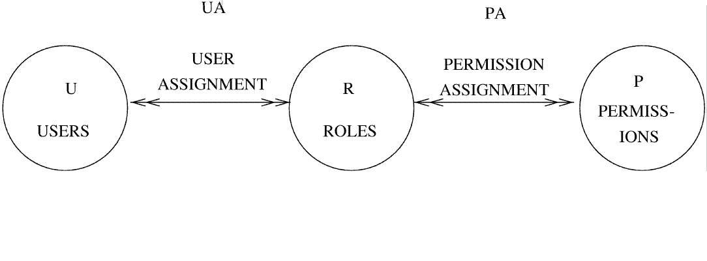

{
    "title": "Delivered exit samples",
    "linkTitle": "Delivered exit samples",
    "weight": "390"
}# Delivered Access Management exit samples

This section describes how to configure access management when not using Central Governance.

Axway delivers an Access Management exit sample, examsmp1.c, in the &lt;CFTDIRRUNTIME&gt;/src/exit directory.

### Services provided by delivered sample

The delivered sample provides two services, authentication and permissions checking.

<table data-cellspacing="0">
<thead>
<tr>
<th>Sample</th>
<th>Authentication</th>
<th>Permissions checking</th>
</tr>
</thead>
<tbody>
<tr>
<td>examsmp1.c</td>
<td>System authentication (Windows only)</td>
<td>Flat file based on flat <a href="javascript:void(0)">RBAC Role Based Access Control</a> model</td>
</tr>
</tbody>
</table>

### Building the dynamic library associated with the sample

To build the exit:

Change the directory to: &lt;CFTDIRRUNTIME&gt;/src/exit

Run the following command:

-   UNIX: make

-   Windows: nmake -f exit.mak

The output is a library located at &lt;CFTDIRRUNTIME&gt;/lib/libcftexam.(so/dll).

## Flat file based on flat RBAC 

To check users rights, Axway delivers a sample flat file based on flat <a href="javascript:void(0)">RBAC Role Based Access Control</a> (Role Based Access Control) located in: &lt;CFTDIRRUNTME&gt;/conf/exam.csv. This file contains a set of permission and user assignments.

## Assigning permission

The following line shows how to add a permission to a role:  

&lt;cmd\_type&gt; &lt;role&gt; &lt;resource&gt; &lt;actions&gt; &lt;policy&gt;

Where:

<table data-cellspacing="0">
<thead>
<tr>
<th>Field</th>
<th>Description</th>
</tr>
</thead>
<tbody>
<tr>
<td>&lt;cmd_type&gt;</td>
<td>PA for Permission Assignment</td>
</tr>
<tr>
<td>&lt;role&gt;</td>
<td>The role for which the permission must be assigned</td>
</tr>
<tr>
<td>&lt;resource&gt;</td>
<td>Name of the resource</td>
</tr>
<tr>
<td>&lt;actions&gt;</td>
<td>List of actions with each action separated by a comma</td>
</tr>
<tr>
<td>&lt;policy&gt;</td>
<td>ACCEPT: accept the actions on the resource 

REFUSE: refuse the actions on the resource</td>
</tr>
</tbody>
</table>

Examples

All available actions on the resource “CONFIGURATION:CFTPARM”:

<table data-cellspacing="0">
<tbody>
<tr>
<td>PA ADMIN CONFIGURATION:CFTPARM CREATE,DELETE,EDIT,VIEW ACCEPT</td>
</tr>
</tbody>
</table>

or

<table data-cellspacing="0">
<tbody>
<tr>
<td>PA ADMIN CONFIGURATION:CFTPARM * ACCEPT</td>
</tr>
</tbody>
</table>

All available actions on resources that start with “CONFIGURATION:” for the ADMIN role:

<table data-cellspacing="0">
<tbody>
<tr>
<td>PA ADMIN CONFIGURATION:* * ACCEPT</td>
</tr>
</tbody>
</table>

All permissions for the ADMIN role:

<table data-cellspacing="0">
<tbody>
<tr>
<td>PA ADMIN * * ACCEPT</td>
</tr>
</tbody>
</table>

All permissions for the ADMIN role except for the resource “TRANSFER”:

<table data-cellspacing="0">
<tbody>
<tr>
<td>PA ADMIN TRANSFER * REFUSE 

PA ADMIN * * ACCEPT</td>
</tr>
</tbody>
</table>

## Assigning users

The following line shows how to add a user to a role:  

&lt;cmd\_type&gt; &lt;role&gt; &lt;users&gt;
<table data-cellspacing="0">
<thead>
<tr>
<th>Field</th>
<th>Description</th>
</tr>
</thead>
<tbody>
<tr>
<td>&lt;cmd_type&gt;</td>
<td>UA for User Assignment</td>
</tr>
<tr>
<td>&lt;role&gt;</td>
<td>The role to which users must be assigned</td>
</tr>
<tr>
<td>&lt;users&gt;</td>
<td>List of users with each user separated by a comma</td>
</tr>
</tbody>
</table>

#### Examples

<table data-cellspacing="0">
<tbody>
<tr>
<td>
UA ADMIN admin,user01,user02

UA DESIGNER user03

UA HELPDESK user03,user04

UA APPLICATION user05
</td>
</tr>
</tbody>
</table>

## Predefined roles

You can find some roles defined in &lt;CFTDIRRUNTIME&gt;/conf/exam.csv.

Predefined roles

<table data-cellspacing="0">
<thead>
<tr>
<th>Role</th>
<th>Description</th>
</tr>
</thead>
<tbody>
<tr>
<td>Administrator</td>
<td>Provides full user access</td>
</tr>
<tr>
<td>Helpdesk</td>
<td>Enables you to view the Catalog and Log</td>
</tr>
<tr>
<td>Partner Manager</td>
<td>Allows you to manage partners</td>
</tr>
<tr>
<td>Designer</td>
<td>Allows you to manage application flows</td>
</tr>
<tr>
<td>Application</td>
<td>Allows applications to request transfers and view the Catalog</td>
</tr>
</tbody>
</table>

The resources and available actions for Transfer CFT are listed in the PassPort AM CSD file.

After installing Transfer CFT, access the CSD file:

&lt;Transfer CFT install directory&gt;/distrib/am/csd\_Transfer\_CFT.xml

For more information, refer to the PassPort AM CSD.

Related topics

[About Access Management exits](../../../internal_access_mgt/am_exits.htm)

[Configuring an Access Management exit](configure_am_exits.htm)

