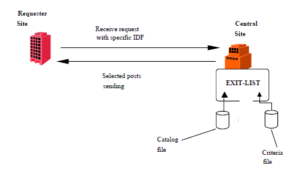

{
    "title": "About exit lists",
    "linkTitle": "About exit lists",
    "weight": "320"
}# About exit lists

An exit list is an optional component supplied with certain Transfer
CFT products. The Exit list is a file exit designed to allow remote partners to consult
the Transfer CFT server's catalog. The Transfer CFT
Exit list is an EXIT used for consulting the catalog.

The Exit list is not supplied with all Transfer CFT products. In addition,
the form in which EXIT is delivered, as object, executable or other code,
depends on the specific product configuration.



The following section explains the high-level steps when using an exit
list.

### 1. Set the exit parameters

Activate the exit list by setting the parameters as shown in the example below.

Remote
requester partner

No specific parameter setting.

Server sender site

<table cellspacing="0">
   <col/>
   <tbody>
      <tr>
         <td>CFTSEND  ID 
 = IDFexit, IMPL = YES, EXIT = IDExitList         </td>
      </tr>
   </tbody>
</table>

<table cellspacing="0">
   <col/>
   <tbody>
      <tr>
         <td>CFTEXIT  ID 
 = IDExitList, LANGUAGE = C, PARM = FileName, RESERV = 16384, PROG = FileExe         </td>
      </tr>
   </tbody>
</table>

<table cellpadding="0" cellspacing="0">
   <col/>
   <col/>
   <col/>
      <tr>
         <td valign="top">         </td>
         <td valign="top"><b>Note</b>
         </td>
         <td data-mc-autonum="&lt;b&gt;Note&lt;/b&gt;" valign="top">We recommend that you use the value 16384 for the RESERV 
and not modify this parameter value.         </td>
      </tr>
</table>

### 2. Prepare the selection criteria file

After you have set the parameters for the sender site,
load the selection criteria file.
The selection commands contained in this file are described in the section *Selection
criteria file*. You must load this file on the server **before**
requesting the catalog.

The LOGICAL name of the Selection
criteria must be the CFTEXIT command identifier. For z/OS environments, the correspondence between the physical name and the
logical name must be given by the JCL initiating Transfer CFT.

The name of the Selection criteria
file may be defined by  either the:

-   Physical name in
    the PARM parameter, *or*

<!-- -->

-   Logical name, which
    must be the CFTEXIT object identifier

### 3. Make a catalog request

After loading the file, you can make a catalog
request. When you make a file reception request, use the CFTSEND object
identifier that is associated with the Exit list as the IDF.

Example

<table cellspacing="0">
   <col/>
   <tbody>
      <tr>
         <td>CFTUTIL            
RECV     PART 
 = &amp;part, IDF = IDFexit
         </td>
      </tr>
   </tbody>
</table>

The server:

-   Recognizes the
    request for the catalog list using the transfer IDF
-   Processes the Selection criteria file
-   Consults the catalog
-   Sends the entries
    selected from the catalog to the requesting partner as fixed-length records.
    The selection implicitly chooses only catalog entries concerning this
    partner. This means that
    the Exit list does not allow a partner to consult the transfers sent to
    other partners.
