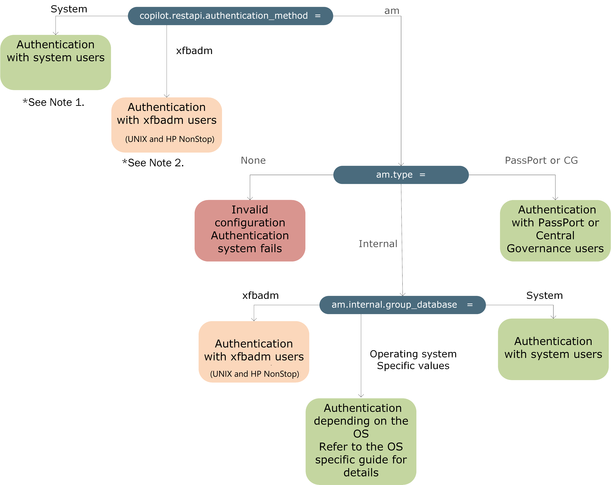

{
    "title": "REST\u00a0API server configuration",
    "linkTitle": "REST\u00a0API server configuration",
    "weight": "310"
}# REST API server configuration

Before you can start using REST API operations with Transfer CFT, you need to set a few parameters in the Transfer CFT configuration.

## Before you start

The REST server is a Copilot service. To start the REST server, use the copstart command to [start Copilot](../administration/manage_copilot.htm).

## Procedure

Transfer CFT requires the following configuration settings before you can use REST API.

1.  Enable the Copilot REST API if you did not do so during installation.

2.  <table data-cellspacing="0">
<tbody>
<tr>
<td>CFTUTIL uconfset id=copilot.restapi.enable, value=yes</td>
</tr>
</tbody>
</table>

3.  Optionally, you can change the REST API server port as follows (default 1768):

4.  <table data-cellspacing="0">
<tbody>
<tr>
<td>CFTUTIL uconfset id=copilot.restapi.serverport, value=&lt;new port&gt;</td>
</tr>
</tbody>
</table>

5.  You require a secure SSL/TLS communication between the client (REST or browser) and the REST server. When using Central Governance, the REST API server automatically uses the SSL business certificate generated during the [registration](../central_governance/cg_register_overview.htm); there is no need to perform this step. This certificate is stored in the internal PKI base and is identified by the Transfer CFT instance ID (uconf:cft.instance\_id).

6.  Otherwise, use UCONF to set the following Copilot parameters to configure the SSL certificate.

7.  <table data-cellspacing="0">
<tbody>
<tr>
<td>
CFTUTIL uconfset id=copilot.ssl.SslCertFile, value=&lt;ssl pkcs12 certificate for copilot&gt;

CFTUTIL uconfset id=copilot.ssl.SslCertPassword, value=&lt;ssl pkcs12 certificate password&gt;
</td>
</tr>
</tbody>
</table>

8.  These parameter settings are described in [Install a certificate on the server side](../administration/manage_copilot.htm#Install).  

9.  Specify the authentication method, as the client must provide credentials (user/password) to the REST server. Set the UCONF the copilot.restapi.authentication\_method parameter.

10. Example

11. <table data-cellspacing="0">
<tbody>
<tr>
<td>CFTUTIL uconfset id=copilot.restapi.authentication_method, value=system</td>
</tr>
</tbody>
</table>

The supported authentication methods are:

<table data-cellspacing="0">
<thead>
<tr>
<th>Authentication method</th>
<th>copilot.restapi.authentication_method</th>
<th>Details</th>
</tr>
</thead>
<tbody>
<tr>
<td>Operating System</td>
<td>system</td>
<td>
The user/password is checked against the operating system.

<table data-cellpadding="0" data-cellspacing="0">
<tbody>
<tr>
<td data-valign="top"></td>
<td data-valign="top"><strong>Note</strong></td>
<td data-mc-autonum="&lt;b&gt;Note&lt;/b&gt;" data-valign="top">We strongly recommend that you set copilot.misc.createprocessasuser=yes when using the system option.</td>
</tr>
</tbody>
</table>

<strong>Unix</strong>

You must use cftsu to create users as a superuser is required (sudo or root privilege) to create a group and assign a user to a group. Refer to <a href="../../../../cft_intro_install/unix_install_start_here/run_first_time_ux/run_first_time_ux/t_adding_system_user_unix">Using system users - UNIX</a> for details.

<ul>
<li>Create a group "group1": groupadd group1</li>
<li>Add user "user1" to group "group1": usermod -a -G group1 user1</li>
</ul>

<strong>Windows</strong>

You require a superuser (administrative user account) to create a group and assign a user to a group.

<ul>
<li>Create a group "group1": net localgroup group1 /add</li>
<li>Add user "user1" to group "group1": net localgroup group1 user1 /add</li>
</ul>
<table data-cellpadding="0" data-cellspacing="0">
<tbody>
<tr>
<td data-valign="top"></td>
<td data-valign="top"><strong>Note</strong></td>
<td data-mc-autonum="&lt;b&gt;Note&lt;/b&gt;" data-valign="top">For a user belonging to a domain, use: domain\user1 instead of user1</td>
</tr>
</tbody>
</table></td>
</tr>
<tr>
<td>Access Management</td>
<td>am</td>
<td>
This methods uses an indirection towards the Access Management system. The user/password is checked by the configured access management system: Flow Manager, PassPort AM, or internal AM.
</td>
</tr>
<tr>
<td>
xfbadm database

(UNIX and HP NonStop exclusively)
</td>
<td>xfbadm</td>
<td>
The user/password is checked using the xfbadm base (see the <a href="../../../../cft_intro_install/unix_install_start_here/run_first_time_ux/use_cft_utilities">xfbadmusr and xfbadmgrp utilities</a>).

A user that can execute xfbadmusr/xfbadmgrp utilities can create users and groups after executing the profile from the runtime directory.

<ol>
<li>Create a group "group1" with gid=200: xfbadmgrp add -G group1 -p group1_pw -g 200</li>
<li>From the user prompt, to add a user "user1" to group "group1"enter: xfbadmusr add -l user1 -p user1_pw -u AUTO -g 200</li>
</ol></td>
</tr>
</tbody>
</table>
REST API server authentication method

<table data-cellpadding="0" data-cellspacing="0">
<tbody>
<tr>
<td data-valign="top"></td>
<td data-valign="top"><strong>Note</strong></td>
<td data-mc-autonum="&lt;b&gt;Note&lt;/b&gt;" data-valign="top">1. If copilot.restapi.authentication_method = system, then your access management type must be set to either am.type= none, or both am.type=internal and am.internal.group_database = system.</td>
</tr>
</tbody>
</table>
<table data-cellpadding="0" data-cellspacing="0">
<tbody>
<tr>
<td data-valign="top"></td>
<td data-valign="top"><strong>Note</strong></td>
<td data-mc-autonum="&lt;b&gt;Note&lt;/b&gt;" data-valign="top">2. If copilot.restapi.authentication_method = xbfadm, then your access management type must be set to either am.type= none, or both am.type=internal and am.internal.group_database = xbfadm.</td>
</tr>
</tbody>
</table>

Parameter

Type

Default

Description

copilot.restapi.enable

bool

No

Enable/disable the REST API service:

-   Yes: enable

-   No: disable

copilot.restapi.serverport

int

1768

REST API server port.

copilot.restapi.authentication\_method

string

system (Windows)

xfbadm (UNIX)

Defines authentication method.

 

See also, [xfbadmusr utilitiy.](../UNIX/UNIX_operations/Utilities/use_cft_utilities.htm#xfbadmusr1)

copilot.restapi.nb\_workers

int

4

Number of activated workers that process the REST API requests.

copilot.restapi.maxclient

int

256

Number of client connections handled per REST worker.

copilot.restapi.coms\_id

string

coms

The TCPIP CFTCOM object identifier used by the REST API server to communicate with the Transfer CFT server.

Leave empty to use

the COM file instead.

copilot.restapi.catalog.retry\_delay

int

5

-   The delay between retries

    in seconds. The Copilot server checks the request status in catalog every retry\_delay seconds.

-   The delay between retries

    in seconds. The Copilot server checks the request status in catalog every retry\_delay seconds.

 

 

 

copilot.restapi.catalog.retry\_timeout

int

30

The default value of the [apiTimeout](api_commands.htm#Manage) parameter as defined in the request URL.

Available exclusively for POST requests.

