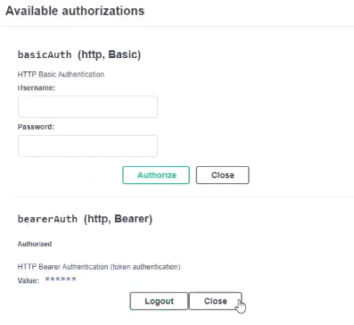

{
    "title": "Swagger UI usage",
    "linkTitle": "Swagger UI usage",
    "weight": "330"
}The Swagger UI is both documentation and a client for the REST API. Each supported API command provides a detailed description, including possible parameters.

Swagger builds the HTTP frames and sends them to the REST server. However, before sending a command you must provide credentials.

#### Authorization

Basic authorization

Enter your Transfer CFT login name and password in the **Username/Password** fields. Click **Authorize**.

Bearer authorization

Copy your token from the Transfer CFT UI My Access Tokens page into the Value field and click Authorize. Click **Authorize**.



<table cellpadding="0" cellspacing="0">
   <col/>
   <col/>
   <col/>
      <tr>
         <td valign="top">         </td>
         <td valign="top"><b>Note</b>
         </td>
         <td data-mc-autonum="&lt;b&gt;Note&lt;/b&gt;" valign="top">See Generate an access token.         </td>
      </tr>
</table>

#### Try it out option

The Try it out option allows you to execute API requests from within the Swagger UI.
