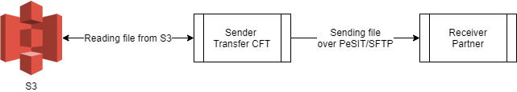

{
    "title": "Amazon S3/Ceph cloud storage",
    "linkTitle": "Amazon S3/Ceph cloud storage",
    "weight": "180"
}You can use Transfer CFT with [Amazon S3](https://aws.amazon.com/s3/) cloud storage to store and retrieve large numbers of files to better manage enterprise big data.

Transfer CFT implements Amazon S3 services using the AWS SDK for C++ (Amazon Web Services Software Development Kit). The Transfer CFT file process uses the AWS SDK to directly deposit or access files (binary) from S3 storage, without saving data on a local hard drive.

## Limitations

-   Available on Linux x86-64 and Windows x86-64 exclusively.
-   Does not support FACTION=RETRYRENAME.
-   The following parameter settings are ignored: WFNAME, FACTION=ERASE or RENAME (S3 creates its own version of the file)
-   You cannot access a file on S3 storage from the Transfer CFT Copilot UI.
-   Groups of files are not supported.
-   When writing a file to S3 storage, the size limit is approximately PACING KiB x 10,000, where PACING is the partner-negotiated value of the RPACING and SPACING parameters (see the [About file size](#about) section below).
-   Transfer CFT Windows presently only supports HTTP proxies (not HTTPS proxies).

## Setup procedure

1.  For SSL connections to S3 storage, libCURL requires a path to the CA certificates bundle to authenticate the peer. Set this path in the UCONF ssl.certificates.ca\_cert\_bundle parameter.

2.  Access keys are used for the AWS credentials, so each user accessing S3 services must have an account allowing access to S3 services. Define the users and access key information in UCONF. For example:  
    

    <table cellspacing="0">
   <col/>
   <tbody>
      <tr>
         <td>
            
CFTUTIL uconfset id=aws.credentials, value=<b>"</b>account1 account2<b>"</b>

            
CFTUTIL uconfset id=aws.credentials.account1.access_key_id, value=<b>"20_characters_string"</b>

            
CFTUTIL uconfset id=aws.credentials.account1.secret_access_key, value=<b>"40_characters_string"</b>

            
CFTUTIL uconfset id=aws.credentials.account2.access_key_id, value=<b>"20_characters_string"</b>

            
CFTUTIL uconfset id=aws.credentials.account2.secret_access_key, value=<b>"40_characters_string"</b>

            
 

            
To check, enter:

            
CFTUTIL listuconf id=aws.credentials*

         </td>
      </tr>
   </tbody>
</table>

## Parameter descriptions

The following table describes Transfer CFT's Amazon S3-related parameters.

<table cellspacing="0">
   <col/>
   <col/>
   <col/>
   <thead>
      <tr>
         <th>Parameter</th>
         <th>Type</th>
         <th>Description</th>
      </tr>
   </thead>
   <tbody>
      <tr>
         <td>ssl.certificates.ca_cert_bundle         </td>
         <td>string         </td>
         <td>
            
Path to the CA certificate bundle. This path can point to either a file containing the CA certificates (for example, /etc/ssl/certs/ca-certificates.crt) or to a directory containing the CA certificates  (for example, /etc/ssl/certs/), which are stored individually with their filenames in a hash format. 

            
You can refer to the <a href="https://curl.haxx.se/docs/manpage.html#--cacert">cURL man page</a> for information on the cacert and capath options.

            
<table cellpadding="0" cellspacing="0">
   <col/>
   <col/>
   <col/>
      <tr>
         <td valign="top">         </td>
         <td valign="top"><b>Note</b>
         </td>
         <td data-mc-autonum="&lt;b&gt;Note&lt;/b&gt;" valign="top">You can set this parameter on UNIX systems, however it is not applicable on Windows.         </td>
      </tr>
</table>

            
If  the certificate bundle is not available on your system, you can download it from: <a href="https://curl.haxx.se/docs/caextract.html">curl.haxx.se/docs/caextract.html</a> (see <a href="https://curl.haxx.se/ca/cacert.pem">cacert.pem</a>).

         </td>
      </tr>
      <tr>
         <td colspan="3">

<b>Credentials</b>

            
Credential parameters identify who is making a request and whether access is allowed. 

         </td>
      </tr>
      <tr>
         <td>aws.credentials         </td>
         <td>node         </td>
         <td>List of <a href="#storageaccount">STORAGEACCOUNT</a> values where each STORAGEACCOUNT consists of an access key pair.          </td>
      </tr>
      <tr>
         <td>aws.credentials.&lt;storageaccount&gt;.access_key_id         </td>
         <td>string         </td>
         <td>
            
Access key ID, a 20-character, alphanumeric sequence.

         </td>
      </tr>
      <tr>
         <td>aws.credentials.&lt;storageaccount&gt;.secret_access_key         </td>
         <td>passwd         </td>
         <td>
            
Secret access key, a 40-character sequence.

         </td>
      </tr>
      <tr>
         <td colspan="3"><b>Region</b>
         </td>
      </tr>
      <tr>
         <td>aws.credentials.&lt;storageaccount&gt;.region         </td>
         <td>string         </td>
         <td>
            
Region to use; this value overrides the parsing of the WORKINGDIR and the config/env settings. 

            
When using the endpoint format for WORKINGDIR, you can use this parameter to set the  AWS Signature Version 4 region to something other than the default (us-east-1).

         </td>
      </tr>
      <tr>
         <td colspan="3">

<b>Server-side encryption</b>

Server-side encryption type with Amazon S3.

         </td>
      </tr>
      <tr>
         <td>aws.credentials.&lt;storageaccount&gt;.encryption_type         </td>
         <td>string         </td>
         <td>
            
Type of server-side encryption to use:

            <ul>
               <li>None: No encryption on Amazon S3 objects               </li>
               <li>sse-s3: Server-side encryption with AES 256               </li>
               <li>sse-kms: Server-side encryption with Key Management Service               </li>
            </ul>
            
See the <a href="#globally_encrypt">example</a> for details on encrypting  files. 

         </td>
      </tr>
      <tr>
         <td>aws.credentials.&lt;storageaccount&gt;.encryption_key_id         </td>
         <td>string         </td>
         <td>
            
Key identifier  for SSE-KMS encryption use; you must provide the full ID of the encryption key for the server.

         </td>
      </tr>
      <tr>
         <td colspan="3">
            
<b>Access Control List </b>

            
The ACL policy to apply to files when uploading a file to AWS. Please refer to the <a href="https://docs.aws.amazon.com/AmazonS3/latest/dev/acl-overview.html#canned-acl">AWS documentation</a> for details.

         </td>
      </tr>
      <tr>
         <td>aws.credentials.&lt;storageaccount&gt;.acl         </td>
         <td>string         </td>
         <td>
            
Type of ACL policy to apply to files when uploading a file to AWS:

            <ul>
               <li>private               </li>
               <li>public-read               </li>
               <li>public-read-write               </li>
               <li>aws-exec-read               </li>
               <li>authenticated-read               </li>
               <li>bucket-owner-read               </li>
               <li>bucket-owner-full-control               </li>
            </ul>
         </td>
      </tr>
      <tr>
         <td colspan="3">

<b>Proxy parameters</b>

            
Connect to AWS S3 through an HTTP proxy for file uploads/downloads.

         </td>
      </tr>
      <tr>
         <td>aws.credentials.&lt;storageaccount&gt;.proxy_scheme         </td>
         <td>string         </td>
         <td>Proxy scheme to use (HTTP or HTTPS).         </td>
      </tr>
      <tr>
         <td>aws.credentials.&lt;storageaccount&gt;.proxy_host         </td>
         <td>string         </td>
         <td>Proxy IP address or FQDN.         </td>
      </tr>
      <tr>
         <td>aws.credentials.&lt;storageaccount&gt;.proxy_port         </td>
         <td>string         </td>
         <td>Proxy port.         </td>
      </tr>
      <tr>
         <td>aws.credentials.&lt;storageaccount&gt;.proxy_username         </td>
         <td>string         </td>
         <td>Proxy user name.         </td>
      </tr>
      <tr>
         <td>aws.credentials.&lt;storageaccount&gt;.proxy_password         </td>
         <td>password         </td>
         <td>Proxy password.         </td>
      </tr>
   </tbody>
</table>

Default access key pair behavior

If you did not define a storageaccount value in the CFTSEND/CFTRECV objects, when you connect to AWS services the AWS SDK checks in the $HOME/.aws/credentials file for a profile and credentials.

You can enter your access key pair information in this file using the following format:

<table cellspacing="0">
   <col/>
   <tbody>
      <tr>
         <td>
            
[default]

            
access_key_id = YOUR_KEY

            
secret_access_key = YOUR_SECRET

         </td>
      </tr>
   </tbody>
</table>

## Creating send and receive definitions

You must include the following parameters in your [CFTSEND/CFTRECV](../../c_intro_userinterfaces/command_summary) definitions for S3 storage:

<table cellspacing="0">
   <col/>
   <col/>
   <col/>
   <thead>
      <tr>
         <th>Parameter</th>
         <th>Type</th>
         <th>Description</th>
      </tr>
   </thead>
   <tbody>
      <tr>
         <td>fname         </td>
         <td>string (key)         </td>
         <td>The fname field corresponds to the S3 services key.         </td>
      </tr>
      <tr>
         <td>workingdir         </td>
         <td>string          </td>
         <td>
            
There are two supported formats. For either, the workingdir field must start with s3:// and be followed by the designated items in the order listed:

            <ul>
               <li><code>s3://bucket.region</code>
 
            <ul>
               <li> the bucket name               </li>
               <li>a period (.)               </li>
               <li>the region               </li>
            </ul>
                </li>
               <li><code>s3://http[s]://endpoint[:port]/bucket</code>
 
            <ul>
               <li> http:// or https:// for secure communication               </li>
               <li>the endpoint, which can be an IP address or the server's hostname                </li>
               <li>a colon (:) and port (if not using the default of 80 for HTTP, 443 for HTTPS)               </li>
               <li>a slash  (/)                </li>
               <li>the bucket name               </li>
            </ul>
               </li>
            </ul>
         </td>
      </tr>
      <tr>
         <td>storageaccount         </td>
         <td>string         </td>
         <td>Points to the access key identifier(s) and the access key secret(s) stored in UCONF. See also <a href="../../c_intro_userinterfaces/command_summary/parameter_intro/storageaccount">storageaccount</a>.         </td>
      </tr>
   </tbody>
</table>

You can use the following example as a basis for configuring a CFTSEND and CFTRECV:

<table cellspacing="0">
   <col/>
   <tbody>
      <tr>
         <td>
            
CFTSEND id = S3_READ,

            
 fname = pub/FTEST,

            
 workingdir = s3://my-cft-test.eu-west-1,

            
 storageaccount=account1

            
 

            
CFTRECV id = S3_WRITE,

            
 fname = pub/&amp;IDF.&amp;IDTU.RCV,

            
workingdir = s3://https://s3.eu-west-1.amazonaws.com/my-cft-test,

            
 storageaccount=account2

         </td>
      </tr>
   </tbody>
</table>

## Using AWS EC2 instance profiles to access S3 storage

To enhance the use of Transfer CFT in large AWS deployments, you can use an IAM role to manage access for applications that run on an EC2 instance. To implement, you need an IAM role that allows access to S3 defined in an IAM instance profile, which is then associated with the EC2 instance. For example, Transfer CFT could be hosted on an EC2 instance that inherits its permissions from the associated instance profile to access the S3 bucket.

No configuration is required on Transfer CFT, you can simply point the CFTSEND or CFTRECV WORKINGDIR field to the desired S3 endpoint and leave the STORAGEACCOUNT definition empty.

Example

<table cellspacing="0">
   <col/>
   <tbody>
      <tr>
         <td>
            

            
CFTRECV id = S3_WRITE_EC2,

            
fname = pub/&amp;IDF.&amp;IDTU.RCV,

            
workingdir = s3://my-cft-test.eu-west-1

         </td>
      </tr>
   </tbody>
</table>

Transfer CFT supports mixing an IAM role from an IAM instance profile with multiple IAM users who have their own access keys.

## Using Ceph storage with S3

Transfer CFT can write objects to the Ceph Storage Cluster using the [Ceph Object Gateway](https://docs.ceph.com/docs/master/radosgw) and the S3 compatible API. The Ceph platform stores data as objects in storage pools on a distributed storage cluster.

To use the Ceph Storage Cluster via its S3 API, follow the S3 storage instructions on this page. Additionally, when implementing:

-   Use the s3://http\[s\]://endpoint\[:port\]/bucket format for the workingdir.

    Example: `s3://http://radosgw_address.net:7480/my_bucket`, where 7480 is the CivetWeb default port on which the Ceph Object Gateway is running.

-   You can change the port and the SSL enabled option for the Ceph configuration.

-   Create the credentials, and add the access key and secret access key to the UCONF aws.credentials.&lt;storage\_account> parameters.

More information:

-   AWS4 signature, available as of Jewel v10, must be supported by Ceph. We used Luminous v12 for testing purposes. Please refer to [ACTIVE RELEASES](https://docs.ceph.com/docs/master/releases/#active-releases).

## Use case examples

In this section, *S3* may refer to either Amazon S3 storage or the Ceph Storage Cluster, which is S3-compatible.

### Transfer CFT receives a file and stores it on S3

In this use case, Transfer CFT  receives a file from a partner over the PeSIT or SFTP protocol, and stores it on either Amazon S3 or Ceph.



In UCONF, set the S3 credentials for the receiving Transfer CFT:

<table cellspacing="0">
   <col/>
   <tbody>
      <tr>
         <td>
            
uconfset id=aws.credentials, value='&lt;ceph_user&gt;'

            
uconfset id=aws.credentials.ceph_user.access_key_id,     value=&lt;key_id&gt;

            
uconfset id=aws.credentials.ceph_user.secret_access_key, value=&lt;access_key&gt;

         </td>
      </tr>
   </tbody>
</table>

Configure the CFTRECV object to write to the S3 storage:

<table cellspacing="0">
   <col/>
   <tbody>
      <tr>
         <td>
            
CFTRECV id=CEPH_WRITE, fname=pub/&amp;IDF.&amp;IDTU.RCV, workingdir=s3://http://radosgw_address.net:7480/my_bucket, storageaccount=&lt;ceph_user&gt;<![CDATA[
]]>

         </td>
      </tr>
   </tbody>
</table>

After the partner sends a file, you can check the log for transfer details.

### Transfer CFT reads a file from S3 and sends to a partner

In this use case, Transfer CFT reads a file from S3 and sends it over PeSIT or SFTP to a partner.



Configure the UCONF credentials for the Ceph Object Storage if you have not already done so:

<table cellspacing="0">
   <col/>
   <tbody>
      <tr>
         <td>
            
uconfset id=aws.credentials, value='&lt;ceph_user&gt;'

            
uconfset id=aws.credentials.ceph_user.access_key_id,    value=&lt;key_id&gt;

            
uconfset id=aws.credentials.ceph_user.secret_access_key, value=&lt;access_key&gt;

         </td>
      </tr>
   </tbody>
</table>

Create the CFTSEND template, and send a file that is stored on S3 to a Transfer CFT partner.

<table cellspacing="0">
   <col/>
   <tbody>
      <tr>
         <td>CFTSEND id=ceph_send, workingdir=s3://http://radosgw_address.net:7480/&lt;my_bucket&gt;, storageaccount=&lt;ceph_user&gt;            
send part=paris,idf=ceph_send,fname=pub/FTEST
         </td>
      </tr>
   </tbody>
</table>

After sending a file to the partner, you can check the log for transfer details.

### Enable server side encryption

You can activate file encryption when uploading files using either the sse-s3 or sse-kms encryption type. Use CFTUTIL and the uconfset command as follows:

<table cellspacing="0">
   <col/>
   <tbody>
      <tr>
         <td>
            
uconfset id=aws.credentials.&lt;storageaccount&gt;.encryption_type, value='sse-s3'

         </td>
      </tr>
   </tbody>
</table>

When using sse-kms, you must additionally enter your key identifier:

<table cellspacing="0">
   <col/>
   <tbody>
      <tr>
         <td>
            
uconfset id=aws.credentials.&lt;storageaccount&gt;.encryption_type, value='sse-kms'

            
uconfset id=aws.credentials.h&lt;storageaccount&gt;.encryption_key_id, value=&lt;key_id&gt;

         </td>
      </tr>
   </tbody>
</table>

### Set the ACL policy

You can set the Access Control List (ACL) policy for files that you upload to AWS S3 as follows:

<table cellspacing="0">
   <col/>
   <tbody>
      <tr>
         <td>
            
uconfset id=aws.credentials.&lt;storageaccount&gt;.acl, value='&lt;ACL policy&gt;'

         </td>
      </tr>
   </tbody>
</table>

## Limitation details

### About file size

The PACING value must be at least 5120 KiB, with a maximum of 32,767 KiB (where 32,767 \*1024 = 33,553,408 bytes). S3 storage supports up to 10,000 parts per upload giving us a maximum file size of 335 GB, which is a bit less than 320 GiB.

### 

## Troubleshooting

This section provides information on how to troubleshoot errors that you may encounter when implementing S3 with Transfer CFT. Note that you can troubleshoot not only in Transfer CFT, but also using the AWS command line tool, as outlined below.

### Transfer CFT checks

CFTF30W AWS S3 error (-1): Unable to connect to endpoint

This error may occur for one of the following reasons:

-   The connection to the Amazon server is firewalled, or the DNS is misconfigured.

<!-- -->

-   Ensure that the server can access the Amazon server and can resolve the address. For instance, ping the server to verify:

<!-- -->

-   On Linux, the SSL certificates auto-detection failed. Use the UCONF ssl.certificates.ca\_cert\_bundle parameter to point to current certificates.
-   The region is invalid for the bucket. Ensure that the workingdir parameter of the send/recv command is valid.

CFTF30W AWS S3 error (13/HTTP 403): Permission denied - No response body

Access to the file was denied for the given storageaccount.

Ensure that the credentials defined in the UCONF aws.credentials.&lt;storageaccount>.access\_key\_id and secret\_access\_key parameters are valid, and that the user is authorized to access the file on the S3 server.

### AWS CLI

To help resolve errors, you can use the AWS CLI tool to verify that the system can connect to the S3 storage, and to check that the user has permission to read the keys in the bucket. Please refer to the instructions provided in the AWS documentation: <https://docs.aws.amazon.com/cli/>

**Examples**

To list objects in a bucket on Amazon S3:

<table cellspacing="0">
   <col/>
   <tbody>
      <tr>
         <td>ping s3-&lt;region&gt;.amazonaws.com         </td>
      </tr>
   </tbody>
</table>

To list objects in a Ceph storage:

<table cellspacing="0">
   <col/>
   <tbody>
      <tr>
         <td>ping  s3-eu-west-1.amazonaws.com         </td>
      </tr>
   </tbody>
</table>

To create a bucket:

<table cellspacing="0">
   <col/>
   <tbody>
      <tr>
         <td>
            
aws --region eu-west-1 s3api list-objects --bucket my-cft-test

         </td>
      </tr>
   </tbody>
</table>
