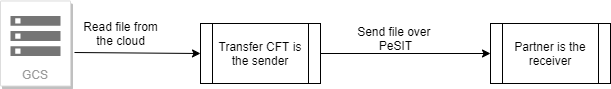

{
    "title": "Google Cloud Storage",
    "linkTitle": "Google Cloud Storage",
    "weight": "190"
}You can use Transfer CFT with Google Cloud Storage (GCS) to store and retrieve large numbers of files to better manage enterprise data.

Transfer CFT implements Google Cloud Storage services using the C++ Client Libraries for Google Cloud Services. The Transfer CFT file process uses the Google Client Libraries to directly deposit or access files from the GCS, without saving data on a local hard drive.

## Limitations

-   Available on Linux-x86-64 exclusively.
-   Available for PeSIT transfers exclusively.
-   Does not support FACTION=RETRYRENAME.
-   The FACTION=ERASE parameter setting is ignored.
-   You cannot access a file on GCS from the Transfer CFT graphical user interface.
-   Groups of files are not supported.
-   When writing a file to GCS, the file will be sent in parts at each checkpoint (see PACING). Each part is the FNAME suffixed with the extension ".part%d" where "%d" is a number that identifies the part. At the end of the transfer, all parts are concatenated.
-   The CFTTFIL task performs synchronous requests to Google Cloud. To perform parallel transfers, it is recommended that you increase the CFTPARM MAXTASK parameter and set CFTPARM TRANTASK to 1.

## Set up the connection

Transfer CFT uses the Application Default Credentials (ADC) library to handle authentication with Google Cloud. Refer to the [Authenticating as a service account](https://cloud.google.com/docs/authentication/production) documentation for information on how to set up service account credentials and how ADC finds your credentials.

For instance, you can create and download a service account file, and then export the key:

<table cellspacing="0">
   <col/>
   <tbody>
      <tr>
         <td>
            
export GOOGLE_APPLICATION_CREDENTIALS=~/Downloads/my-key.json

         </td>
      </tr>
   </tbody>
</table>

For SSL connections to GCS, libCURL requires a path to the CA certificates bundle to authenticate the peer. You can set this path in the UCONF ssl.certificates.ca\_cert\_bundle parameter if automatic detection fails.

## Parameter description

The following table describes Transfer CFT's Google Cloud Storage-related parameters.

<table cellspacing="0">
   <col/>
   <col/>
   <col/>
   <thead>
      <tr>
         <th>Parameter</th>
         <th>Type</th>
         <th>Description</th>
      </tr>
   </thead>
   <tbody>
      <tr>
         <td>ssl.certificates.ca_cert_bundle         </td>
         <td>string         </td>
         <td>
            
Path to the CA certificate bundle. This path can point to either a file containing the CA certificates (for example, /etc/ssl/certs/ca-certificates.crt) or to a directory containing the CA certificates  (for example, /etc/ssl/certs/), which are stored individually with their filenames in a hash format. 

            
Please refer to the <a href="https://curl.haxx.se/docs/manpage.html#--cacert">cURL man page</a> for information on the cacert and capath options.

            
If  the certificate bundle is not available on your system, you can download it from: <a href="https://curl.haxx.se/docs/caextract.html">curl.haxx.se/docs/caextract.html</a> (download from <a href="https://curl.haxx.se/ca/cacert.pem">cacert.pem</a>).

         </td>
      </tr>
   </tbody>
</table>

## Creating send and receive definitions

You must include the following parameters in your Google Cloud Storage [CFTSEND/CFTRECV](../../c_intro_userinterfaces/command_summary) definitions:

<table cellspacing="0">
   <col/>
   <col/>
   <col/>
   <thead>
      <tr>
         <th>Parameter</th>
         <th>Type</th>
         <th>Description</th>
      </tr>
   </thead>
   <tbody>
      <tr>
         <td>fname         </td>
         <td>string          </td>
         <td>Corresponds to the Google Cloud Storage object name.         </td>
      </tr>
      <tr>
         <td>workingdir         </td>
         <td>string          </td>
         <td>
            
The workingdir field must start with gs:// and be followed by the bucket name (as used with gsutil):

            
gs://my-bucket

         </td>
      </tr>
      <tr>
         <td>wfname         </td>
         <td>string         </td>
         <td>
            
In the CFTRECV command, this specifies the temporary object that is used to upload chunks of the file. The file is then concatenated to the value defined in the FNAME parameter.

         </td>
      </tr>
   </tbody>
</table>

## Use case examples

### Configure the connection

Export the credentials:

<table cellspacing="0">
   <col/>
   <tbody>
      <tr>
         <td>
            
export GOOGLE_APPLICATION_CREDENTIALS=~/Downloads/my-key.json

         </td>
      </tr>
   </tbody>
</table>

In UCONF, set the GCS certificate path for the receiving Transfer CFT (only required if automatic detection fails):

<table cellspacing="0">
   <col/>
   <tbody>
      <tr>
         <td>
            
uconfset ssl.certificates.ca_cert_bundle, value='&lt;path to CA bundle&gt;'

         </td>
      </tr>
   </tbody>
</table>

### The Transfer CFT stores a received file on GCS

Transfer CFT  receives a file from a partner over the PeSIT protocol and stores it on Google Cloud Storage.



Configure the CFTRECV object to write to the GCS:

<table cellspacing="0">
   <col/>
   <tbody>
      <tr>
         <td>
            
CFTRECV id=GCS_WRITE, fname=pub/&amp;IDF.&amp;IDTU.RCV, wfname=tmp/&amp;IDF.&amp;IDTU.RCV, workingdir=gs://my_bucket

         </td>
      </tr>
   </tbody>
</table>

After the partner sends a file, you can check the log for transfer details.

### Transfer CFT reads a file from GCS and sends it to a partner

Here, Transfer CFT reads a file from GCS and sends it over PeSIT to a partner.



Create the CFTSEND template, and send a file that GCS to a Transfer CFT partner.

<table cellspacing="0">
   <col/>
   <tbody>
      <tr>
         <td>
            
CFTSEND id=GCS_READ, workingdir=gs://my_bucket

            
SEND PART=PARIS, IDF=GCS_READ, FNAME=pub/FTEST

         </td>
      </tr>
   </tbody>
</table>

After sending a file to the partner, you can check the log for transfer details.

## Troubleshooting

This section provides information on how to troubleshoot errors that you may encounter when implementing GCS with Transfer CFT. Note that you can troubleshoot both Transfer CFT and GCS using the gsutil tool as outlined below.

### Transfer CFT logs and diagnostic codes

When an issue occurs with Google Cloud Storage, a message displays in the CFTLOG and the DIAGC is set.

If your credentials were not found:

-   Log: CFTF30W GCS error: 2(UNKNOWN) - Could not automatically determine credentials.
-   DIAGC: 'GCS error: 2(UNKNOWN) - Could not automatically determine credentials.

<!-- -->

-   Please refer to the Google Cloud [Application Default Credentials](https://cloud.google.com/docs/authentication/production) documentation.

If a file is not available on Google Cloud Storage to SEND:

-   DIAGC: 'GCS error: 2 (No such file or directory) - 5(NOT\_FOUND) - No such object: my-bucket/FTEST'

### GCS CLI

To help resolve errors, you can use the GCS CLI gsutil tool to verify that the system can connect to the GCS storage and check that the user has permission to read the keys in the bucket. Please refer to the Google Cloud documentation at: [cloud.google.com/storage/docs/gsutil](https://cloud.google.com/storage/docs/gsutil).

### Example

To list objects in a bucket on GCS:

<table cellspacing="0">
   <col/>
   <tbody>
      <tr>
         <td>
            
gsutil ls gs://my-bucket

         </td>
      </tr>
   </tbody>
</table>
