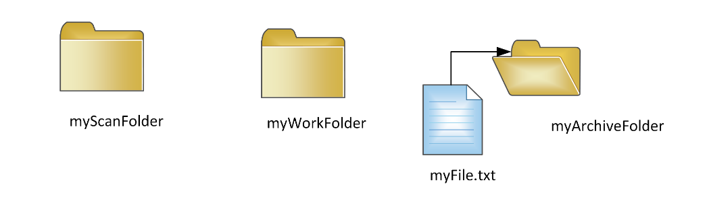

{
    "title": "Folder monitoring CFTFOLDER",
    "linkTitle": "Folder monitoring CFTFOLDER",
    "weight": "190"
}This section provides a description of how to use Transfer CFT objects to manage folder monitoring.

<table cellpadding="0" cellspacing="0">
   <col/>
   <col/>
   <col/>
      <tr>
         <td valign="top">         </td>
         <td valign="top"><b>Note</b>
         </td>
         <td data-mc-autonum="&lt;b&gt;Note&lt;/b&gt;" valign="top">There are two ways to implement Transfer CFT folder monitoring, either using UCONF or Transfer CFT objects. We recommend the CFTFOLDER method of configuring folder monitoring. Users that presently are using UCONF to manage folder monitoring can migrate to a CFTFOLDER configuration as described in <a href="../migrate_uconf_cftfolder">Migrate to CFTFOLDER folder monitoring</a>.         </td>
      </tr>
</table>

## Folder monitoring set up

1.  Activate the folder monitoring option.
    -   Set uconf parameter folder\_monitoring.enable to Yes.
2.  Declare your logical directories to monitor.
    -   Add CFTFOLDER objects.
3.  For each logical directory defined, configure the specific options you want to use for each:
    -   File management method

    <!-- -->

    -   Used sub-directories

    <!-- -->

    -   Set the IDF

    <!-- -->

    -   Set the partner name

    <!-- -->

    -   Define the delay to take into account the file

    <!-- -->

    -   Define other Folder Monitoring parameters
4.  Optionally, to specify file-system event monitoring you additionally must set this in [CFTFOLDER object.](#enable)

## CFTFOLDER object

The following table describes the parameters you can use to define the CFTFOLDER object. Additionally the table lists the UCONF equivalent for users who have opted for a polling type of folder monitoring.

### Folder monitoring parameters

Use the following CFTFOLDER parameters to configure folder monitoring for each directory as needed.

Parameter descriptions

<table cellspacing="0">
   <col/>
   <col/>
   <col/>
   <col/>
   <thead>
      <tr>
         <th>Parameter</th>
         <th>Type </th>
         <th>
            
Default  

</th>
         <th>Description</th>
      </tr>
   </thead>
   <tbody>
      <tr>
         <td>
            
same as in UCONF

            
&lt;folder_monitoring.enable&gt;

         </td>
         <td>Boolean         </td>
         <td>No         </td>
         <td>
            <ul>
               <li>No: No folder monitoring occurs.               </li>
               <li>Yes: Enable Transfer CFT folder monitoring.                </li>
            </ul>
         </td>
      </tr>
      <tr>
         <td>
            
ID

            
<i><i>Mandatory</i></i>

         </td>
         <td>node         </td>
         <td>None         </td>
         <td>
            
Add the logical folders to monitor (list of logical identifiers).

            
You should provide a unique name to identify the set of configuration parameters corresponding to this directory.
 If you have more than one Folder to monitor, use a space between each logical value. 

         </td>
      </tr>
      <tr>
         <td>STATE         </td>
         <td>Boolean         </td>
         <td>Active         </td>
         <td>
            
Enables a scan of the folder.

            
<table cellpadding="0" cellspacing="0">
   <col/>
   <col/>
   <col/>
      <tr>
         <td valign="top">         </td>
         <td valign="top"><b>Note</b>
         </td>
         <td data-mc-autonum="&lt;b&gt;Note&lt;/b&gt;" valign="top"> NO = NOACTIVE.         </td>
      </tr>
</table>

         </td>
      </tr>
      <tr>
         <td>
            
SCANDIR
<i>Mandatory</i>
         </td>
         <td>string         </td>
         <td>None         </td>
         <td>
            
Absolute path name of the top level directory to scan.

            
This directory must exist before restarting Transfer CFT.

            
*See <a href="#*char_note">NOTE</a>.

         </td>
      </tr>
      <tr>
         <td>
            
WORKDIR
<i>Mandatory</i>
         </td>
         <td>string         </td>
         <td>None         </td>
         <td>
            
Absolute path name of the top level directory available for file state information.

            <ul>
               <li>If you are using the MOVE method, files that are ready to be submitted are available in the work_dir.               </li>
               <li>If you are using the FILE method, the .met files are stored in the work_dir.               </li>
            </ul>
            
<table cellpadding="0" cellspacing="0">
   <col/>
   <col/>
   <col/>
      <tr>
         <td valign="top">         </td>
         <td valign="top"><b>Caution  </b>
         </td>
         <td data-mc-autonum="&lt;b&gt;Caution  &lt;/b&gt;" valign="top">   Never delete any .met files.         </td>
      </tr>
</table>

            
*See <a href="#*char_note">NOTE</a>.

         </td>
      </tr>
      <tr>
         <td>ENABLESUBDIR         </td>
         <td>Boolean         </td>
         <td>Yes         </td>
         <td>
            
Values:

            <ul>
               <li>Yes: The entire scan_dir sub-directory tree is monitored.               </li>
               <li>No: No scan is performed.               </li>
            </ul>
         </td>
      </tr>
      <tr>
         <td>METHOD         </td>
         <td>enum         </td>
         <td>MOVE         </td>
         <td>
            
Values:

            <ul>
               <li>MOVE: Files are moved to the work_dir prior to being submitted.                </li>
               <li>FILE: Files are left in the scan_dir, and a state file with the same name is created in work_dir prior to submitting the file.               </li>
            </ul>
            
<table cellpadding="0" cellspacing="0">
   <col/>
   <col/>
   <col/>
      <tr>
         <td valign="top">         </td>
         <td valign="top"><b>Note</b>
         </td>
         <td data-mc-autonum="&lt;b&gt;Note&lt;/b&gt;" valign="top">Before changing the method from FILE to MOVE, you should remove all files (metadata .met files) located in the associated working directory.         </td>
      </tr>
</table>

            
<table cellpadding="0" cellspacing="0">
   <col/>
   <col/>
   <col/>
      <tr>
         <td valign="top">         </td>
         <td valign="top"><b>Note</b>
         </td>
         <td data-mc-autonum="&lt;b&gt;Note&lt;/b&gt;" valign="top">Changing the method from MOVE to FILE, deletes all files located in the associated working directory. Therefore, we recommend removing all files from the scan and working directory before changing the METHOD type.         </td>
      </tr>
</table>

            
Please see the <a href="..//transfercft/app_integration_intro/intro_folder_monitor">Limitations</a> for multi-host system recommendations.

         </td>
      </tr>
      <tr>
         <td>ARCHIVEDIR         </td>
         <td>String         </td>
         <td>          </td>
         <td>Archive directory where a source file is moved to after a successful transfer. This means the source file is moved from the WORKDIR for METHOD=MOVE or SCANDIR for METHOD=FILE to the ARCHIVEDIR.         </td>
      </tr>
      <tr>
         <td>FILEIDLEDELAY         </td>
         <td>integer          </td>
         <td>5         </td>
         <td>If the state of a file has not changed within this delay in seconds, the file becomes a candidate for submission.         </td>
      </tr>
      <tr>
         <td>GROUPID          </td>
         <td>String          </td>
         <td>          </td>
         <td> Complementary information for the USERID. Maximum length 32 characters.         </td>
      </tr>
      <tr>
         <td>
            
IDF

            
<i>Mandatory</i>

         </td>
         <td>string         </td>
         <td>""         </td>
         <td>
            
The IDF  name to use in the SEND command. Use one of the following:

            <ul>
               <li> A fixed name.               </li>
               <li>"(0)":  The name of the first directory sub-level is used.               </li>
               <li>"(1)": The name of the second directory sub-level is used.               </li>
            </ul>
            
<table cellpadding="0" cellspacing="0">
   <col/>
   <col/>
   <col/>
      <tr>
         <td valign="top">         </td>
         <td valign="top"><b>Note</b>
         </td>
         <td data-mc-autonum="&lt;b&gt;Note&lt;/b&gt;" valign="top">In the <a href="##example_for_description">Directory C example</a>/home/CFT/fr/dir_c/scan/newyork/idf1, the (0) represents newyork, and (1) represents idf1.         </td>
      </tr>
</table>

         </td>
      </tr>
      <tr>
         <td>
            
PART
<i>Mandatory</i>
         </td>
         <td>string         </td>
         <td>""         </td>
         <td>
            
The PART name to use in the SEND command. Use one of the following:

            <ul>
               <li> A fixed name.               </li>
               <li>"(0)": The name of the first directory sub-level is used.               </li>
               <li>"(1)": The name of the second directory sub-level is used.               </li>
            </ul>
            
<table cellpadding="0" cellspacing="0">
   <col/>
   <col/>
   <col/>
      <tr>
         <td valign="top">         </td>
         <td valign="top"><b>Note</b>
         </td>
         <td data-mc-autonum="&lt;b&gt;Note&lt;/b&gt;" valign="top">In the <a href="##example_for_description">Directory C example</a>/home/CFT/fr/dir_c/scan/newyork/idf1, the (0) represents newyork, and (1) represents idf1.         </td>
      </tr>
</table>

         </td>
      </tr>
      <tr>
         <td>INTERVAL         </td>
         <td>int         </td>
         <td>60         </td>
         <td>The interval between two scans of the directory files in seconds.         </td>
      </tr>
      <tr>
         <td>FILECOUNT         </td>
         <td>int         </td>
         <td>0         </td>
         <td>
            
Maximum number of file submissions for each scan. Using the default value indicates that there is no maximum.

         </td>
      </tr>
      <tr>
         <td>FILESIZEMIN         </td>
         <td>int         </td>
         <td>0         </td>
         <td>
            
Files shorter than this value, in bytes, are not candidates for submission. Using the default value indicates that there is no lower limit on the file size.

         </td>
      </tr>
      <tr>
         <td>FILESIZEMAX         </td>
         <td>int         </td>
         <td>0         </td>
         <td>
            
Files larger than this value, in bytes, are not candidates for submission. Using the default value indicates that there is no upper limit on the file size.

         </td>
      </tr>
      <tr>
         <td>INCLUDEFILTER         </td>
         <td>string         </td>
         <td>""         </td>
         <td>If this parameter is defined, only files whose names match this pattern are monitored.         </td>
      </tr>
      <tr>
         <td>EXCLUDEFILTER         </td>
         <td>string         </td>
         <td>""         </td>
         <td>If this parameter is defined, files whose names match this pattern are not monitored.         </td>
      </tr>
      <tr>
         <td>RESUBMITCHANGED         </td>
         <td>Boolean         </td>
         <td>Yes         </td>
         <td>
            
This parameter  has no effect when the configured method is MOVE.

            
When the method parameter value is set to FILE:

            <ul>
               <li>Yes: When the state of a previously submitted file is seen as having changed, the file is submitted again.                </li>
               <li>No: Files are not resubmitted, regardless of changes.               </li>
            </ul>
            
<table cellpadding="0" cellspacing="0">
   <col/>
   <col/>
   <col/>
      <tr>
         <td valign="top">         </td>
         <td valign="top"><b>Note</b>
         </td>
         <td data-mc-autonum="&lt;b&gt;Note&lt;/b&gt;" valign="top">The file is resubmitted after <i>any</i> change regardless of if the modification is a small change, or purging and replacing the file with another file having the same name.         </td>
      </tr>
</table>

         </td>
      </tr>
      <tr>
         <td>FILTERTYPE         </td>
         <td>enum         </td>
         <td>WILDMAT         </td>
         <td>
            
Defines the pattern matching algorithm to use for file name filtering.

            
Values:

            <ul>
               <li>STRJCMP: The Transfer CFT pattern matching algorithm.
                  </li>
               <li>WILDMAT: A well known public domain algorithm, and is the default. <strong>Unix/Windows only</strong>               </li>
               <li>EREGEX:  Extended regular expression syntax.                </li>
            </ul>
            
See  <a href="../folder_customize">Create inclusion and exclusion filters</a> for details.

         </td>
      </tr>
      <tr>
         <td>RENAMEMETHOD         </td>
         <td>Enum          </td>
         <td>TIMESTAMP          </td>
         <td>
            
This parameter applies only to the MOVE method. When set to TIMESTAMP, a timestamp of the pattern YYYYMMDDHHMMSS is added at the end of the name of the renamed file but before the last '.'.
For example, using timestamp_separators=".":            <ul>               <li>myfile     is renamed myfile.20131025               </li>               <li> myfile.txt is renamed myfile.20131025.txt               </li>            </ul>            
<table cellpadding="0" cellspacing="0">   <col/>   <col/>   <col/>      <tr>         <td valign="top">         </td>         <td valign="top"><b>Note</b>         </td>         <td data-mc-autonum="&lt;b&gt;Note&lt;/b&gt;" valign="top">Unset the default value and use " " to MOVE without adding a timestamp.         </td>      </tr></table>
         </td>
      </tr>
      <tr>
         <td>RENAMESEPARATOR         </td>
         <td>string         </td>
         <td>
            
"."

         </td>
         <td>
            
This parameter only applies to the MOVE method.

            
You can use no more than two characters from among the following: 

            
._-

            
The first character defines the separator before the timestamp.
The second one, when present, defines the separator after the timestamp.

            
For example, using timestamp_separators "[]":
 - myfile     is renamed myfile.[20131025]
 - myfile.txt is renamed myfile.[20131025].txt

         </td>
      </tr>
      <tr>
         <td>N/A in this version         </td>
         <td>string         </td>
         <td>          </td>
         <td>Metadata used to control user changes.         </td>
      </tr>
      <tr>
         <td>
            
USEFSEVENTS

            
 

            
<a href="../../../c_intro_userinterfaces/web_copilot_ui/flow_def_intro/cftfolder">More information</a>

         </td>
         <td>Boolean         </td>
         <td>No         </td>
         <td>Set to YES to enable the file system events monitoring service to detect newly available files.         </td>
      </tr>
      <tr>
         <td><a href="../../../c_intro_userinterfaces/command_summary/parameter_intro/userid">USERID </a>
         </td>
         <td>String          </td>
         <td>          </td>
         <td>
            
<i>Available on UNIX and </i>Windows<i> </i>

            
Identifier for a user who can scan a folder. See the section, <a href="#folder2">Folder monitoring using USERCTRL</a>.

         </td>
      </tr>
   </tbody>
</table>

<table cellpadding="0" cellspacing="0">
   <col/>
   <col/>
   <col/>
      <tr>
         <td valign="top">         </td>
         <td valign="top"><b>Note</b>
         </td>
         <td data-mc-autonum="&lt;b&gt;Note&lt;/b&gt;" valign="top">*You cannot use the following characters in the SCANDIR or WORKDIR definition. Additionally you cannot use a comma (,) in the CFTFOLDER SCANDIR or WORKDIR definition.         </td>
      </tr>
</table>

-   UNIX /
-   For Windows \\ / : \* ? " &lt; > |

### Parameter settings and actions

-   The delay between scans of a given directory is defined by its interval parameter value.
-   By default the ENABLESUBDIR \[enable\_subdir\] parameter is set to YES, and the directory and all its sub-directories are scanned.
-   For each file detected, the name is checked against the configured parameters values in the include and exclude file filters. Files that match the combined criteria are monitored, all others are ignored.

For a file to become a candidate to be submitted, the following conditions must be met:

-   File size: If these values are configured, the following rules apply.
    -   FILESIZEMIN \[file\_size\_min\]: The current size must not be less than this value.
    -   FILESIZEMAX \[file\_size\_max\]: The current size must not be greater than this value.
-   The last modification time and duration must not have changed within a number of seconds as defined in the FILEIDLEDELAY \[file\_idle\_delay\] parameter value.

## Create or modify a CFTFOLDER object

The act of starting Transfer CFT causes Transfer CFT to check for and reload configuration changes. Alternatively, you can dynamically execute the CFTUTIL RECONFIG type=FOLDER command to check and reload the configuration.

Upon reloading, if there are any modified configuration parameters or detected errors in the new configuration, Transfer CFT records these in the log. Additionally, Transfer CFT verifies that the updated configuration is compatible with the contents of the current directories.

In particular, if you change the METHOD parameter from FILE to MOVE without modifying the scan\_dir and work\_dir parameters, and if the work\_dir directory is not empty, Transfer CFT displays an error message in the log and will not monitor the corresponding directory.

If you create or modify a folder while Transfer CFT is running, you must execute the ACT command to reload the configuration.

Example

The following command reloads the FM40 configuration.

<table cellspacing="0">
   <col/>
   <tbody>
      <tr>
         <td>ACT ID=FM40, type=FOLDER          </td>
      </tr>
   </tbody>
</table>

## Enable the file-system event monitoring

This feature enables you to use file-system events monitoring to detect newly available files for an immediate Transfer CFT action.

Available on Linux/Windows only

See [Supported OS for file-system event monitoring](..//transfercft/app_integration_intro/intro_folder_monitor).

To enable file-system event monitoring modify as follows:

<table cellspacing="0">
   <col/>
   <tbody>
      <tr>
         <td>CFTFOLDER ID=&lt;myfolderobject&gt;, USEFSEVENTS=YES, ...         </td>
      </tr>
   </tbody>
</table>

#### Attention

This feature can be resource intensive for Transfer CFT and the system in general in the following situations:

-   You have a large number of directories and sub-directories monitored using file-system events.
-   The activity in terms of file additions, removals, changes of files in those directories is high.

We recommended that you only use file-system event monitoring when immediate attention by Transfer CFT is a functional requirement.

## Activate and deactivate folder monitoring

To turn the file-system event monitoring off for a given folder object, use the command:

<table cellspacing="0">
   <col/>
   <tbody>
      <tr>
         <td> INACT TYPE=FOLDER,ID=&lt;myfolderobject&gt;         </td>
      </tr>
   </tbody>
</table>

To turn on the file-system event monitoring for a given folder object, use the command:

<table cellspacing="0">
   <col/>
   <tbody>
      <tr>
         <td> ACT TYPE=FOLDER,ID=&lt;myfolderobject&gt;         </td>
      </tr>
   </tbody>
</table>

To view all of the CFTFOLDER objects, use the command:

<table cellspacing="0">
   <col/>
   <tbody>
      <tr>
         <td> LISTPARM TYPE=FOLDER         </td>
      </tr>
   </tbody>
</table>

To extract the folder objects, use the command:

<table cellspacing="0">
   <col/>
   <tbody>
      <tr>
         <td> CFTEXT TYPE=FOLDER         </td>
      </tr>
   </tbody>
</table>

## Remove or change a folder

### Change a folder

If Transfer CFT is running and you create or change a folder or multiple folders, you can execute RECONFIG TYPE=FOLDER so that all changes are taken into account.

### Delete a folder

Prior to deleting a folder object, check that it is inactive. You can execute INACT on this folder if unsure.

<table cellspacing="0">
   <col/>
   <tbody>
      <tr>
         <td>
            
INACT TYPE=FOLDER, ID=&lt;myfolder&gt;

            
CFTFOLDER ID=&lt;myfolder&gt;, MODE=DELETE

         </td>
      </tr>
   </tbody>
</table>

<table cellpadding="0" cellspacing="0">
   <col/>
   <col/>
   <col/>
      <tr>
         <td valign="top">         </td>
         <td valign="top"><b>Note</b>
         </td>
         <td data-mc-autonum="&lt;b&gt;Note&lt;/b&gt;" valign="top">If you delete an active folder object  while Transfer CFT is running without first deactivating the folder (INACT), you must execute a RECONFIG TYPE=FOLDER. If you do not, the folder remains active.         </td>
      </tr>
</table>

## Directory configuration examples

This section presents an example that consists of configuring 3 directories for monitoring, each having a different set of configuration parameter values. In this example, the three different directories are called A, B, and C.

<table cellpadding="0" cellspacing="0">
   <col/>
   <col/>
   <col/>
      <tr>
         <td valign="top">         </td>
         <td valign="top"><b>Note</b>
         </td>
         <td data-mc-autonum="&lt;b&gt;Note&lt;/b&gt;" valign="top">All of the examples in this section were written for a UNIX platform. Modify to suit your environment accordingly.         </td>
      </tr>
</table>

### Directory A requirements

The first directory presents the simplest possible configuration, leaving most parameters set to their default values.

-   All of the files in the directory sub-tree are candidates for the SEND submission.
-   The files are sent to a given partner, newyork, using an IDF name of IDFA.

The following commands create the configuration defined for directory A.

<table cellspacing="0">
   <col/>
   <tbody>
      <tr>
         <td>
            
#

            
# Create all of the needed directories (UNIX platform example)

            
#

            
mkdir /home/CFT/fm/dir_a

            
mkdir /home/CFT/fm/dir_a/scan

            
mkdir /home/CFT/fm/dir_a/work

            
#

            
CFTUTIL CFTFOLDER ID=A, SCANDIR='/home/CFT/fm/dir_a/scan',  WORKDIR='/home/CFT/fm/dir_a/work', PART='NEWYORK', IDF='IDFA'

         </td>
      </tr>
   </tbody>
</table>

### Directory B requirements

For the second directory, directory B, we want to:

-   Be able to send files to the following partners, newyork, berlin, london, rome, brussels, and paris.
-   Use the id given as the IDF, in this example TXT.
-   Send only files suffixed by .txt.

The following commands create the required directory B configuration.

<table cellspacing="0">
   <col/>
   <tbody>
      <tr>
         <td>
            
#

            
# Create all needed directories (example for UNIX platforms)

            
#

            
mkdir /home/CFT/fm/dir_b

            
mkdir /home/CFT/fm/dir_b/scan

            
mkdir /home/CFT/fm/dir_b/work

            
mkdir /home/CFT/fm/dir_b/scan/newyork

            
mkdir /home/CFT/fm/dir_b/scan/berlin

            
mkdir /home/CFT/fm/dir_b/scan/london

            
mkdir /home/CFT/fm/dir_b/scan/rome

            
mkdir /home/CFT/fm/dir_b/scan/brussels

            
mkdir /home/CFT/fm/dir_b/scan/paris

            
#

            
CFTUTIL CFTFOLDER ID=B, SCANDIR='/home/CFT/fm/dir_b/scan', WORKDIR='/home/CFT/fm/dir_b/work', PART='(0)', IDF='TXT', INCLUDEFILTER='*.txt'

         </td>
      </tr>
   </tbody>
</table>

The files to be sent must be moved to the directory that corresponds to the destination partner name, for example /home/CFT/fm/dir\_b/newyork for the partner named newyork.

### Directory C requirements

For directory C we want to:

-   Send files to multiple partners, newyork and paris.
-   Use idf1, idf2, or idf3 as the newyork partner IDF.
-   Use idfa, idfb, idfc, or idfd as the paris partner IDF.
-   Not send files suffixed by .tmp.
-   Automatically move the files to be sent to the SCANDIR, so the FILEIDLEDELAY parameter value is set to zero.
-   Submit files within a delay of approximately 10 seconds (INTERVAL).
-   Limit the number of send submissions per interval to 4 (FILECOUNT).

The following commands create the described directory C configuration.

<table cellspacing="0">
   <col/>
   <tbody>
      <tr>
         <td>
            
#

            
# Create all needed directories (example for UNIX platforms)

            
#

            
mkdir /home/CFT/fm/dir_c

            
mkdir /home/CFT/fm/dir_c/scan

            
mkdir /home/CFT/fm/dir_c/work

            
mkdir /home/CFT/fm/dir_c/scan/newyork/idf1

            
mkdir /home/CFT/fm/dir_c/scan/newyork/idf2

            
mkdir /home/CFT/fm/dir_c/scan/newyork/idf3

            
mkdir /home/CFT/fm/dir_c/scan/paris/idfa

            
mkdir /home/CFT/fm/dir_c/scan/paris/idfb

            
mkdir /home/CFT/fm/dir_c/scan/paris/idfc

            
mkdir /home/CFT/fm/dir_c/scan/paris/idfd

            
#

            
CFTUTIL CFTFOLDER ID=C, FILEIDLEDELAY='0', PART='(0)', IDF='(1)', SCANDIR='/home/CFT/fm/dir_c/scan', 

            
WORKDIR='/home/CFT/fm/dir_c/work', INTERVAL='10', FILECOUNT='4', FILEEXCLUDEFILTER='*.tmp'

         </td>
      </tr>
   </tbody>
</table>

The files to be sent must be moved to the directory that corresponds to the destination partner and idf names, for example /home/CFT/fm/dir\_c/newyork/idf1 for the partner newyork and idf idf1.

## Customize SEND with folder monitoring

You can customize the transfer related metadata, such as the IDA, PARM, SUSER, etc. using the file name value. This allows folder monitoring to provide a functionality that resembles a SEND command.

For example, you have a file named A0001.appli1.cft.XXX in the scan1 folder, and you have the following two objects in your configuration:

<table cellspacing="0">
   <col/>
   <tbody>
      <tr>
         <td>CFTFOLDER id=folder1,scandir=scan1,idf=idf1,par=part1,...            
CFTSEND id=idf1,ida=&amp;%.1froot,sappl="&amp;%.2froot",suser="&amp;%.3froot",...
         </td>
      </tr>
   </tbody>
</table>

Consequently, Transfer CFT automatically creates a request based on the above syntax:

<table cellspacing="0">
   <col/>
   <tbody>
      <tr>
         <td>SEND part=part1,idf=idf1,ida=A0001,sappl="appli1",suser="cft"         </td>
      </tr>
   </tbody>
</table>

-   For more information on how to effectively use separators with symbolic variables, please see [Separate fields in symbolic variables.](../../../c_intro_userinterfaces/command_summary/symbolic_variables)
-   For more information on the various symbolic variables to use in CFTSEND with CFTFOLDER, see [List of symbolic variables.](../../../c_intro_userinterfaces/command_summary/symbolic_variables)

## Archiving with folder monitoring

Archiving is a way to store files after they have been moved from the scanned folder to the receiving folder.

1.  A file is deposited in the folder to be scanned.  
    
    
2.  Depending on the folder monitoring method you have enabled, the file is picked up and moved to the working directory.  
    
    
3.  The file transfer and any related processing occur and the file is then moved to the storage folder.  
    
    

### Use case scenario

The following example describes how to scan a folder, send any new file, and then store a backup of the file. Additionally, the scenario provides instructions on how to then rename the transferred file as it is stored in the backup folder.

<table cellpadding="0" cellspacing="0">
   <col/>
   <col/>
   <col/>
      <tr>
         <td valign="top">         </td>
         <td valign="top"><b>Note</b>
         </td>
         <td data-mc-autonum="&lt;b&gt;Note&lt;/b&gt;" valign="top">If you create a new transfer with the same name as a previous file, it overwrites the existing file in the archive folder.         </td>
      </tr>
</table>

### Prerequisites

Create the following:

-   A folder to scan, for example: `mkdir myScanFolder`
-   A working folder, for example: mkdir myWorkFolder
-   An archive folder, for example: `mkdir myArchiveFolder`
-   A test file, for example: `myFile.txt`
-   Folder monitoring must be enabled: `uconfset id=folder_monitoring.enable, value=yes`
-   Stop Transfer CFT prior to start the procedure, enter: `cft stop `

In the **Steps** below, we use the absolute paths, that is, the folders are located in the runtime directory.

### Archive with no file renaming afterward

1.  Create the CFTFOLDER object.  
    

2.  <table cellspacing="0">
   <col/>
   <tbody>
      <tr>
         <td>
            
cftfolder id=app1, PART=paris, idf=myfile, scandir=MyScanFolder, workdir=MyWorkFolder, renamemethod=none, archivedir=MyArchiveFolder,method=move,interval=1,fileidledelay=0

         </td>
      </tr>
   </tbody>
</table>

3.  Activate the new CFTFOLDER object:  
    

4.  <table cellspacing="0">
   <col/>
   <tbody>
      <tr>
         <td>
            
ACT type=folder, id=app1

         </td>
      </tr>
   </tbody>
</table>

5.  Start Transfer CFT: cft start

6.  Put the test file in the runtime/MyScanFolder folder.

7.  Navigate to the `runtime/MyArchivedFolder` and check that the MyFile.txt is stored there.

8.  Check in the log for a message similar to the following:  
    

    <table cellspacing="0">
   <col/>
   <tbody>
      <tr>
         <td>
            
CFTT89I Faction on FNAME=MyWorkFolder\MyFile.txt archived as MyArchivedFolder\MyFile.txt &lt;IDTU=A000000F PART=PARIS IDF=MYFILE IDT=C1918185&gt;

         </td>
      </tr>
   </tbody>
</table>

### Archive and rename in the archive folder

1.  Create the CFTFOLDER object.  
    

2.  <table cellspacing="0">
   <col/>
   <tbody>
      <tr>
         <td>
            
cftfolder id=app1, PART=paris, idf=MyFile, SCANDIR=MyScanFolder, workdir=MyWorkFolder, renamemethod=none, archivedir=MyArchivedFolder,method=move,interval=1,fileidledelay=0

         </td>
      </tr>
   </tbody>
</table>

3.  Create a SEND model using `archivefname`. In this example the transfer's IDTU is appended on the filename:

    <table cellspacing="0">
   <col/>
   <tbody>
      <tr>
         <td>
            
CFTSEND id=MYFILE, archivefname=&amp;FROOT&amp;(-.)FSUF_&amp;IDTU, faction=ARCHIVE

         </td>
      </tr>
   </tbody>
</table>

4.  Activate the new CFTFOLDER object:  
    

5.  <table cellspacing="0">
   <col/>
   <tbody>
      <tr>
         <td>
            
ACT type=folder, id=app1

         </td>
      </tr>
   </tbody>
</table>

6.  Start Transfer CFT: cft start

7.  Put the test file in the runtime/MyScanFolder folder.

8.  Navigate to the `runtime/MyArchiveFolder` and check that the MyFile.txt is stored there.

9.  Check in the log for a message similar to the following:  
    

    <table cellspacing="0">
   <col/>
   <tbody>
      <tr>
         <td>
            
CFTT89I Faction on FNAME=MyWorkFolder\MyFile.txt archived as MyArchiveFolder\MyFile.txt_A000000F &lt;IDTU=A000000F PART=PARIS IDF=MYFILE IDT=C1918185&gt;

         </td>
      </tr>
   </tbody>
</table>

### Folder monitoring using USERCTRL

The following example demonstrates how to use the [USERCTRL](../../../c_intro_userinterfaces/command_summary/parameter_intro/userctrl) parameter to define access control for another user. See the sections on user rights in [Using system users - UNIX](../../../cft_intro_install/unix_install_start_here/run_first_time_ux/run_first_time_ux/t_adding_system_user_unix) or [How to enable system users - Windows](../../../cft_intro_install/windows_install_start_here/windows_install_start_here/running_cft_for_the_first_time_windows/add_system_user_windows) for details.

<table cellpadding="0" cellspacing="0">
   <col/>
   <col/>
   <col/>
      <tr>
         <td valign="top">         </td>
         <td valign="top"><b>Note</b>
         </td>
         <td data-mc-autonum="&lt;b&gt;Note&lt;/b&gt;" valign="top">USEFSEVENTS=YES is not supported on UNIX systems in this use case.         </td>
      </tr>
</table>

1.  Enable USERCTRL in the CFTPARM command:  
    

    <table cellspacing="0">
   <col/>
   <tbody>
      <tr>
         <td>CFTPARM ID=IDPARM0,…,USERCTRL=YES         </td>
      </tr>
   </tbody>
</table>

2.  Start Transfer CFT with `usercft `as the user.

3.  User1 creates the /home/user1/scandir\_app1 and `/home/user1/workdir` folders:  
    

    <table cellspacing="0">
   <col/>
   <tbody>
      <tr>
         <td>
               <li>mkdir /home/user1/scandir_app1 mkdir /home/user1/workdir               </li>
         </td>
      </tr>
   </tbody>
</table>

4.  `App1 `writes files to this specific scandir folder, e.g. `/home/user1/scandir_app1`, which belongs to user1. Notice that the usercft user does not have access to`  scandir_app1`.

5.  From CFTUTIL, create a CFTFOLDER:  
    

    <table cellspacing="0">
   <col/>
   <tbody>
      <tr>
         <td>
               <li>cftfolder id=app1, PART=paris, idf=app1, SCANDIR=/home/user1/scandir_app1  ,userid=user1, workdir=/home/user1/workdir, method=move, interval=10,fileidledelay=0               </li>
         </td>
      </tr>
   </tbody>
</table>

6.  Activate the CFTFOLDER object:  
    

    <table cellspacing="0">
   <col/>
   <tbody>
      <tr>
         <td>
               <li>act type=folder,id=app1               </li>
         </td>
      </tr>
   </tbody>
</table>

7.  Create a file called Myfile.txt, and copy it to the `/home/user1/scandir_app1` folder.

Results

The  transfer is executed on the behalf of user1. Notice that there is a message indicating that the folder is activated on behalf of the specified user.

<table cellspacing="0">
   <col/>
   <tbody>
      <tr>
         <td>CFTR20I folder "/home/user1/scandir_app1" registered as nickname &lt;APP1&gt;

CFTR20I on behalf of "user1" user         </td>
      </tr>
   </tbody>
</table>
