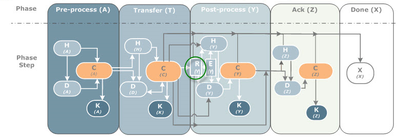

{
    "title": "Post-transfer file renaming",
    "linkTitle": "Post-transfer file renaming",
    "weight": "230"
}You can configure  post-transfer, file renaming on the receiver side of a flow. The file is renamed on transfer completion, in the post processing phase, and includes a configurable retry mechanism.

Limitation

-   When using a group of files in homogeneous mode, you cannot use post-transfer file renaming.

## How to configure

To enable the renaming option for a given flow (CFTRECV) set FACTION to RETRYRENAME.

**Example**

<table cellspacing="0">
   <col/>
   <tbody>
      <tr>
         <td>CFTRECV ID=SPOOLOUT, WFNAME=pub/&amp;IDTU.TMP,
FNAME=pub/MYFILE,
FACTION=RETRYRENAME         </td>
      </tr>
   </tbody>
</table>

Use the following uconf parameters to customize the retry mechanism.

<table cellspacing="0">
   <col/>
   <col/>
   <col/>
   <col/>
   <thead>
      <tr>
         <th>Parameter</th>
         <th>Default </th>
         <th>Value </th>
         <th>Description</th>
      </tr>
   </thead>
   <tbody>
      <tr>
         <td>cft.server.transfer.rrename.retry_delay         </td>
         <td>60 seconds         </td>
         <td>1-65535         </td>
         <td>
            
Delay in seconds between two retries for renaming.

            
If the file is not successfully renamed after the first retry_delay, the time is compounded so that the next retry occurs at the retry time added to the number of tries multiplied by the retry value. 

            
The time of the next retry = D + D * (R-1) 

            
Where:

            <ul>
               <li>D is the retry_delay               </li>
               <li>R is the number of retries               </li>
            </ul>
            
For example, if the file is not renamed after 60 seconds (default value), the next retry occurs in 120 seconds, and the following one in 180 seconds, etc.

         </td>
      </tr>
      <tr>
         <td>cft.server.transfer.rrename.max_retries         </td>
         <td>10         </td>
         <td>1-65535         </td>
         <td>Maximum number of retries.         </td>
      </tr>
   </tbody>
</table>

### Monitoring

Log

Following a successful renaming, CFTF33I is displayed.

Once the maximum number of retries is reached, the transfer moves to the YK state, and displays a DIAGI=156, DIAGP=RETRYRENAME, a DIAGC=RETRYRENAME MAX RETRIES REACHED or = `RETRYRENAME WFNAME NOT FOUND`, and the log messages [CFTF32E](../../troubleshoot_intro/messages_and_error_codes_start_here/cftf_messages) and [CFTF34E](../../troubleshoot_intro/messages_and_error_codes_start_here/cftf_messages).

Catalog

Information in the catalog displays the number of retries performed.

## Work flow

The retry and rename (R) option falls between the (T) and (Y) phase.



## Queuing

If you have several transfers with RETRYRENAME set for the same FNAME in a single flow, the transfers are queued based on their date/time of the end-of-transfer (DATEE, TIMEE).

## Example of spooling and renaming files

This example combines the use of the serialization with the rename/retry mechanism to ensure a spooling of file transfers without overwriting an un-consumed file at the destination.

-   Our user defines a transfer flow, for example `DailyReport,`based on a transfer state (acknowledgement) using the serialization option.
-   Several applications generate files that use the same flow, DailyReport; these file transfer requests are queued.
-   The source Transfer CFT for the flow executes the first file transfer request, Report1.  
-   The target Transfer CFT receives Report1.
-   Post-processing makes the file available to a target application, and immediately sends an acknowledgment to the source. This enables the next file transfer in the queue to be executed.
-   Upon receiving the acknowledgement, the source Transfer CFT executes the next transfer request. However:

> -   If the file no longer exists on the target (it was consumed by a target application), the cycle repeats as above.
>
> <!-- -->
>
> -   If the file still exists on the target Transfer CFT, then the next new file transfer (Report2) enters a retry cycle while it waits for the previous file to be deleted (moved/copied).

### Example configuration

#### Create models

Create a sender side model:

<table cellspacing="0">
   <col/>
   <tbody>
      <tr>
         <td>CFTSEND id=DailyReports, serial=X, ackstate=require          </td>
      </tr>
   </tbody>
</table>

Create a receiver side model:

<table cellspacing="0">
   <col/>
   <tbody>
      <tr>
         <td>CFTRECV id=DailyReport, faction=retryrename, wfname=pub/&amp;idtu.tmp, fname=pub/MyReport, exec=exec/
myreport.cmd          </td>
      </tr>
   </tbody>
</table>

#### Define post-processing

Post-processing should include an acknowledgement so that the next queued transfer request is triggered. Additionally, your post-processing script can include, for example, a message to indicate that the file has been received and renamed, and is ready to be consumed by the target application.

<table cellspacing="0">
   <col/>
   <tbody>
      <tr>
         <td>
            
end part=&amp;part,idt=&amp;idt,istate=yes,diagc='READY TO CONSUME' 

            
send part=&amp;part,idm=ACK,idt=&amp;idt,type=reply,msg='&amp;fname ready to consume by target application'

            
...[at this point the file is consumed by the target application]...

            
end part=&amp;part,idt=&amp;idt,istate=no,diagc='FILE CONSUMED'

         </td>
      </tr>
   </tbody>
</table>

#### Enter command to send files

<table cellspacing="0">
   <col/>
   <tbody>
      <tr>
         <td>
            
send part=paris, idf=dailyreport, ida=report1 

            
send part=paris, idf=dailyreport, ida=report2

            
send part=paris, idf=dailyreport, ida=report3

         </td>
      </tr>
   </tbody>
</table>

#### Check output files

Sender side

<table cellspacing="0">
   <col/>
   <tbody>
      <tr>
         <td>
            
17/01/26 18:01:43.31  CFTR12I SEND Treated for USER \dupont  &lt;IDTU=A000002C PART=PARIS IDF=DAILYREPORT&gt;

            
17/01/26 18:01:43.37  CFTR12I SEND Treated for USER \dupont  &lt;IDTU=A000002D PART=PARIS IDF=DAILYREPORT&gt;

            
17/01/26 18:01:43.37  CFTR12I SEND Treated for USER \dupont  &lt;IDTU=A000002E PART=PARIS IDF=DAILYREPORT&gt;

            
17/01/26 18:01:43.43  CFTT57I Requester transfer started   &lt;IDTU=A000002C PART=PARIS IDF=DAILYREPORT IDT=A2618014 &gt;

            
17/01/26 18:01:43.43  CFTT58I Requester transfer ended     &lt;IDTU=A000002C PART=PARIS IDF=DAILYREPORT IDT=A2618014&gt;

            
17/01/26 18:01:44.38  CFTT59I Server    reply    transferred &lt;IDTU=00000000 PART=PARIS IDM=DAILYREPORT IDT=A2618014&gt;

            
17/01/26 18:01:44.40  CFTT57I Requester transfer started   &lt;IDTU=A000002D PART=PARIS IDF=DAILYREPORT IDT=A2618015 &gt;

            
... (etc. for each transfer)

         </td>
      </tr>
   </tbody>
</table>

Receiver side

<table cellspacing="0">
   <col/>
   <tbody>
      <tr>
         <td>
            
17/01/26 18:01:43.43  CFTT57I Server    transfer started   &lt;IDTU=A000002F PART=NEWYORK IDF=DAILYREPORT IDT=A2618014 &gt;

            
17/01/26 18:01:43.43  CFTT58I Server    transfer ended     &lt;IDTU=A000002F PART=NEWYORK IDF=DAILYREPORT IDT=A2618014&gt;

            
17/01/26 18:01:43.43  CFTT88I+&lt;IDTU=A000002C WORKINGDIR= WFNAME=pub/FTEST NBC=7104&gt;

            
17/01/27 18:01:43.43  CFTF33I Rename to FNAME=pub/myreport done &lt;IDTU=A000002F PART=NEWYORK IDF=DAILYREPORT IDT= A2618014&gt;

            
17/01/26 18:01:43.45  CFTS03I _ exec/myreport.cmd executed &lt;IDTU=A000002F PART=NEWYORK IDF=DAILYREPORT IDT=A2618014&gt; (0.013008 sec)

            
17/01/26 18:01:44.37  CFTR12I END Treated for USER \dupont : DIAGC value was "" and is now "READY TO CONSUME"

            
17/01/26 18:01:44.38  CFTH60I reply  transferred &lt;PART=NEWYORK IDS=00005 IDM=DAILYREPORT NIDT=2618014&gt;

            
17/01/26 18:01:44.40  CFTT57I Server    transfer started   &lt;IDTU=A000002H PART=NEWYORK IDF=DAILYREPORT IDT=A2618015 &gt;

         </td>
      </tr>
   </tbody>
</table>

## Troubleshooting

Error and information messages include the following:

-   [CFTF32E](../../troubleshoot_intro/messages_and_error_codes_start_here/cftf_messages): PART=&part IDF=&idf IDT=&idt \_ Maximum number of rename retries reached
-   [CFTF34E](../../troubleshoot_intro/messages_and_error_codes_start_here/cftf_messages): PART=&part IDF=&idf IDT=&idt \_ WFNAME=&wfname not found
-   [CFTF35W](../../troubleshoot_intro/messages_and_error_codes_start_here/cftf_messages) PART=&part IDF=&idf IDT=&idt Rename to FNAME=&fname failed, will be retried at &datetime

Diagnostic code values related to RETRYRENAME include:

-   [diagi=156](../../troubleshoot_intro/messages_and_error_codes_start_here/diagi_diagnostic_codes) / diagc=RETRYRENAME
