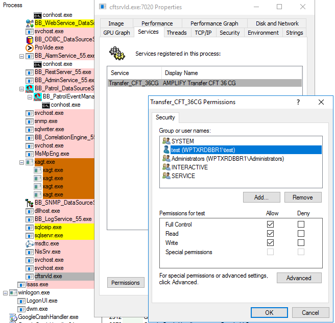

{
    "title": "Post installation",
    "linkTitle": "Post installation",
    "weight": "130"
}After installing Transfer CFT, but before starting Transfer CFT and the Copilot server, you may need to perform the following tasks:

-   [Perform an update](#updates)
-   [Create a basic configuration](#creating_a_basic_configuration)

Otherwise you can go to:

-   [Start the Transfer CFT Copilot server](#start)
-   [Start Transfer CFT](#start2)

For information on user rights, refer to the topic [Defining user rights UNIX](../../unix_install_start_here/run_first_time_ux/run_first_time_ux/user_rights_and_interface_unix).

## Installed directories and files

When you install Transfer CFT, the home directory is created and populated under the Transfer\_CFT installation directory. This home directory contains installation libraries, binaries, and templates. Do not store any personal files in the home directory, as they are erased during updates.

### Installer-generated files

During the installation, the Transfer CFT installer creates two files in the installation directory that are working files for the installer. Do not modify these files unless instructed to do so by Axway. While they are not used for Transfer CFT operations, they are necessary for installer functions such as upgrades.

-   .rundir
-   .transfer\_cft.properties

## Standalone installations

If you are not using Transfer CFT with Central Governance, you must provide a certificate in order to be able to use the Transfer CFT UI. See [Using the web-based browser UI](../../../c_intro_userinterfaces/web_copilot_ui) page for details.

## Perform an update

If you need to apply service packs or patches, refer to Update Transfer CFT.

If you have already started Transfer CFT or Copilot, stop these servers prior to performing an update.

## Create a basic configuration

This section describes how to create a basic Transfer CFT configuration
if you did not do so during the installation process. If you started Transfer CFT or Copilot, stop these servers before modifying the configuration.

### Update the profile

To add environment variables to your Transfer CFT profile
edit the following script:

-   Windows:  &lt;CFTDIRRUNTIME>\\profile.bat
-   UNIX: ./&lt;CFTDIRRUNTIME>/profile

### UCONF

To determine the Transfer CFT variable values list the values using
the command:

<table data-cellspacing="0">
<tbody>
<tr class="odd">
<td>CFTUTIL listuconf</td>
</tr>
</tbody>
</table>

To change or update a value, start the Transfer CFT profile
and make modifications using either the Transfer CFT Copilot UI or command line UCONF tools. Refer to Transfer
CFT online
documentation for details.

For example, to change the user interface port:

<table data-cellspacing="0">
<tbody>
<tr class="odd">
<td>CFTUTIL
uconfset id=copilot.general.serverport,value=1766</td>
</tr>
</tbody>
</table>

### Configuration

Before you can start Transfer CFT for the first time, Transfer CFT must
have a basic configuration. Typically this is created during installation or migration.

### License key

If you did not enter the license key during installation, you can enter it post installation in the cft.key file located in: &lt;CFTDIRRUNTIME>/conf/

You can enter a single key or a list of keys in this file. In the configuration default
file, the variable &lt;$CFTKEY> represents the cft.key file.

### Transfer CFT internal datafile and configuration

Check the values, especially the key value, hostname, and port for TCP,
in the following file:

-   Windows and UNIX: &lt;CFTRUNTIME>/conf/cft-tcp.conf

Start the Transfer CFT profile and, to create the Transfer CFT
internal datafile and update the basic configuration, execute:

<table data-cellspacing="0">
<tbody>
<tr class="odd">
<td>cftinit
cft-tcp.conf</td>
</tr>
</tbody>
</table>

To update the configuration at a later date, execute:

<table data-cellspacing="0">
<tbody>
<tr class="odd">
<td>cftupdate
cft-tcp.conf</td>
</tr>
</tbody>
</table>

### User interface configuration

To view the Copilot user interface configuration, execute:

<table data-cellspacing="0">
<tbody>
<tr class="odd">
<td>CFTUTIL
LISTUCONF id=copilot*</td>
</tr>
</tbody>
</table>

To change this configuration, you update the hostname and listening
port for Transfer CFT UI using CFTUTIL
uconfset.

**Example**

<table data-cellspacing="0">
<tbody>
<tr class="odd">
<td>CFTUTIL
uconfset id=copilot.general.serverhost, value="127.0.0.1"

CFTUTIL
uconfset id=copilot.general.serverport, value="7000"
</td>
</tr>
</tbody>
</table>

### Configuration for Service Mode

This option is only available on Windows systems and must be selected during the installation process configuration.

## Start the Transfer CFT Copilot server

If you have implemented Central Governance, starting Copilot launches the registration process. For more information, see the topic [Registration overview](../../../governance_services_intro/cg_register_overview).

**Windows**

1.  Change directory to the runtime.
2.  Execute profile.bat.
3.  To start the Copilot server, enter: copstart
4.  To check the Copilot status, enter: copstatus -v

**UNIX**

<table data-cellspacing="0" data-mc-conditions="Primary.unix_in">
<tbody>
<tr class="odd">
<td>
cd &lt;CFTDIRRUNTIME&gt;


. . /profile


copstart


http://myHostName:1766
</td>
</tr>
</tbody>
</table>

## Start Transfer CFT

If you have implemented Central Governance, you can start and stop Transfer CFT via the Central Unified Flow Management user interface. Otherwise perform the following command from the Transfer CFT runtime directory.

Enter:

<table data-cellspacing="0">
<tbody>
<tr class="odd">
<td> cft start</td>
</tr>
</tbody>
</table>

## Service mode set up when using Central Governance

Since you can start or restart a registered Transfer CFT from Central Governance, when using service mode you must set the **CFT UI service** account so that it can start the **CFT service**. Therefore, perform one of the following two tasks:

-   Add the account to the CFT server's **Local Administrator Group**, or
-   Provide the rights to start the Transfer CFT Service as a non Local Admin user:
    -   Use a Sysinternals utility such as Process Explorer to change Windows service permissions. Run Process Explorer as administrator and locate the CFT service (CFTSRVLD.exe) process.
    -   Open the process properties and click the **Services** tab. Click the **Permissions** button and add the user or group in the opened window. Then select the permissions that you want to assign (Full Control) and click **OK** to save.
    -   

## Register with Central Governance

If you intend to implement Central Governance, please refer to the Transfer CFT *User's Guide &gt; [*Register with* Central Governance](https://docs.axway.com/bundle/TransferCFT_36_UsersGuide_allOS_en_HTML5/page/Content/cft_installation/migrate/register_CG.htm)* page for registration details.
