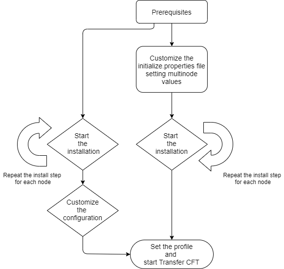

{
    "title": "Before you start",
    "linkTitle": "Before you start",
    "weight": "200"
}# Windows: Installation and operation

## Transfer CFT Windows specific operations

This section introduces prerequisite information as well as installation and information on operating Transfer CFT in Windows.

-   [Operating the product](../running_cft_for_the_first_time_windows)
-   [Specific system
    functions](../specific_system_functions)
-   Programming
    interfaces
-   Transfer CFT
    client/server architecture

The information in the Windows operations section
may be supplemented, corrected, or even contradicted by the
README.TXT file or the Release Notes supplied with the product. The README.TXT file and Release Notes take priority in this case.

## Product presentation

Transfer CFT can operate both as client and/or as server. The
number of simultaneous transfers that Transfer CFT can support
is defined by the license key. It is also limited by the properties of
the networks used. The TCP/IP network is supported.

## Installation schematic overview

Standalone installation



Multi-node installation


