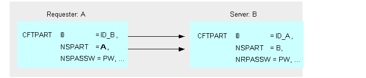

{
    "title": "Partner naming conventions",
    "linkTitle": "Partner naming conventions",
    "weight": "260"
}The parameter setting relative to partners makes a distinction between
the *network* names and *local* names. This
section describes the naming conventions to use in Transfer CFT.

### Network names

The network names are the names the scope of which generally
covers all the communicating partners. Only these names are conveyed over
the network, and must consequently comply with the formats and sizes defined
by the protocols used. The parameters describing these names are described in the following table.

Partner network names

<table cellspacing="0">
   <col/>
   <col/>
   <col/>
   <thead>
      <tr>
         <th>Parameter</th>
         <th>Object</th>
         <th>Network name</th>
      </tr>
   </thead>
      <tr valign="middle">
         <td valign="top" width="18%">
            
NSPART 

         </td>
         <td valign="top" width="18%">
            
CFTPART 

         </td>
         <td valign="top" width="65%">
            
Name of the local Transfer CFT with regard to the remote partner 
 described by this command 

         </td>
      </tr>
      <tr valign="middle">
         <td valign="top" width="18%">
            
NRPART 

         </td>
         <td valign="top" width="18%">
            
CFTPART 

         </td>
         <td valign="top" width="65%">
            
Name of the remote partner Transfer CFT 

         </td>
      </tr>
      <tr valign="middle">
         <td valign="top" width="18%">
            
NPART 

         </td>
         <td valign="top" width="18%">
            
CFTPARM 

         </td>
         <td valign="top" width="65%">
            
Default name of the local Transfer CFT with regard 
 to the partners (default value of the NSPART parameter) 

         </td>
      </tr>
</table>

### Local names

Local names are limited
to the local Transfer CFT, and are recognized as identifiers specific
to the Transfer CFT. The parameters describing these names are indicated in
the table below:

Partner local names

<table cellspacing="0">
   <col/>
   <col/>
   <col/>
   <thead>
      <tr>
         <th>
            
Parameter 

</th>
         <th>
            
Location 

</th>
         <th>
            
Local name 

</th>
      </tr>
   </thead>
   <tbody>
      <tr>
         <td>
            
ID 

         </td>
         <td>
            
CFTPART 

         </td>
         <td>
            
Uniquely identifies the partner and supplies the default 
 value of the NRPART parameter 

         </td>
      </tr>
      <tr>
         <td>
            
IPART parameter setting at requester end 

         </td>
         <td>
            
CFTPART 

         </td>
         <td>
            
The local name identifying an intermediate partner 
 (if using store and forward) 

         </td>
      </tr>
      <tr>
         <td>
            
IPART during transfer 

         </td>
         <td>
            
CFT CATALOG 

         </td>
         <td>
            <ul>
               <li>If there is no store and forward: remote partner identifier                </li>
               <li>If there is store and forward: store and forward 
 site identifier (immediate party)                </li>
            </ul>
         </td>
      </tr>
      <tr>
         <td>
            
PART 

         </td>
         <td>
            
CFTPARM 

         </td>
         <td>
            
Identifies the local Transfer CFT 

         </td>
      </tr>
      <tr>
         <td>
            
PART 

         </td>
         <td>
            
CFT CATALOG 

         </td>
         <td>
            <ul>
               <li>If there is no store and forward: remote partner identifier                </li>
               <li>If there is store and forward (see the paragraphs below): store and forward 
 site identifier (immediate party).                </li>
            </ul>
         </td>
      </tr>
      <tr>
         <td>
            
SPART 

         </td>
         <td>
            
CFT CATALOG 

         </td>
         <td>
            
Designates the initial sending partner 

         </td>
      </tr>
      <tr>
         <td>
            
RPART 

         </td>
         <td>
            
CFT CATALOG 

         </td>
         <td>
            
Designates the final receiving partner 

         </td>
      </tr>
   </tbody>
</table>

### Using reciprocal recognition

Transfer CFT can use the names in NSPART and NRPART to apply reciprocal
recognition of partners over the network. This recognition mechanism works
by comparing the name that is received from a partner with the name recorded
in the Transfer CFT parameters.

Reciprocal recognition mechanism

The recognition mechanism is displayed
in the diagram below.



*On  the server*, Transfer CFT
also provides the possibility of checking whether the requester
is authorized to connect to the network. This check compares
the requester’s password, set in NSPASSW and conveyed over the network, against
the password indicated in the NRPASSW parameter on the server.

The checks performed on connection are indicated in the following diagram.



That is, a CFTPART parameter is set for each
partner to be communicated with, where different NRPART parameters correspond
to the identifier of these partners, so each partner must identify itself
with a specific unique network identifier.

This principle is applies to this entire section.

However, for requester operations, a partner with the same NRPART
value shows that you can have several partner descriptions
each having the same NRPART value. This is a special operating mode which
should not be generalized.
