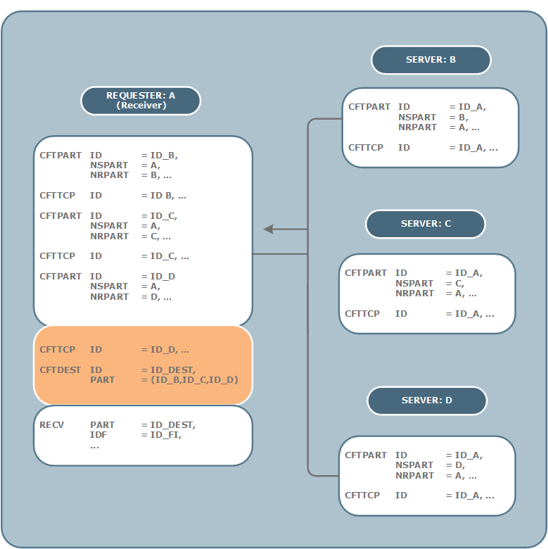

{
    "title": "Broadcast and collect",
    "linkTitle": "Broadcast and collect",
    "weight": "240"
}This section describes the following two types of transfer functions, which you can perform in
requester mode:

-   [Broadcast](#broadcasting_mode):
    Send one or more files or messages to several partners by activating a
    SEND command
-   [Collect](#collecting):
    Receive one or more files or messages from several partners by activating
    a single RECV command

<table data-cellpadding="0" data-cellspacing="0">
<tbody>
<tr class="odd">
<td data-valign="top"></td>
<td data-valign="top"><strong>Note</strong></td>
<td data-mc-autonum="&lt;b&gt;Note&lt;/b&gt;" data-valign="top">When using these features with Central Governance, you must enable broadcasting for the flow. For more information, refer to the <em>Central Governance</em> documentation.</td>
</tr>
</tbody>
</table>

## Broadcasting mode

This mode is used to send a file or a group of files through a single
send request, to a group of partners where the number of partners in a group is limited to 200. The CFTDEST command
defines this group of partners. Each partner is also described by a CFTPART
command.

The correspondences to be established in the local Transfer CFT parameter
setting to implement this mechanism are shown in the figure below,
on the basis of a generic example.

#### Define a broadcasting list



The broadcasting list can be described by indicating the identifiers
of the partners in this list, in the PART parameter of the CFTDEST command.
This limits the number of identifiers.

This diagram represents a SEND command for "mygroup", which is a collection of applications as defined in Central Governance, or CFTPART objects if defined in Transfer CFT.



Another method involves defining these identifiers in a file (using an fname). The number
of identifiers is then not limited. When using this method, if you change the runtime or import the configuration to a new environment you must remember to copy this file to the new runtime. The name of this file is defined in
the FNAME parameter of CFTDEST.

<table data-cellspacing="0">
<tbody>
<tr class="odd">
<td>
     CFTDEST     ID    
=     &lt;<em>identifier</em>&gt;, 
          FNAME    
=     &lt;<em>file</em>&gt;, 
          ...
</td>
</tr>
</tbody>
</table>

These two methods are mutually exclusive. The PART parameter cannot
be used simultaneously with the FNAME parameter in the CFTDEST command.

To broadcast a file called X, with N partners, a SEND
PART=DEST, IDF=ID\_EM, FNAME=X command generates N+1 transfer entries in
the catalog that corresponds to:

-   An entry for each
    effective transfer (i.e. N entries)
-   And a generic virtual
    entry, which never leads to an effective transfer, used locally for broadcasting
    management

This virtual transfer is identified by a DIAGP code equal to DIFFUS,
on querying the catalog. It is in the K state.

The associated post processing procedure is only executed when
all the transfers are correctly completed (DIFFUS entry changes to the
T or X state, depending on the compat mode).

<table data-cellpadding="0" data-cellspacing="0">
<tbody>
<tr class="odd">
<td data-valign="top"></td>
<td data-valign="top"><strong>Note</strong></td>
<td data-mc-autonum="&lt;b&gt;Note&lt;/b&gt;" data-valign="top">If the CFTDEST command includes the EXEC=PART parameter, the end of
send procedure is executed on completion of each transfer.</td>
</tr>
</tbody>
</table>

The post processing procedure in the case of an error is executed for each transfer in the same
way as for normal transfers.

To broadcast a group of P files if N partners are involved, a SEND PART =
DEST, IDF = ID\_EM, FNAME = &lt;file\_symb>GROUP command generates N (P+1) +1 transfer
entries in the catalog corresponding to:

-   An entry for each
    effective transfer (i.e. N\*P entries)
-   A generic virtual
    entry which never leads to an effective transfer, used locally for broadcasting
    management
-   Where &lt;file\_symb> is the OS appropriate symbol (# or @)

This virtual transfer is identified by a DIAGP
code equal to DIFFUS, on querying
the catalog.

-   And a generic virtual
    entry per partner used locally for the management of the group of files
    sent for the partner in question (i.e. N generic entries)

These virtual transfers are identified by a DIAGP code equal to LIST\_FI,
on querying the catalog.

The associated post processing procedure is activated in this
case:

-   For each end of
    transfer, of all the files of the group, the "LIST\_FI" entry
    changes to the T state
-   On completion of
    broadcasting, when all the partners have received all the files, the DIFFUS
    entry changes to the T or X state

The following diagram illustrates the parameter setting to broadcast to
three different partners.

Parameter setting to broadcast to several
partners



## Broadcasting and store and forward

You can use the store and forward mechanism for each transfer to a partner
that is defined in a broadcasting list. You can also use the SEND command to broadcast from a store and forward
site. The mechanisms and the associated parameter setting are described in
[Store
and forward mode relay](../store_and_forward_mode_routing).

### Define a relay for a broadcast list

You can use the following commands as an example to configure a transfer flow from Partner A to a distribution list C*n*, via the intermediate site B.



**Step 1**

1.  Partner A sends the list of partners (C1, C2, ...Cn) that you want to broadcast to Partner B:

2.  <table data-cellspacing="0">
    <tbody>
    <tr class="odd">
    <td data-mc-conditions="governance.CG_out">SEND PART=ID_B, FNAME=LIST_B,IDF=LIST,...</td>
    </tr>
    </tbody>
    </table>

3.  Partner B receives this list with the command:

4.  <table data-cellspacing="0">
    <tbody>
    <tr class="odd">
    <td data-mc-conditions="governance.CG_out">CFTRECV ID=LIST,..., FNAME=LIST</td>
    </tr>
    </tbody>
    </table>

**Step 2**

1.  Partner A sends the file to broadcast to a virtual Partner C:

2.  <table data-cellspacing="0">
    <tbody>
    <tr class="odd">
    <td data-mc-conditions="governance.CG_out">SEND PART=ID_C, FNAME=FILE_TO_BROADCAST,...</td>
    </tr>
    </tbody>
    </table>

3.  On Partner A perform the following command to reach Partner C virtually via Partner B:

4.  <table data-cellspacing="0">
    <tbody>
    <tr class="odd">
    <td data-mc-conditions="governance.CG_out">CFTPART ID=ID_C,..., OMINTIME=O, OMAXTIME=0, IPART=ID_B</td>
    </tr>
    </tbody>
    </table>

    1.  Partner B receives the FILE\_TO\_BROADCAST and sends it on to Partner C (where C is a broadcast list).

5.  <table data-cellspacing="0">
    <tbody>
    <tr class="odd">
    <td data-mc-conditions="governance.CG_out">CFTDEST ID=C, FNAME=LIST, FOR=COMMUT</td>
    </tr>
    </tbody>
    </table>

    This results in the FILE\_TO\_BROADCAST being sent to all of the partners in the C list of partners.

## Collecting

This section describes the collecting
mode. The collecting mode is when Transfer CFT receives one or more files
or messages from several partners. The Collecting
transfer mode is described in more detail in the section below.

### Collecting mode

As in broadcasting, a single reception command is used to collect the
partner files from a list of partners, CFTDEST object.

The collecting mechanism correspondences are displayed in the following command.

<table data-cellspacing="0">
<tbody>
<tr class="odd">
<td data-mc-conditions="governance.CG_out">RECV PART=GROUP, IDF=IDF1,...</td>
</tr>
</tbody>
</table>

### Define a collecting partner list

The list of partners can be described in one of two ways:

-   Explicitly by defining
    the PART parameter.
-   Using a file in
    which this list is saved. The name of this file is defined in the FNAME
    parameter.

These two methods are mutually exclusive. The PART parameter cannot
be used simultaneously with the [FNAME](../../../c_intro_userinterfaces/command_summary/parameter_intro/fname)
parameter.

This RECV command generates N+1 transfer entries in the catalog if there
are N partners involved, the first one being a virtual transfer (generic)
which never leads to a physical transfer. This transfer virtual is identified
by a DIAGP code equal to COLLECT, on querying the catalog.  
The associated end of transfer procedure is only executed when all the
transfers are correctly completed.

### End-of-send procedure

When all transfers are completed, the end of transfer procedure is executed on the generic transfer.

There are three possible actions when transfers complete depending on the [EXEC](../../../c_intro_userinterfaces/command_summary/parameter_intro/exec) parameter setting, DEST, PART, CHILDREN.

The error procedure is executed for each transfer in the same
way as for normal transfers.

It is a special
case when a single command is used to collect all available files from
all partners in the list.

For each partner, the mechanism used is RECV IDF=\*, FILE=ALL. See the paragraphs relating to the use of the RECV command
for [ODETTE](../../../protocols_start_here/start_here_odette/receiving_transfers) and [PeSIT](../../../protocols_start_here/about_pesit/defining_cftrecv_in_pesit) in the [Protocol](../../../protocols_start_here) sections.

The EXEC parameter of the CFTDEST command is ignored. The end of transfer procedure is only executed when all the transfers
are correctly completed (COLLECT entry changes to the T or **X**
state). No procedure is submitted for the generic collection entry, which
remains in K state when reception
is complete.

No error procedure is submitted for created entries that include
errors.

The following figure indicates the parameter setting of a collect from
three different partners.

**Parameter setting to collect from three
partners**


