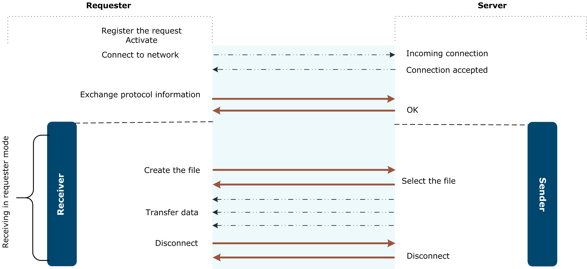

{
    "title": "Transfer steps",
    "linkTitle": "Transfer steps",
    "weight": "200"
}# Requester and server modes

Transfer CFT mechanisms differ depending on if the Transfer CFT is operating in
requester mode or server mode, as mentioned in the [Introduction](introduction4.htm). This section describes the transfer steps
in relation to each mode.

-   In
    requester mode, Transfer CFT initiates the connection with the partner
    following a local request.
-   In
    server mode, Transfer CFT replies to an incoming connection, re-sent
    by the system communication layers.

For details on using these modes in a Central Unified Flow Management setting, please refer to the Central Unified Flow Management User Guide.

## Requester mode overview

Transfer CFT is able to send and receive files, and send messages. Although
the receiver file can be dynamically created, directories or libraries
must already exist. The receiver file, and the directories or libraries can be created dynamically.

Steps include:

1.  **Register the request**: Transfer CFT processes each transfer request in the catalog.
2.  **Activate the transfer**: Transfer CFT activates all pending
    transfers, which are entries having a "ready for execution" state.
3.  **Connect to the network**: When Transfer CFT has a "ready for execution" transfer,
    it attempts to make the connection to the communication system attached
    to the partner of this transfer.
4.  **Exchange protocol information**: When the network connection is established, the partners participate in an exchange
    of messages in accordance with the chosen protocol.
5.  **Select or create the file**: Depending on if you are the sender or the receiver, once the partner is recognized and the protocol is defined the file is selected or created.
6.  **Transfer data**: The data in the file is transferred item by item.
    The exchange protocol may include compression functions.
7.  **Disconnect**: On completion of data transfer, the files are closed, the network connection
    is cut after the expiration of the associated hold timeout.

## Server mode overview

Transfer CFT accepts transfer requests from the
network and then operates in server mode.

Steps include:

1.  **Receive an incoming call**: Transfer CFT receives an incoming connection on the communication system, which could be rejected depending on Transfer CFT limitations and/or parameter settings.
2.  **Exchange protocol information**: When the network connection is established, the partners participate in an exchange
    of messages in accordance with the chosen protocol.
3.  **Create or select a
    file**: Once the recognition phase is complete, Transfer CFT receives a request
    to create a file (receive) or select a file (send).
4.  **Transfer data**: The data in the file is transferred item by item.
    The exchange protocol may include compression functions.
5.  **Disconnect**: On completion of data transfer, the files are closed, the network connection
    is cut after the expiration of the associated hold timeout.

Example: Sending in requester mode



 

Example: Receiving in requester mode


