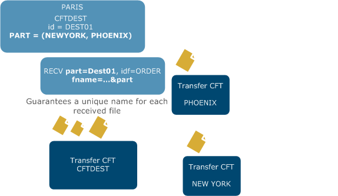

{
    "title": "First file transfer with standalone Transfer CFT",
    "linkTitle": "First file transfer with standalone Transfer CFT",
    "weight": "100"
}After installing your Transfer CFT, you can use the delivered configuration samples and default values to quickly and easily perform your first transfer.

For more information on starting your Transfer CFT, and basic operational commands, see the section [Start, stop, and Transfer CFT administrative scripts.](../../admin_intro/start_stop_cft)

This topic describes how to:

-   [Perform a file transfer using the sample configuration](#perform)
-   [Perform a standard mode transfer](#perform2)
-   [Use the explicit mode to get a file](#use)
-   [Receive multiple files from a partner](#receive)
-   [Use the implicit transfer mode](#use2)
-   [Send using open mode](#send)
-   [Receive using open mode](#receive2)
-   [Perform broadcast and collect operations](#perform3)

## Perform a file transfer using the sample configuration

The sample file features two default partners, NEWYORK and PARIS. Each of these partners is pre-configured to communicate using the [PeSIT](../../protocols_start_here/about_pesit) protocol. Additionally, both of these partners listen on the localhost interface. You can begin with a simple transfer, and then check the catalog for transfer details.

To send a file from PARIS to NEWYORK, run the following command:

<table cellspacing="0">
   <col/>
   <tbody>
      <tr>
         <td>CFTUTIL send part=NEWYORK, idf=txt         </td>
      </tr>
   </tbody>
</table>

To check in the Transfer CFT catalog to confirm that the transfer completed successfully, enter:

<table cellspacing="0">
   <col/>
   <tbody>
      <tr>
         <td>CFTUTIL listcat         </td>
      </tr>
   </tbody>
</table>

You should see that the default file was sent from NEWYORK to PARIS. There are two entries are displayed, this is due to the fact that you performed a loop transfer using the localhost interface.

<table cellspacing="0">
   <col/>
   <tbody>
      <tr>
         <td>
            
Partner  DTSAPP File     Transfer         Records       Diags        Appli.   Appstate.

            
                Id.      Id.       Transmit     Total   CFT Protocol Id.

            
-------- ------ -------- -------- ---------- ---------- --- -------- -------- ---------

            
NEWYORK  SFX XX TXT      J2220582        112        112   0 CP NONE

            
PARIS    RFX XX TXT      J2220582        112        112   0 CP NONE

         </td>
      </tr>
   </tbody>
</table>

To display exhaustive transfer details, enter the command:

<table cellspacing="0">
   <col/>
   <tbody>
      <tr>
         <td>CFTUTIL listcat content=debug         </td>
      </tr>
   </tbody>
</table>

The purpose of the My first file transfer section is to help you feel comfortable with basic Transfer CFT file transfer commands. Once you understand core file transfer concepts, you can delve into the rich array of parameters that allow you to customize your application integrations and data flows. Additional commands and options are available to help you define the monitoring granularity  for your executed transfers.

## What's next?

In the following sections, we'll take a look at additional Transfer CFT transfer modes, as well as some useful configuration parameters. With Transfer CFT, the transfer initiator can be either the sender of the file or the receiver, as indicated in the examples below. Additionally, in these examples we will use the convention that the requester is the client, so the transfer description may read Requester/Sender if the client is supplying the file.

<table cellpadding="0" cellspacing="0">
   <col/>
   <col/>
   <col/>
      <tr>
         <td valign="top">         </td>
         <td valign="top"><b>Note</b>
         </td>
         <td data-mc-autonum="&lt;b&gt;Note&lt;/b&gt;" valign="top">For more information on a command and a list of available parameters, enter CFTUTIL help cmd=&lt;name of command&gt;.         </td>
      </tr>
</table>

### Perform a standard mode transfer

Let's start by performing the same type of transfer as in the sample configuration above, but without using the samples. First, you need to create two partners, and then exchange a file.



 

<table cellspacing="0">
   <col/>
   <col/>
   <thead>
      <tr>
         <th>Requester/Sender</th>
         <th>Server/Receiver</th>
      </tr>
   </thead>
   <tbody>
      <tr>
         <td>
            
<b>Configuration</b>

<ol start="1">
               <li value="1">Create a partner.                </li>
               <li value="2">Create an IDF.               </li>
</ol>
            
<b>Runtime</b>

<ol start="3">
               <li value="3">Run the transfer.               </li>
</ol>
<ol start="4">
               <li value="4">Check the catalog.               </li>
</ol>
         </td>
         <td>
            
<b>Configuration</b>

<ol start="1">
               <li value="1">Create a partner.               </li>
               <li value="2">Create an IDF.               </li>
</ol>
            
<b>Runtime</b>

<ol start="3">
               <li value="3">Retrieve the sent file.               </li>
               <li value="4">Check the catalog.               </li>
</ol>
         </td>
      </tr>
   </tbody>
</table>

View an example

<table cellspacing="0">
   <col/>
   <tbody>
      <tr>
         <td>
            
<b>/*REQUESTER/SENDER*/</b>

            
CFTPART 

            
     ID =     NEWYORK,      

            
PROT =     PESITANY, 

            
     SAP =     1761, /*remote listening port for NewYork*/

            
NRPART =     NEWYORK, 

            
     NSPART =     PARIS,

            
 

            
CFTTCP 

            
ID=NEWYORK,

            
HOST = @&lt;NEWYORK address&gt;

            
 

            
CFTSEND ID=INVOICE,...

            
 

            
SEND PART=NEWYORK, IDF=INVOICE

            
 

            
LISTCAT

         </td>
      </tr>
   </tbody>
</table>

 

<table cellspacing="0">
   <col/>
   <tbody>
      <tr>
         <td>
            
<b>/*SERVER/RECEIVER*/</b>

            
CFTPART     

            
     ID =     PARIS,      

            
PROT =     PESITANY, 

            
     SAP =         1761, /*remote listening port for Paris*/

            
NRPART =     PARIS, 

            
     NSPART =     NEWYORK,

            
 

            
CFTTCP 

            
ID=PARIS,

            
HOST = @&lt;PARIS address&gt;

            
 

            
CFTRECV ID=INVOICE, FNAME=MYFILE

            
 

            
LISTCAT

         </td>
      </tr>
   </tbody>
</table>

### Use the explicit mode to get a file

In explicit mode, an application makes a specific file available for a defined partner. Then when that particular remote partner is ready, it can retrieve the specified file, which only needed to be made available once.



 

<table cellspacing="0">
   <col/>
   <col/>
   <thead>
      <tr>
         <th>Server/Sender </th>
         <th>Requester/Receiver </th>
      </tr>
   </thead>
   <tbody>
      <tr>
         <td>
            
Configuration

<ol start="1">
               <li value="1">Create a partner.               </li>
               <li value="2">Create an IDF.               </li>
</ol>
            
 

            
 

            
Runtime

<ol start="3">
               <li value="3">Make your file available.            
The send command is set with the ‘state=HOLD’ parameter. The HOLD attribute puts the file in the Transfer CFT catalog, and indicates that it is available for the partner.
               </li>
               <li value="4">Check the catalog.                </li>
</ol>
         </td>
         <td>
            
Configuration

<ol start="1">
               <li value="1">Create a partner.               </li>
               <li value="2">Create an IDF.               </li>
</ol>
            
 

            
 

            
Runtime

<ol start="3">
               <li value="3">Receive the available file.                </li>
</ol>
<ol start="4">
               <li value="4">Check the catalog.               </li>
</ol>
         </td>
      </tr>
   </tbody>
</table>

View an example

<table cellspacing="0">
   <col/>
   <tbody>
      <tr>
         <td>
            
<b>/*SERVER/SENDER*/</b>

            
CFTPART     

            
     ID =     PARIS,      

            
PROT =     PESITANY, 

            
     SAP =     1761, /*remote listening port for Phoenix*/

            
NSPART =     PHOENIX, 

            
     NRPART =     PARIS,

            
CFTTCP 

            
ID=PARIS, 

            
HOST = @&lt;Paris address&gt;

            
 

            
CFTSEND ID=INVOICE, IMPL=NO,....

            
 

            
SEND PART=PARIS, IDF=INVOICE, STATE=HOLD 

            
 

            
LISTCAT /*show transfers in hold state*/

         </td>
      </tr>
   </tbody>
</table>

<table cellspacing="0">
   <col/>
   <tbody>
      <tr>
         <td>
            
<b>/*REQUESTER/RECEIVER*/</b>

            
CFTPART     

            
     ID =     PHOENIX,      

            
PROT =     PESITANY, 

            
     SAP =     1761, /* remote listening port for Paris */

            
NSPART =     PARIS, 

            
     NRPART =     PHOENIX,

            
CFTTCP 

            
ID=PHOENIX, 

            
HOST = @&lt;Phoenix address&gt; 

            
 

            
CFTRECV ID=INVOICE,....

            
 

            
RECV PART=PHOENIX, IDF=INVOICE, FNAME=MY_FILE

            
 

            
LISTCAT

         </td>
      </tr>
   </tbody>
</table>

### Receive multiple files from a partner

This transfer mode is the same as the previously described explicit mode but provides multiple files for a defined partner. So an application might create several files and set them to an available state, and the remote partner can then retrieve these when ready, for example at a scheduled time.



 

<table cellspacing="0">
   <col/>
   <col/>
   <thead>
      <tr>
         <th>Server/Sender</th>
         <th>
            
Requester/Receiver

</th>
      </tr>
   </thead>
   <tbody>
      <tr>
         <td>
            
Configuration

<ol start="1">
               <li value="1">Create a partner.               </li>
               <li value="2">Create an IDF.               </li>
</ol>
            
Runtime

<ol start="3">
               <li value="3">Make a file available SEND part=PARIS, idf=INVOICE, state=HOLD.               </li>
               <li value="4">Repeat with another file.               </li>
               <li value="5">Repeat again with a third file. This ‘HOLD’ attribute puts the files in the Transfer CFT catalog and makes them available for the partner.               </li>
</ol>
<ol start="6">
               <li value="6">Check the catalog for 1 entry per transfer. A generic entry is set.               </li>
</ol>
         </td>
         <td>
            
Configuration

<ol start="1">
               <li value="1">Create a partner.               </li>
               <li value="2">Create an IDF.               </li>
</ol>
            
Runtime

<ol start="3">
               <li value="3">Receive all of the available files: RECV part=PHOENIX, idf=INVOICE, file=ALL.               </li>
</ol>
<ol start="4">
               <li value="4">Check the catalog for 1 entry per transfer. A generic entry is set.               </li>
</ol>
         </td>
      </tr>
   </tbody>
</table>

View an example

<table cellspacing="0">
   <col/>
   <tbody>
      <tr>
         <td>
            
<b>/*SERVER/SENDER*/</b>

            
CFTPART     

            
     ID =     PARIS,      

            
PROT =     PESITANY, 

            
     SAP =     1761, /*remote listening port for Phoenix*/

            
NSPART =     PHOENIX, 

            
     NRPART =     PARIS,

            
CFTTCP 

            
ID=PARIS, 

            
HOST = @&lt;Paris address&gt;

            
 

            
CFTSEND ID=INVOICE, IMPL=NO,....

            
 

            
SEND PART=PARIS, IDF=INVOICE, STATE=HOLD, FNAME=FILE_1

            
SEND PART=PARIS, IDF=INVOICE, STATE=HOLD, FNAME=FILE_2

            
SEND PART=PARIS, IDF=INVOICE, STATE=HOLD, FNAME=FILE_n

            
 

            
LISTCAT /*would show transfer in hold state*/

         </td>
      </tr>
   </tbody>
</table>

<table cellspacing="0">
   <col/>
   <tbody>
      <tr>
         <td>
            
<b>/*REQUESTER/RECEIVER*/</b>

            
CFTPART     

            
     ID =     PHOENIX,      

            
PROT =     PESITANY, 

            
     SAP =     1761, /* remote listening port for Paris */

            
NSPART =     PARIS, 

            
     NRPART =     PHOENIX,

            
CFTTCP 

            
ID=PHOENIX, 

            
HOST = @&lt;Phoenix address&gt; 

            
 

            
CFTRECV ID=INVOICE, FNAME=@IDTU.RCV,...

            
 

            
RECV PART=PHOENIX, IDF=INVOICE, FILE=ALL

            
 

            
LISTCAT

         </td>
      </tr>
   </tbody>
</table>

### Use the implicit transfer mode

The implicit transfer mode is often used to make a file whose content is frequently changing available to partners. The file is always available and partners can retrieve it as many time as necessary.



 

<table cellspacing="0">
   <col/>
   <col/>
   <thead>
      <tr>
         <th>Server/Sender</th>
         <th>Requester/Receiver</th>
      </tr>
   </thead>
   <tbody>
      <tr>
         <td>
            
Conf

<ol start="1">
               <li value="1">Create a partner.               </li>
               <li value="2">Create an IDF where impl=yes.               </li>
</ol>
            
Runtime

<ol start="3">
               <li value="3">The CFTSEND is set with ‘impl=yes’.               </li>
               <li value="4">Check the catalog.               </li>
</ol>
         </td>
         <td>
            
Conf

<ol start="1">
               <li value="1">Create a partner.               </li>
               <li value="2">Create an IDF.               </li>
</ol>
            
Runtime

<ol start="3">
               <li value="3">Receive the file.               </li>
</ol>
<ol start="4">
               <li value="4">Check the catalog.               </li>
</ol>
         </td>
      </tr>
   </tbody>
</table>

View an example

<table cellspacing="0">
   <col/>
   <tbody>
      <tr>
         <td>
            
<b>/*PHOENIX*/</b>

            
CFTPART     

            
     ID =     PARIS,      

            
PROT =     PESITANY, 

            
     SAP =     1761, /*remote listening port for Phoenix*/

            
NSPART =     PHOENIX, 

            
     NRPART =     PARIS,

            
CFTTCP 

            
ID=PARIS, 

            
HOST = @&lt;Paris address&gt;

            
 

            
CFTSEND ID=ORDER, IMPL=YES, FNAME=FILE_TO_SEND....

            
 

            
 

            
LISTCAT /*would show transfer in hold state*/

         </td>
      </tr>
   </tbody>
</table>

 

<table cellspacing="0">
   <col/>
   <tbody>
      <tr>
         <td>
            
<b>/*PARIS*/</b>

            
CFTPART     

            
     ID =     PHOENIX,      

            
PROT =     PESITANY, 

            
     SAP =     1761, /* remote listening port for Paris */

            
NSPART =     PARIS, 

            
     NRPART =     PHOENIX,

            
CFTTCP 

            
ID=PHOENIX, 

            
HOST = @&lt;Phoenix address&gt; 

            
 

            
CFTRECV ID=ORDER,....

            
 

            
RECV PART=PHOENIX, IDF=ORDER, FNAME=MY_FILE

            
 

            
LISTCAT

         </td>
      </tr>
   </tbody>
</table>

### Send using open mode

This mode is similar to the FTP put command. It allows you to define the file name in the remote partner. The receiver must accept the open mode. Then, using a simple SEND command allows you to send a file to a partner in a dedicated directory with a dedicated file name.



 

<table cellspacing="0">
   <col/>
   <col/>
   <thead>
      <tr>
         <th>Requester/Sender</th>
         <th>Server/Receiver</th>
      </tr>
   </thead>
   <tbody>
      <tr>
         <td>
            
Conf

<ol start="1">
               <li value="1">Create a partner.               </li>
               <li value="2">Create a CFTSEND with fname=&lt;FILE_TO_SEND&gt;, nfname=cft/filpub/fic.txt …               </li>
</ol>
            
Runtime

<ol start="3">
               <li value="3">Run the transfer.               </li>
</ol>
<ol start="4">
               <li value="4">Check the catalog.               </li>
</ol>
         </td>
         <td>
            
Conf

<ol start="1">
               <li value="1">Create a partner.               </li>
               <li value="2">Create an CFTRECV  fname=&amp;nfname…            
The syntax ‘fname=&amp;nfname’ means that the receiver allows the open mode.
               </li>
</ol>
            
Runtime

<ol start="3">
               <li value="3">The file has been stored in the path defined by the client/sender, in this example: cft/filpub/fic.txt.               </li>
               <li value="4">Check the catalog.               </li>
</ol>
         </td>
      </tr>
   </tbody>
</table>

View an example

<table cellspacing="0">
   <col/>
   <tbody>
      <tr>
         <td>
            
<b>/*REQUESTER/SENDER*/ </b>

            
CFTPART 

            
     ID =     NEWYORK,      

            
PROT =     PESITANY, 

            
     SAP =     1761, /*remote listening port for NewYork*/

            
NRPART =     NEWYORK, 

            
     NSPART =     PARIS,

            
 

            
CFTTCP 

            
ID=NEWYORK,

            
HOST = @&lt;NEWYORK address&gt;

            
 

            
CFTSEND ID=INVOICE,FNAME=FILE_TO_SEND, NFNAME=&lt;remote_location_pathname&gt;

            
 

            
SEND PART=NEWYORK, IDF=INVOICE

            
 

            
LISTCAT

         </td>
      </tr>
   </tbody>
</table>

 

<table cellspacing="0">
   <col/>
   <tbody>
      <tr>
         <td>
            
<b>/*RECEIVER/SERVER*/</b>

            
 

            
CFTPART     

            
     ID =     PARIS,      

            
PROT =     PESITANY, 

            
     SAP =         1761, /*remote listening port for Paris*/

            
NRPART =     PARIS, 

            
     NSPART =     NEWYORK,

            
 

            
CFTTCP 

            
ID=PARIS,

            
HOST = @&lt;PARIS address&gt;

            
 

            
CFTRECV ID=INVOICE, FNAME=MYFILE,FNAME=&amp;NFNAME

            
 

            
LISTCAT

         </td>
      </tr>
   </tbody>
</table>

### Receive using open mode

This mode is similar to FTP get command. It allows the receiver to get a file from the sender in a dedicated location.  The receiver must accept the open mode. Then, a simple RECV command allows to get a file from a partner from a dedicated directory with a dedicated file name.



 

<table cellspacing="0">
   <col/>
   <col/>
   <thead>
      <tr>
         <th>
            
Requester/Receiver

</th>
         <th>Server/Sender</th>
      </tr>
   </thead>
   <tbody>
      <tr>
         <td>
            
Configuration

<ol start="1">
               <li value="1">Create a partner.               </li>
               <li value="2">Create an CFTRECV that defines the fname.               </li>
</ol>
            
Runtime

<ol start="3">
               <li value="3">Request the file  stored on the remote server. Run the command: CFTUTIL RECV… nfname=&lt;remote_requested_file&gt;.               </li>
</ol>
<ol start="4">
               <li value="4">The file retrieved is stored in the fname location.               </li>
               <li value="5">Check the catalog.               </li>
</ol>
         </td>
         <td>
            
Configuration

<ol start="1">
               <li value="1">Create a partner.               </li>
               <li value="2">Create an CFTSEND where impl=yes, fname=&amp;nfname.            
The syntax ‘fname=&amp;nfname’ means that the server/sender allows the open mode.
               </li>
</ol>
            
Runtime

<ol start="3">
               <li value="3">The file stored locally in &lt;remote_requested_file&gt; is sent to the client.               </li>
</ol>
<ol start="4">
               <li value="4">Verify the catalog                </li>
</ol>
         </td>
      </tr>
   </tbody>
</table>

View an example

<table cellspacing="0">
   <col/>
   <tbody>
      <tr>
         <td>
            
<b>/*REQUESTER/RECEIVER*/</b> 

            
CFTPART 

            
     ID =     NEWYORK,      

            
PROT =     PESITANY, 

            
     SAP =     1761, /*remote listening port for NewYork*/

            
NRPART =     NEWYORK, 

            
     NSPART =     PARIS,

            
 

            
CFTTCP 

            
ID=NEWYORK,

            
HOST = @&lt;NEWYORK address&gt;

            
 

            
CFTRECV ID=INVOICE, FNAME=&lt;local_download_location&gt;

            
 

            
RECV PART=NEWYORK, IDF=INVOICE, NFNAME=&lt;remote_requested_file&gt;

            
 

            
LISTCAT

         </td>
      </tr>
   </tbody>
</table>

 

<table cellspacing="0">
   <col/>
   <tbody>
      <tr>
         <td>
            
<b>/*SERVER/SENDER*/</b>

            
CFTPART     

            
     ID =     PARIS,      

            
PROT =     PESITANY, 

            
     SAP =         1761, /*remote listening port for Paris*/

            
NRPART =     PARIS, 

            
     NSPART =     NEWYORK,

            
 

            
CFTTCP 

            
ID=PARIS,

            
HOST = @&lt;PARIS address&gt;

            
 

            
CFTSEND ID=INVOICE, IMP=YES,FNAME=&amp;NFNAME

            
 

            
LISTCAT

         </td>
      </tr>
   </tbody>
</table>

### Perform broadcast and collect operations

Broadcast and collect modes allow you to send files to multiple partners and receiving files from multiple partners using a single command request for each.

#### Broadcasting

You can use broadcasting to send a file to an entire group of partners in one command, avoiding the task of sending the selected file individually to each of the partners in a flow.

The name of the broadcast list is itself a virtual partner, which contains a list of partners in your flow. This list of partners can be explicit, or it can reference a file that contains the list of partners.

Additionally, you can define what occurs if a partner is unknown, how the scripts are applied to the broadcast list, and so on.

[More information](../../concepts/transfer_command_overview/broadcast_collect)...



 

<table cellspacing="0">
   <col/>
   <col/>
   <col/>
   <thead>
      <tr>
         <th>Requester/Sender</th>
         <th>Server/Receiver – PHOENIX</th>
         <th>Server/Receiver – NEWYORK</th>
      </tr>
   </thead>
   <tbody>
      <tr>
         <td>
            
Configuration

<ol start="1">
               <li value="1">Create a first partner NEWYORK.               </li>
               <li value="2">Create a second partner PHOENIX.               </li>
               <li value="3">Create a broadcast list that contains both part1 and part2.               </li>
               <li value="4">Create a CFTSEND.               </li>
</ol>
            
Runtime

<ol start="5">
               <li value="5">Using one command, send a file to the broadcast list.               </li>
               <li value="6">The file is sent to both partners at the same time.               </li>
</ol>
<ol start="7">
               <li value="7">Check the catalog. You should have 3 entries in the catalog, one generic entry and one entry per partner.               </li>
</ol>
         </td>
         <td>
            
Configuration

<ol start="1">
               <li value="1">Create a first partner.               </li>
               <li value="2">Create an CFTRECV.               </li>
</ol>
            
Runtime

<ol start="3">
               <li value="3">The first partner receives the file.               </li>
</ol>
<ol start="4">
               <li value="4">Check the catalog, there should be get one entry for this partner.               </li>
</ol>
         </td>
         <td>
            
Configuration

<ol start="1">
               <li value="1">Create a second partner.               </li>
               <li value="2">Create an CFTRECV.               </li>
</ol>
            
Runtime

<ol start="3">
               <li value="3">The second partner receives the file.               </li>
</ol>
<ol start="4">
               <li value="4">Check the catalog, there should be get one entry for this partner.               </li>
</ol>
            
 

            
 

         </td>
      </tr>
   </tbody>
</table>

View an example

<table cellspacing="0">
   <col/>
   <tbody>
      <tr>
         <td>
            
/*SENDER*/ 

            
CFTPART     

            
     ID =     PHOENIX,      

            
PROT =     PESITANY, 

            
     SAP =     1761, /*remote listening port for Phoenix*/

            
NSPART =     PARIS, 

            
     NRPART =     PHOENIX,

            
CFTTCP 

            
ID=PHOENIX, 

            
HOST = @&lt;PHOENIX address&gt;

            
 

            
CFTPART     

            
     ID =     NEWYORK,      

            
PROT =     PESITANY, 

            
     SAP =     1761, /*remote listening port for New York*/

            
NSPART =     PARIS, 

            
     NRPART =     NEWYORK,

            
CFTTCP 

            
ID=NEWYORK, 

            
HOST = @&lt;NEWYORK address&gt;

            
 

            
CFTDEST ID=DEST01, PART=NEWYORK, PHOENIX

            
 

            
CFTSEND ID=ORDER

            
 

            
SEND PART=DEST01, IDF=ORDER

            
 

            
LISTCAT 

         </td>
      </tr>
   </tbody>
</table>

 

<table cellspacing="0">
   <col/>
   <tbody>
      <tr>
         <td>
            
<b>/*RECEIVER 1*/</b>

            
CFTPART     

            
     ID =     PARIS,      

            
PROT =     PESITANY, 

            
     SAP =     1761, /* remote listening port for Paris */

            
NSPART =     PHOENIX, 

            
     NRPART =     PARIS,

            
CFTTCP 

            
ID=PARIS, 

            
HOST = @&lt;PARIS address&gt; 

            
 

            
CFTRECV ID=ORDER,....

            
 

            
LISTCAT

         </td>
      </tr>
   </tbody>
</table>

 

<table cellspacing="0">
   <col/>
   <tbody>
      <tr>
         <td>
            
<b>/*RECEIVER 2*/</b>

            
CFTPART     

            
     ID =     PARIS, 

            
PROT =     PESITANY, 

            
     SAP =     1761, /* remote listening port for Paris */

            
NSPART =     NEWYORK, 

            
     NRPART =     PARIS,

            
CFTTCP 

            
ID=PARIS, 

            
HOST = @&lt;PARIS address&gt; 

            
 

            
CFTRECV ID=ORDER,....

            
 

            
LISTCAT

         </td>
      </tr>
   </tbody>
</table>

#### Collecting

Collecting files is the inverse of using a broadcast list. In the collect transfer mode you can receive a dedicated file from multiple partners (P*n*). This allows the receiver, or flow initiator, to receive a file from all defined partners using a single request command.

More information...



<table cellspacing="0">
   <col/>
   <col/>
   <col/>
   <thead>
      <tr>
         <th>Client/Receiver</th>
         <th>
            
Server/Sender

            
PHOENIX

</th>
         <th>
            
Server/Sender 

            
NEW YORK

</th>
      </tr>
   </thead>
   <tbody>
      <tr>
         <td>
            
Configuration

<ol start="1">
               <li value="1">Create a first partner.               </li>
               <li value="2">Create a second partner.               </li>
               <li value="3">Create a collect list containing both NEW YORK and PHOENIX.               </li>
               <li value="4">Create a CFTRECV.               </li>
</ol>
            
Runtime

<ol start="5">
               <li value="5">Using a single command, receive a file from both (all) partners using the defined collect list.                </li>
</ol>
<ol start="6">
               <li value="6">Both files are received from both partners at the same time               </li>
</ol>
<ol start="7">
               <li value="7">Check the catalog. You should have 3 entries in the catalog, one generic entry and one entry per partner.               </li>
</ol>
         </td>
         <td>
            
Configuration

<ol start="1">
               <li value="1">Create this partner.               </li>
               <li value="2">Create an CFTSEND.               </li>
</ol>
            
Runtime

<ol start="3">
               <li value="3">This partner makes a file available for the client  SEND state=HOLD.               </li>
</ol>
<ol start="4">
               <li value="4">The first partner sends the file.               </li>
</ol>
<ol start="5">
               <li value="5">Check the catalog, there should be one entry.               </li>
</ol>
         </td>
         <td>
            
Configuration

<ol start="1">
               <li value="1">Create a this partner.               </li>
               <li value="2">Create an CFTSEND.               </li>
</ol>
            
Runtime

<ol start="3">
               <li value="3">This partner makes a file available for the client  SEND state=HOLD.               </li>
</ol>
<ol start="4">
               <li value="4">The second partner sends the file.               </li>
               <li value="5">Check the catalog, there should be one entry.               </li>
</ol>
         </td>
      </tr>
   </tbody>
</table>

View an example

<table cellspacing="0">
   <col/>
   <tbody>
      <tr>
         <td>
            
<b>/*RECEIVER*/ </b>

            
CFTPART     

            
     ID =     PHOENIX,      

            
PROT =     PESITANY, 

            
     SAP =     1761, /*remote listening port for Phoenix*/

            
NSPART =     PARIS, 

            
     NRPART =     PHOENIX,

            
CFTTCP 

            
ID=PHOENIX, 

            
HOST = @&lt;PHOENIX address&gt;

            
 

            
CFTPART     

            
     ID =     NEWYORK,      

            
PROT =     PESITANY, 

            
     SAP =     1761, /*remote listening port for New York*/

            
NSPART =     PARIS, 

            
     NRPART =     NEWYORK,

            
CFTTCP 

            
ID=NEWYORK, 

            
HOST = @&lt;NEWYORK address&gt;

            
 

            
CFTDEST ID=DEST01, PART=NEWYORK, PHOENIX

            
 

            
CFTRECV ID=ORDER

            
 

            
RECV PART=DEST01, IDF=ORDER, FNAME=&lt;...&gt;&amp;part

            
 

            
LISTCAT 

         </td>
      </tr>
   </tbody>
</table>

 

<table cellspacing="0">
   <col/>
   <tbody>
      <tr>
         <td>
            
<b>/*SENDER 1*/</b>

            
CFTPART     

            
     ID =     PARIS,      

            
PROT =     PESITANY, 

            
     SAP =     1761, /* remote listening port for Paris */

            
NSPART =     PHOENIX, 

            
     NRPART =     PARIS,

            
CFTTCP 

            
ID=PARIS, 

            
HOST = @&lt;PARIS address&gt; 

            
 

            
CFTSEND ID=ORDER,...

            
 

            
SEND IDF=ORDER, STATE=HOLD

            
 

            
LISTCAT

         </td>
      </tr>
   </tbody>
</table>

 

<table cellspacing="0">
   <col/>
   <tbody>
      <tr>
         <td>
            
<b>/*SENDER 2*/</b>

            
CFTPART     

            
     ID =     PARIS, 

            
PROT =     PESITANY, 

            
     SAP =     1761, /* remote listening port for Paris */

            
NSPART =     NEWYORK, 

            
     NRPART =     PARIS,

            
CFTTCP 

            
ID=PARIS, 

            
HOST = @&lt;PARIS address&gt; 

            
 

            
CFTSEND ID=ORDER,...

            
 

            
SEND IDF=ORDER, STATE=HOLD

            
 

            
LISTCAT

         </td>
      </tr>
   </tbody>
</table>

<table cellpadding="0" cellspacing="0">
   <col/>
   <col/>
   <col/>
      <tr>
         <td valign="top">         </td>
         <td valign="top"><b>Note</b>
         </td>
         <td data-mc-autonum="&lt;b&gt;Note&lt;/b&gt;" valign="top">In these examples we created partners using the default MODE value, which is REPLACE. You can also use the MODE=CREATE, to create a new Transfer CFT partner.         </td>
      </tr>
</table>

#### Additional information

Once you understand the basic modes and concepts described in this topic, you can then add processing, symbolic variables, scripts and more to your transfers using other Transfer CFT options and features. See the dedicated sections in this document for details on customizing your transfer flows. A good place to start is [Transfer Concepts](../../concepts/transfer_command_overview), which presents high-level transfer processing concepts, transfer mode details, and procedural topics.
