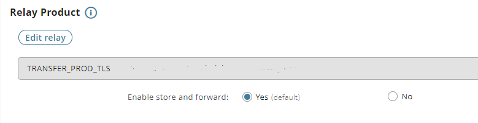

{
    "title": "Add a relay (store and forward)",
    "linkTitle": "Add a relay (store and forward)",
    "weight": "180"
}This page describes how to use a relay in a SEND/RECV operation. You can use a SEND/RECV to perform a transfer with a single partner via an intermediate machine, or relay, using the store and forward mode. Additionally, you can combine the store and forward mode with broadcasting when using the SEND command.

## On Central Governance

1.  In the toolbar, select **Flows** > **Add flow**.  

    

2.  **Name** the flow `Relay_flow`.  
    

3.  Select **Source? > Add source**, and click to select the source Transfer CFT. Choose `Store_66` and then click **Select as source**.  
    You can leave all other fields set to the default values.  
    

4.  Click **Protocol?** and select **PeSIT**. Enter flow22 as the **Flow identifier**.  
    Use the other default values, and remember that the flow identifier is the IDF on Transfer CFT.  
    

5.  Select **Target? > Add target**. Then click to choose the target Transfer CFT. Select MainOffice and then click **Select as target**.

6.  Click **Relay** then click **Edit relay**. Select the relay, and confirm by clicking **Select as relay**.  
    

7.  The **Enable store and forward** option displays, leave it set to Yes.  
    

8.  In the newly displayed **Protocol?** and select **PeSIT**. Enter flow22 as the **Flow identifier**. Use the other default values.

9.  Click Save. You can check that you have correctly selected the source, target, and relay, then click Deploy. [Details](../intro_cg_task_catalog/t_savedeployflow)

#### In Transfer CFT

You will need to add a file locally for the transfer exchange and execute the SEND command.

1.  Put a test file, for example SALES\_report, in the Store\_66 Transfer CFT runtime/pub folder.
2.  From the source Transfer CFT, run the SEND command. Remember:
    -   Replace &lt;instance\_target> with your Transfer CFT for the `MainOffice `target.

    <!-- -->

    -   The flow Identifier field is equivalent to the Transfer CFT IDF parameter.

<table data-cellspacing="0">
<tbody>
<tr class="odd">
<td>
CFTUTIL SEND part=&lt;instance_target&gt;, idf=flow22, fname=pub/SALES_report


 


CFTUTIL LISTLOG /to check the status/
</td>
</tr>
</tbody>
</table>

 
