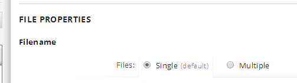

{
    "title": "Enable flows with multiple files",
    "linkTitle": "Enable flows with multiple files",
    "weight": "340"
}1.  In this simple flow, select the Source.
2.  Select File properties.
3.  Select Multiple files.



In our example, you make the files SALES\_report, DAILY\_news, and INVENTORY available for an exchange.
