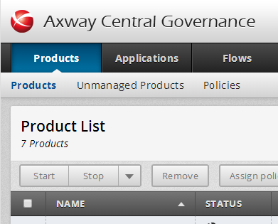

{
    "title": "View products",
    "linkTitle": "View products",
    "weight": "230"
}To view your registered Transfer CFTs click Products on the top toolbar to open the Product List page.



Example

Copy or note the host name or IP address for each of the three Transfer CFTs that you will use in these exercises.

<table cellspacing="0">
   <col/>
   <col/>
   <col/>
   <thead>
      <tr>
         <th>Transfer CFT </th>
         <th>Host name</th>
         <th>Application name</th>
      </tr>
   </thead>
   <tbody>
      <tr>
         <td>Transfer CFT 1         </td>
         <td>&lt; host name / IP address &gt;         </td>
         <td>MainOffice         </td>
      </tr>
      <tr>
         <td>Transfer CFT 2         </td>
         <td>&lt; host name / IP address &gt;         </td>
         <td>Store_66         </td>
      </tr>
      <tr>
         <td>Transfer CFT 1         </td>
         <td>&lt; host name / IP address &gt;         </td>
         <td>Store_89         </td>
      </tr>
   </tbody>
</table>

 

&lt;&lt; [My first transfer flow](../../)
