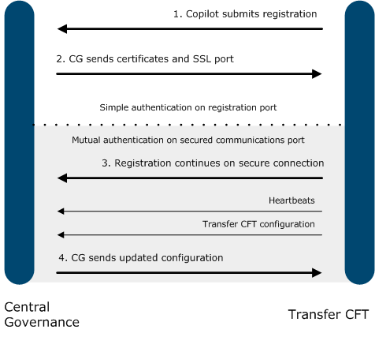

{
    "title": "Registration overview",
    "linkTitle": "Registration overview",
    "weight": "170"
}This topic describes the Transfer CFT to Central Governance or Flow Manager registration process.

There are several types of exchanges that occur between Central Governance or Flow Manager and Transfer CFT. The first exchange is registration, which begins when Copilot initiates a request to connect with Central Governance or Flow Manager.

The registration is performed on a SSL connection using simple authentication. Further exchanges - the heartbeat, and certificate renewal - are performed on a SSL connection using mutual authentication.

Refer to the Central Governance 1.1.3 User Guide for more information on registration processes, such as registration approval.

Registration exchange overview (the same for either Central Governance or Flow Manager)



## Step overview

This section describes the general steps that occurs during the registration process, and the impact on the configuration.

Starting Copilot after installation begins the connection and registration process with Central Governance or Flow Manager.

<table cellpadding="0" cellspacing="0">
   <col/>
   <col/>
   <col/>
      <tr>
         <td valign="top">         </td>
         <td valign="top"><b>Note</b>
         </td>
         <td data-mc-autonum="&lt;b&gt;Note&lt;/b&gt;" valign="top">Transfer CFT requires the Central Governance  or Flow Manager shared secret to register. See the Central Governance  or Flow Manager documentation for details.         </td>
      </tr>
</table>

1\. Copilot connects to Central Governance or Flow Manager and submits its registration.

-   Copilot sends a registration request through a simple authenticated SSL connection and submits its registration. Copilot authenticates the Central Governance or Flow Manager server using the CA certificate pointing by the uconf:cg.ca\_cert\_id parameter. The registration request contains:

    -   Information about the Transfer CFT instance, including its instance name, host, port and version.
    -   Two Certificate Signing Requests (CSRs) for Central Governance to process.

    <table cellpadding="0" cellspacing="0">   <col/>   <col/>   <col/>      <tr>         <td valign="top">         </td>         <td valign="top"><b>Note</b>         </td>         <td data-mc-autonum="&lt;b&gt;Note&lt;/b&gt;" valign="top">If you use an intermediate certificate as a governance CA certificate, you must add the root CA certificate that signs  this intermediate certificate in the Transfer CFT PKI database.         </td>      </tr></table>

2\. Central Governance or Flow Manager sends the SSL certificates to Transfer CFT.

Central Governance or Flow Manager processes the CSRs and returns two SSL certificates, one dedicated to governance exchanges and the other one dedicated to business exchanges (used for securing file transfers between the registering Transfer CFT and all other Managed File Transfers).

Both certificates are stored in the internal PKI base using the following identifiers:

-   &lt;uconf:cft.instance\_id>\_GOV for the governance certificate
-   &lt;uconf:cft.instance\_id> for the business certificate

3\. Copilot sends the first heartbeat over a mutual authenticated SSL connection.

4\. The Transfer CFT configuration is updated and returned to Transfer CFT.

During the registration process Central Governance or Flow Manager receives the current configuration of Transfer CFT and changes it accordingly to their own rules.

Registration completes with Transfer CFT appearing in the Central Governance or Flow Manager product list with the status of "Started" or "Stopped".

## Configuration updates

During the registration process Central Governance or Flow Manager receives the original Transfer CFT configuration and updates it so that Transfer CFT is configured to:

-   Connect to Central Governance using the Central Governance mutual authentication port
-   Use Central Governance for access management
-   Use Central Governance for transfer monitoring
-   Use its own internal PKI

These changes create two security profiles (CFTSSL) for Transfer CFT, one client and one server, named SSL\_DEFAULT.

Completing the registration process, Central Governance or Flow Manager gets the current configuration of Transfer CFT and changes it.

-   Transfer CFT is configured to use the Central Governance PassPort service for access management.
-   Transfer CFT is configured to use the Central Governance Sentinel for transfer monitoring. For Transfer CFT 3.2.2 and higher, a secured connection is used.

These changes create two security profiles (CFTSSL) on the Transfer CFT (except when using a SAF-based PKI Transfer CFT). The profiles are named SSL\_DEFAULT; one profile is of type client and one is of type server. Their SSL version is TLSV1COMP. The configured cipher list is CIPHLIST= ('53','47') for Transfer CFT 3.1.2 and 3.1.3. The values represent the following cipher suites:

The values represent the following cipher suites:

-   47: TLS\_RSA\_WITH\_AES\_128\_CBC\_SHA
-   53: TLS\_RSA\_WITH\_AES\_256\_CBC\_SHA

For Transfer CFT 3.2.2 and higher, the configured cipher list is CIPHLIST= ('49200', '49199', '49192', '49191', '157', '156', '61', '60', '53', '47'). The values represent the following cipher suites:

-   49200: TLS\_ECDHE\_RSA\_WITH\_AES\_256\_GCM\_SHA384
-   49199: TLS\_ECDHE\_RSA\_WITH\_AES\_128\_GCM\_SHA256
-   49192: TLS\_ECDHE\_RSA\_WITH\_AES\_256\_CBC\_SHA384
-   49191: TLS\_ECDHE\_RSA\_WITH\_AES\_128\_CBC\_SHA256
-   157: TLS\_RSA\_WITH\_AES\_256\_GCM\_SHA384
-   156: TLS\_RSA\_WITH\_AES\_128\_GCM\_SHA256
-   61: TLS\_RSA\_WITH\_AES\_256\_CBC\_SHA256
-   60: TLS\_RSA\_WITH\_AES\_128\_CBC\_SHA256
-   53: TLS\_RSA\_WITH\_AES\_256\_CBC\_SHA
-   47: TLS\_RSA\_WITH\_AES\_128\_CBC\_SHA

The client and server security profiles must be mutually authenticated. However, by default, a registered Transfer CFT does not have a protocol with a security profile. You must edit the Transfer CFT configuration to support protocols with mutual authentication.

Central Governance or Flow Manager sends the updated configuration to Transfer CFT. The following are the Transfer CFT parameters updated in this process. However, you can overwrite certain default values by assigning an existing policy at registration. Please see, below for details.

<table cellspacing="0">
   <col/>
   <col/>
   <thead>
      <tr>
         <th>Parameter</th>
         <th>Value</th>
      </tr>
   </thead>
   <tbody>
      <tr>
         <td>am.passport.cg.organization         </td>
         <td>
            
Org 

            
&amp;&amp;&amp; ïïï ùùù

         </td>
      </tr>
      <tr>
         <td>am.passport.domain         </td>
         <td>
            
CG

         </td>
      </tr>
      <tr>
         <td>am.passport.hostname         </td>
         <td>&lt;Central Governance host name &gt;         </td>
      </tr>
      <tr>
         <td>am.passport.instance_id         </td>
         <td>$(cft.instance_group).$(cft.instance_id)         </td>
      </tr>
      <tr>
         <td>am.passport.port         </td>
         <td>6666         </td>
      </tr>
      <tr>
         <td>am.passport.use_ssl         </td>
         <td>Yes         </td>
      </tr>
      <tr>
         <td>am.passport.userctrl.check_permissions_on_transfer_execution         </td>
         <td>No         </td>
      </tr>
      <tr>
         <td>am.type         </td>
         <td>passport         </td>
      </tr>
      <tr>
         <td>cft.purge.rt         </td>
         <td>10D         </td>
      </tr>
      <tr>
         <td>cft.purge.rx         </td>
         <td>10D         </td>
      </tr>
      <tr>
         <td>cft.purge.st         </td>
         <td>10D         </td>
      </tr>
      <tr>
         <td>cft.purge.sx         </td>
         <td>10D         </td>
      </tr>
      <tr>
         <td>cft.server.bandwitdth.cos         </td>
         <td>4         </td>
      </tr>
      <tr>
         <td>cft.server.bandwitdth.cos.0.max_rate_in         </td>
         <td>-1         </td>
      </tr>
      <tr>
         <td>cft.server.bandwitdth.cos.0.max_rate_out         </td>
         <td>-1         </td>
      </tr>
      <tr>
         <td>cft.server.bandwitdth.cos.1.weight_in         </td>
         <td>80         </td>
      </tr>
      <tr>
         <td>cft.server.bandwitdth.cos.1.weight_out         </td>
         <td>80         </td>
      </tr>
      <tr>
         <td>cft.server.bandwitdth.cos.2.weight_in         </td>
         <td>15         </td>
      </tr>
      <tr>
         <td>cft.server.bandwitdth.cos.2.weight_out         </td>
         <td>15         </td>
      </tr>
      <tr>
         <td>cft.server.bandwitdth.cos.3.weight_in         </td>
         <td>5         </td>
      </tr>
      <tr>
         <td>cft.server.bandwitdth.cos.3.weight_out         </td>
         <td>5         </td>
      </tr>
      <tr>
         <td>cft.server.bandwitdth.enable         </td>
         <td>No         </td>
      </tr>
      <tr>
         <td>cg.mutual_auth_port         </td>
         <td>&lt;secured communications port&gt;         </td>
      </tr>
      <tr>
         <td>copilot.misc.createprocessasuser         </td>
         <td>No         </td>
      </tr>
      <tr>
         <td>pki.type         </td>
         <td>
            
cft

            
&amp;&amp;&amp; ïïï ùùù

         </td>
      </tr>
      <tr>
         <td>sentinel.trkipaddr         </td>
         <td>&lt;Sentinel – Front-end host &gt;         </td>
      </tr>
      <tr>
         <td>sentinel.trkipport         </td>
         <td>&lt;Sentinel - Font-end port&gt;         </td>
      </tr>
      <tr>
         <td>sentinel.xfb.enable         </td>
         <td>Yes         </td>
      </tr>
      <tr>
         <td>sentinel.xfb.use_ssl         </td>
         <td>Yes         </td>
      </tr>
   </tbody>
</table>

### Transfer CFT instance id

When you register Transfer CFT with Central Governance or Flow Manager, Central Governance or Flow Manager sets the CFTPARM PART parameter to the same value as the Transfer CFT installation instance ID. Having a different value may impact transfer monitoring.

### Network definitions

Windows and Linux

For Transfer CFT to register successfully with Flow Manager, it must have at least one of the following Flow Manager network types defined, but cannot have more than one of each type: TCP, pTCP, and UDT. This means that you can register a Transfer CFT that has a maximum of three CFTNET objects, where the Transfer CFT type=TCP and CLASS is different for each CFTNET.

The CFTNET objects are:

-   One pTCP, where ID = &lt;pTCP\_ID> and CLASS=&lt;X> and the UCONF parameter acceleration.ptcp = &lt;pTCP\_ID>
-   One  UDT, where ID = &lt;UDT\_ID> and CLASS=&lt;Y> and the UCONF parameter acceleration.udt = &lt;UDT\_ID>
-   One TCP, where ID=&lt;TCP\_ID> and CLASS=&lt;Z>

Flow Manager does not manage additional CFTNET types; these are stored, without modification, on the Transfer CFT as retrieved on registration.

### Communication profiles

If the Transfer CFT that is registering has existing network definitions, for example a server type TCP\_SSL definition, Flow Manager creates the appropriate corresponding communication profile on registration.

Flow Manager can create Transfer CFT flows that are configured with the PeSIT E  protocol. When a Transfer CFT registers with Flow Manager, for each CFTPROT where TYPE=PESIT and PROF=ANY,  Flow Manager recognizes communication profiles created with this protocol.
