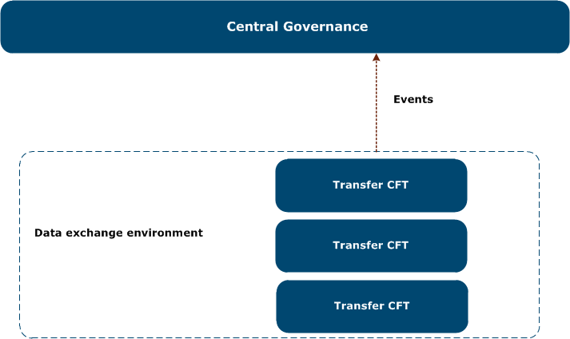

{
    "title": "About governance services",
    "linkTitle": "About governance services",
    "weight": "160"
}In this guide, *flow* refers to the complete interaction between the source and target applications, more specifically Transfer CFT systems, to enable data exchanges between business applications or partners.

## Managed File Transfer services

Managed File Transfer services, using a blend of Axway products, can centralize flow definition and configuration deployment for Transfer CFT (file transfer) engines.

You can use Central Governance in your MFT architecture to easily create and deploy flows. You then trigger your flows at the system level.



<table cellpadding="0" cellspacing="0">
   <col/>
   <col/>
   <col/>
      <tr>
         <td valign="top">         </td>
         <td valign="top"><b>Note</b>
         </td>
         <td data-mc-autonum="&lt;b&gt;Note&lt;/b&gt;" valign="top">Connectivity may include connection to other  or third-party products that are outside of  the MFT reference solution.         </td>
      </tr>
</table>

### Additional documentation

-   AMPLIFY Supported Platforms
-   Central Governance documentation
-   Flow Manager documentation

## Governance exchanges

The following types of exchanges occur between Central Governance or Flow Manager and the managed Transfer CFTs:

-   Flow management
-   Certificate management
-   Configuration management
-   Update management

See [Exchanges with Central Governance](../cg_postregister) for more information.

## Overview and practical considerations

Begin by planning your MFT architecture and deployment strategy. After installing Central Governance or Flow Manager, the following steps occur:

-   In the Transfer CFT installation select the Central Governance connectivity option
-   After installing, start the Transfer CFT Copilot server (the Transfer CFT server can be running, but this is optional)
-   Registration occurs automatically on Copilot start up
-   From Central Governance or Flow Manager start the Transfer CFT(s)
-   If you migrated or upgraded, you may want to reference the following sections:
    -   [Manually activate Central Governance connectivity](../register_cg)
    -   Parameter mapping between products

## Feature support and management

Transfer CFTs running under Central Governance or Flow Manager can manage or have support for the following features.

<table cellspacing="0">
   <col/>
   <col/>
   <col/>
   <thead>
      <tr data-mc-conditions="">
         <th>Feature</th>
         <th> Manage using  Flow Manager or Central Governance</th>
         <th> Supported but  not configurable using Central Governance  or Flow Manager</th>
      </tr>
   </thead>
      <tr data-mc-conditions="">
         <td>Folder monitoring         </td>
         <td>yes         </td>
         <td>yes         </td>
      </tr>
      <tr data-mc-conditions="">
         <td>Multi-node architecture         </td>
         <td>no         </td>
         <td>yes         </td>
      </tr>
      <tr data-mc-conditions="">
         <td>CRONJOB         </td>
         <td>yes         </td>
         <td>yes         </td>
      </tr>
      <tr data-mc-conditions="">
         <td>Exits         </td>
         <td>no         </td>
         <td>yes          </td>
      </tr>
      <tr data-mc-conditions="">
<th colspan="3">Network and protocol features</th>
      </tr>
      <tr data-mc-conditions="">
         <td>IPv6         </td>
         <td>yes         </td>
         <td>yes         </td>
      </tr>
      <tr data-mc-conditions="">
         <td>pTCP (UNIX/Windows only)         </td>
         <td>yes          </td>
         <td>yes          </td>
      </tr>
      <tr data-mc-conditions="">
         <td>UDT (UNIX/Windows only)         </td>
         <td>yes         </td>
         <td>yes         </td>
      </tr>
      <tr data-mc-conditions="">
         <td>SOCKS         </td>
         <td>no         </td>
         <td>yes         </td>
      </tr>
      <tr data-mc-conditions="">
         <td>Heartbeat          </td>
         <td>embedded         </td>
         <td>yes         </td>
      </tr>
      <tr data-mc-conditions="">
<th colspan="3">Interoperability
                </th>
      </tr>
      <tr data-mc-conditions="">
         <td>Secure Relay          </td>
         <td>no         </td>
         <td>yes         </td>
      </tr>
      <tr data-mc-conditions="">
         <td>TrustedFile (UNIX/Windows/and z/OS)         </td>
         <td>no         </td>
         <td>
            
yes 

         </td>
      </tr>
      <tr data-mc-conditions="">
         <td>PassPort AM         </td>
         <td>embedded         </td>
         <td>no (*)         </td>
      </tr>
      <tr data-mc-conditions="">
         <td>PassPort PS         </td>
         <td>no         </td>
         <td>yes         </td>
      </tr>
      <tr data-mc-conditions="">
         <td>Sentinel         </td>
         <td>embedded         </td>
         <td>yes         </td>
      </tr>
      <tr data-mc-conditions="">
         <td>Composer         </td>
         <td>no         </td>
         <td>no         </td>
      </tr>
      <tr data-mc-conditions="">
<th colspan="3">Protocols
                </th>
      </tr>
      <tr data-mc-conditions="">
         <td>PeSIT         </td>
         <td>yes         </td>
         <td>yes          </td>
      </tr>
      <tr data-mc-conditions="">
         <td>ODETTE         </td>
         <td>no         </td>
         <td>yes         </td>
      </tr>
      <tr data-mc-conditions="">
         <td>SFTP <i>(UNIX, Windows)</i>         </td>
         <td>no         </td>
         <td>yes         </td>
      </tr>
</table>

\* If you perform a migration or upgrade from a previous version, you must migrate your PassPort AM.

## Legacy flows

Legacy flows refer to former flow definitions available in migrated Transfer CFT systems. Central Governance or Flow Manager can manage the following use cases:

-   Via the Central Governance or Flow Manager user interface, you can add and manage partners, and use send and receive templates for a given Transfer CFT.
-   You can migrate Transfer CFT flow definitions to the Central Governance or Flow Manager flow-management process.
