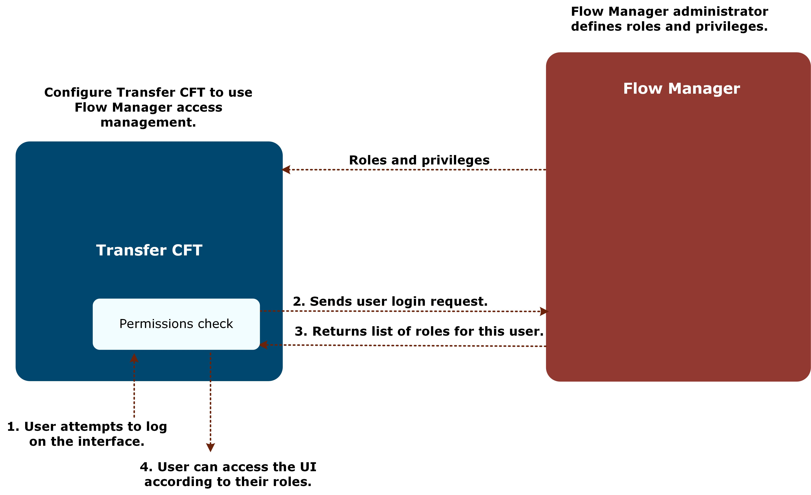

{
    "title": "Flow Manager access management ",
    "linkTitle": "Flow Manager access management ",
    "weight": "150"
}You can use Flow Manager to define and control Transfer CFT access management as described in the following sections.

How it works

If you have opted to use the Flow Manager for Transfer CFT access management, after configuring both Transfer CFT and Flow Manager:

1.  A user logs in via the Transfer CFT UI, CFTUTIL, or other.
2.  A login request is sent to Flow Manager.
3.  If the login is successful, Flow Manager returns the list of roles for the user.
4.  The user login is complete. Transfer CFT then stores these roles in the cache and applies them accordingly. The information about this user is stored in the cache and is only updated when a new login is performed.

<table cellpadding="0" cellspacing="0">
   <col/>
   <col/>
   <col/>
      <tr>
         <td valign="top">         </td>
         <td valign="top"><b>Note</b>
         </td>
         <td data-mc-autonum="&lt;b&gt;Note&lt;/b&gt;" valign="top">All role and permission definitions are stored in CFTPARM.         </td>
      </tr>
</table>

However, if you are an am.superuser user, Transfer CFT does not check your access for resources, and permissions are granted unconditionally. Additionally, it is useful to note that if you define a service account during Transfer CFT installation, this user is automatically added to the UCONF am.superuser parameter's list.

See also, Flow Manager *Security Guide &gt;*[Predefined roles](https://docs.axway.com/bundle/FlowManager_20_allOS_en_HTML5/page/predefined_roles.html) and [Predefined privileges](https://docs.axway.com/bundle/FlowManager_20_allOS_en_HTML5/page/predefined_privileges.html) (requires account login).



Limitations

-   Transfer CFT ROLES are stored on Transfer CFT in upper case. This means that if you create roles **XXX** and **Xxx** on Flow Manager, there is only one ROLE in Transfer CFT, which is ID=XXX.

## Using roles and privileges

The Flow Manager method of access management impacts two Transfer CFT objects that are defined in the CFTPARM database: roles (CFTROLE) and privileges (CFTPRIV). You assign these roles and privileges in Flow Manager, which are then deployed on Transfer CFT.

Conversely, you can create roles and privileges locally in Transfer CFT, as you do with other objects.

### Using CFTROLE

A role is a general profile that can be associated with a user. A role is based on one or more privileges, and a privilege is based on a resource. There are two types of roles: predefined and user-defined. Predefined roles are available by default to assign to users.

You can assign users to one or more roles. Typically, users with multiple roles have more privileges than users with fewer roles.

Examples of roles can be ADMINISTRATOR, PARTNER MANAGER, IT MANAGER, and so on.

<table cellspacing="0">
   <col/>
   <col/>
   <col/>
   <thead>
      <tr>
         <th>
            
Field

</th>
         <th>
            
Type

</th>
         <th>
            
Comment

</th>
      </tr>
   </thead>
   <tbody>
      <tr>
         <td>
            
id

         </td>
         <td>
            
String32

         </td>
         <td>
            
Role identifier

         </td>
      </tr>
      <tr>
         <td>
            
comment

         </td>
         <td>
            
String80

         </td>
         <td>
            
Comment

         </td>
      </tr>
      <tr>
         <td>
            
privs[]

         </td>
         <td>
            
List of String32

         </td>
         <td>
            
List of privileges associated to this role (1 to 128)

         </td>
      </tr>
   </tbody>
</table>

Example of CFTROLE in a configuration file:

<table cellspacing="0">
   <col/>
   <tbody>
      <tr>
         <td>
            
CFTROLE      ID          = 'Application',

            
             COMMENT     = 'My comments',

            
             PRIVS       = ( 'SERVICE:UI_CONNECT',

            
                             'MYPRIV1',

            
                             'CONFIGURATION:CFTCOM_VIEW',

            
                             'CONFIGURATION:CFTPARM_VIEW',

            
                             'CONFIGURATION:CFTPART_VIEW',

            
                             'CONFIGURATION:CFTDEST_VIEW',

            
                             'CONFIGURATION:CFTSEND_VIEW',

            
                             'CONFIGURATION:CFTRECV_VIEW',

            
                             'CONFIGURATION:CFTLOG_VIEW',

            
                             'FILTER:CATALOG_ALL',

            
                             'FILTER:LOG_ALL',

            
                             'FILE_VIEW'),

            
             ORIGIN      = 'CFTUTIL',

            
             MODE        = 'REPLACE'

         </td>
      </tr>
   </tbody>
</table>

### Using CFTPRIV

Privileges give users authorization to access and perform actions in the user interface. Examples of actions include CREATE, DELETE, VIEW, EDIT (use \* to assign all actions).

<table cellspacing="0">
   <col/>
   <col/>
   <col/>
   <thead>
      <tr>
         <th>
            
Field

</th>
         <th>
            
Type

</th>
         <th>
            
Comment

</th>
      </tr>
   </thead>
   <tbody>
      <tr>
         <td>
            
id

         </td>
         <td>
            
String32

         </td>
         <td>
            
Privilege identifier

         </td>
      </tr>
      <tr>
         <td>
            
comment

         </td>
         <td>
            
String80

         </td>
         <td>
            
Comment

         </td>
      </tr>
      <tr>
         <td>
            
resource

         </td>
         <td>
            
String32

         </td>
         <td>
            
Resource on which this privilege applies

         </td>
      </tr>
      <tr>
         <td>
            
actions

         </td>
         <td>
            
List of String32

         </td>
         <td>
            
Actions authorized on the resource (1 to 16 actions)

         </td>
      </tr>
      <tr>
         <td>
            
condition

         </td>
         <td>
            
String256

         </td>
         <td>
            
Condition to check for authorizing (<a href="#specifyi">see below</a>)

         </td>
      </tr>
   </tbody>
</table>

Example of CFTPRIV in a configuration file:

<table cellspacing="0">
   <col/>
   <tbody>
      <tr>
         <td>
            
CFTPRIV      ID          = 'MYPRIV1',

            
            COMMENT     = 'My comment',

            
             RESOURCE    = 'TRANSFER',

            
             ACTIONS     = ( 'CREATE' , 'DELETE', 'VIEW', 'EDIT', 'CANCEL', 'RESUME', 

            
                            'PAUSE', 'EXECUTE', 'SUBMIT', 'END' ),

            
             CONDITION   = '',

            
             ORIGIN      = 'CFTUTIL',

            
             MODE        = 'REPLACE'

         </td>
      </tr>
   </tbody>
</table>

### Specifying conditions

Conditions allow you to assign finer control on resources and actions by specifying a logical condition that must be true to authorize the action.

Examples

In these examples PART and ID are properties of the resource being checked. As you can see, you can use parenthesis and logical operators && (AND) and || (OR).

<table cellspacing="0">
   <col/>
   <tbody>
      <tr>
         <td>
            
PART=="PARIS" &amp;&amp; ID=="IDFDEF"

            
(PART=="PARIS" || PART==”NEWYORK”) &amp;&amp; ID~="IDF*"

         </td>
      </tr>
   </tbody>
</table>

Comparison operators include:

-   == : equals
-   != : not equal
-   ~= : matches (use \* and ? for jokers)
-   /= : not matching (use \* and ? for jokers)
-   &lt; : inferior to
-   &gt; : superior to
-   &lt;= : inferior or equal to
-   &gt;= :superior or equal to

### Resource properties in privileges

The following table is an exhaustive list of all properties for all resources. These properties are available regardless of the action to be checked. However, if a resource has no properties, setting a condition for it has no impact.

<table cellspacing="0">
   <col/>
   <col/>
   <col/>
   <thead>
      <tr>
         <th>
            
Resource

</th>
         <th>
            
Actions

</th>
         <th>
            
Properties

</th>
      </tr>
   </thead>
   <tbody>
      <tr>
         <td>
            
CONFIGURATION:PKICER

         </td>
         <td>
            
CREATE, DELETE, VIEW, EDIT,  ACTIVATE, DEACTIVATE

         </td>
         <td>
            
ID

         </td>
      </tr>
      <tr>
         <td>
            
CONFIGURATION:PKIENTITY

         </td>
         <td>
            
CREATE, DELETE, VIEW, EDIT,  ACTIVATE, DEACTIVATE

         </td>
         <td>
            
ID

         </td>
      </tr>
      <tr>
         <td>
            
CONFIGURATION:PKIKEY

         </td>
         <td>
            
CREATE, DELETE, VIEW, EDIT,  ACTIVATE, DEACTIVATE

         </td>
         <td>
            
ID

         </td>
      </tr>
      <tr>
         <td>
            
CONFIGURATION:CFTPARM

         </td>
         <td>
            
CREATE, DELETE, VIEW, EDIT

         </td>
         <td>
            
ID

         </td>
      </tr>
      <tr>
         <td>
            
CONFIGURATION:CFTNET

         </td>
         <td>
            
CREATE, DELETE, VIEW, EDIT

         </td>
         <td>
            
ID

         </td>
      </tr>
      <tr>
         <td>
            
CONFIGURATION:CFTPROT

         </td>
         <td>
            
CREATE, DELETE, VIEW, EDIT

         </td>
         <td>
            
ID

         </td>
      </tr>
      <tr>
         <td>
            
CONFIGURATION: CFTSEND

         </td>
         <td>
            
CREATE, DELETE, VIEW, EDIT

         </td>
         <td>
            
ID

         </td>
      </tr>
      <tr>
         <td>
            
CONFIGURATION: CFTSENDI (1)

         </td>
         <td>
            
CREATE, DELETE, VIEW, EDIT

         </td>
         <td>
            
ID

         </td>
      </tr>
      <tr>
         <td>
            
CONFIGURATION: CFTRECV

         </td>
         <td>
            
CREATE, DELETE, VIEW, EDIT

         </td>
         <td>
            
ID

         </td>
      </tr>
      <tr>
         <td>
            
CONFIGURATION:CFTAUTH

         </td>
         <td>
            
CREATE, DELETE, VIEW, EDIT

         </td>
         <td>
            
ID

         </td>
      </tr>
      <tr>
         <td>
            
CONFIGURATION:CFTXLATE

         </td>
         <td>
            
CREATE, DELETE, VIEW, EDIT

         </td>
         <td>
            
ID

         </td>
      </tr>
      <tr>
         <td>
            
CONFIGURATION:CFTLOG

         </td>
         <td>
            
CREATE, DELETE, VIEW, EDIT

         </td>
         <td>
            
ID

         </td>
      </tr>
      <tr>
         <td>
            
CONFIGURATION:CFTCAT

         </td>
         <td>
            
CREATE, DELETE, VIEW, EDIT

         </td>
         <td>
            
ID

         </td>
      </tr>
      <tr>
         <td>
            
CONFIGURATION:CFTCOM

         </td>
         <td>
            
CREATE, DELETE, VIEW, EDIT

         </td>
         <td>
            
ID

         </td>
      </tr>
      <tr>
         <td>
            
CONFIGURATION:CFTACCNT

         </td>
         <td>
            
CREATE, DELETE, VIEW, EDIT

         </td>
         <td>
            
ID

         </td>
      </tr>
      <tr>
         <td>
            
CONFIGURATION:CFTEXIT

         </td>
         <td>
            
CREATE, DELETE, VIEW, EDIT

         </td>
         <td>
            
ID

         </td>
      </tr>
      <tr>
         <td>
            
CONFIGURATION:CFTIDF

         </td>
         <td>
            
CREATE, DELETE, VIEW, EDIT

         </td>
         <td>
            
ID

         </td>
      </tr>
      <tr>
         <td>
            
CONFIGURATION:CFTFOLDER

         </td>
         <td>
            
CREATE, DELETE, VIEW, EDIT,  ACTIVATE, DEACTIVATE

         </td>
         <td>
            
ID

         </td>
      </tr>
      <tr>
         <td>
            
CONFIGURATION:CFTETB

         </td>
         <td>
            
CREATE, DELETE, VIEW, EDIT

         </td>
         <td>
            
ID

         </td>
      </tr>
      <tr>
         <td>
            
CONFIGURATION:CFTAPPL

         </td>
         <td>
            
CREATE, DELETE, VIEW, EDIT

         </td>
         <td>
            
ID

         </td>
      </tr>
      <tr>
         <td>
            
CONFIGURATION:CFTSSL

         </td>
         <td>
            
CREATE, DELETE, VIEW, EDIT

         </td>
         <td>
            
ID

         </td>
      </tr>
      <tr>
         <td>
            
CONFIGURATION:CFTCRON

         </td>
         <td>
            
CREATE, DELETE, VIEW, EDIT,  ACTIVATE, DEACTIVATE, RELOAD

         </td>
         <td>
            
ID

         </td>
      </tr>
      <tr>
         <td>
            
CONFIGURATION:CFTPART

         </td>
         <td>
            
CREATE, DELETE, VIEW, EDIT,  ACTIVATE, DEACTIVATE, TURN

         </td>
         <td>
            
ID

         </td>
      </tr>
      <tr>
         <td>
            
CONFIGURATION:CFTDEST

         </td>
         <td>
            
CREATE, DELETE, VIEW, EDIT

         </td>
         <td>
            
ID

         </td>
      </tr>
      <tr>
         <td>
            
CONFIGURATION:CFTTCP

         </td>
         <td>
            
CREATE, DELETE, VIEW, EDIT

         </td>
         <td>
            
ID

         </td>
      </tr>
      <tr>
         <td>
            
CONFIGURATION:CFTUCONF

         </td>
         <td>
            
DELETE, VIEW, EDIT

         </td>
         <td>
            
ID

         </td>
      </tr>
      <tr>
         <td>
            
 

         </td>
         <td>
            
 

         </td>
         <td>
            
 

         </td>
      </tr>
      <tr>
         <td>
            
SERVICE:BATCH (2)

         </td>
         <td>
            
EXECUTE

         </td>
         <td>
            
ID, FNAME

         </td>
      </tr>
      <tr>
         <td>
            
SERVICE:UI (3)

         </td>
         <td>
            
CONNECT

         </td>
         <td>
            
TYPE, ID, GROUP

         </td>
      </tr>
      <tr>
         <td>
            
SERVICE:BATCH

         </td>
         <td>
            
EXECUTE

         </td>
         <td>
            
ID, FNAME

         </td>
      </tr>
      <tr>
         <td>
            
SERVICE:CATALOG

         </td>
         <td>
            
PURGE

         </td>
         <td>
            
 

         </td>
      </tr>
      <tr>
         <td>
            
SERVICE:LOG

         </td>
         <td>
            
SWITCH

         </td>
         <td>
            
 

         </td>
      </tr>
      <tr>
         <td>
            
SERVICE:ACCOUNT

         </td>
         <td>
            
SWITCH

         </td>
         <td>
            
 

         </td>
      </tr>
      <tr>
         <td>
            
SERVICE:CFTSRV

         </td>
         <td>
            
STARTUP, SHUTDOWN

         </td>
         <td>
            
 

         </td>
      </tr>
      <tr>
         <td>
            
SERVICE:COM

         </td>
         <td>
            
DELETE, VIEW

         </td>
         <td>
            
 

         </td>
      </tr>
      <tr>
         <td>
            
 

         </td>
         <td>
            
 

         </td>
         <td>
            
 

         </td>
      </tr>
      <tr>
         <td>
            
COMMAND:EXTRACT

         </td>
         <td>
            
EXECUTE

         </td>
         <td>
            
 

         </td>
      </tr>
      <tr>
         <td>
            
COMMAND:MQUERY

         </td>
         <td>
            
EXECUTE

         </td>
         <td>
            
 

         </td>
      </tr>
      <tr>
         <td>
            
COMMAND:TURN

         </td>
         <td>
            
EXECUTE

         </td>
         <td>
            
 

         </td>
      </tr>
      <tr>
         <td>
            
COMMAND:CFTSUPPORT

         </td>
         <td>
            
EXECUTE

         </td>
         <td>
            
 

         </td>
      </tr>
      <tr>
         <td>
            
TRANSFER

         </td>
         <td>
            
CREATE, DELETE, VIEW, EDIT, CANCEL, RESUME, PAUSE, EXECUTE, SUBMIT, END, VIEWIFLE, EDITFILE, DELETEFILE

         </td>
         <td>
            
IDAPPL, ID, PART, SPART, RPART, IPART, TYPE, DIRECT, MODE, FNAME, MESSAGE, SUSER, RUSER, SAPPL, RAPPL, NFNAME

         </td>
      </tr>
      <tr>
         <td>
            
AM:RIGHTS (4)

         </td>
         <td>
            
VIEW_SELF, VIEW_OTHERS

         </td>
         <td>
            
ID

         </td>
      </tr>
      <tr>
         <td>
            
FILTER:CATALOG

         </td>
         <td>
            
CREATE, DELETE, VIEW, EDIT

         </td>
         <td>
            
ID

         </td>
      </tr>
      <tr>
         <td>
            
FILTER:LOG

         </td>
         <td>
            
CREATE, DELETE, VIEW, EDIT

         </td>
         <td>
            
ID

         </td>
      </tr>
      <tr>
         <td>
            
FILE (5)

         </td>
         <td>
            
CREATE, DELETE, VIEW, EDIT

         </td>
         <td>
            
FNAME

         </td>
      </tr>
      <tr>
         <td>
            
URL (6)

         </td>
         <td>
            
VIEW

         </td>
         <td>
            
URL

         </td>
      </tr>
   </tbody>
</table>

1.  Manage implicit SEND object definitions.
2.  Manage batch files.
3.  Connect to user interface.
4.  Rights from PassPort AM.
5.  Manage Transfer CFT file definition objects.
6.  Manage file name definitions.

## Use cases

### Restrict user to a specific partner and IDF

As an Administrator, you want to authorize a user to work only with a given partner and a specific IDF.

This user can preform the following operations only with an IDF name equal to "MYIDF" and the PART name equal to "MYPART":

-   View transfers (LISTCAT and DISPLAY)
-   Create transfers
-   Delete transfers
-   Cancel transfers
-   Resume transfers
-   Execute transfers

In this use case, you assign the user a role that references a privilege having these characteristics:

-   RESOURCE = 'TRANSFER',
-   ACTIONS = ( ‘VIEW’, ‘CREATE’, ‘DELETE’, ‘CANCEL', 'RESUME', ‘EXECUTE’ ),
-   CONDITION = ' IDF=="MYIDF" && PART=="MYPART" '

The following is an example of the Transfer CFT configuration for this use case (the ROLE must exist in Flow Manager, and be available for required users):

<table cellspacing="0">
   <col/>
   <tbody>
      <tr>
         <td>
            
CFTROLE      ID          = 'TRANSFER-ROLE',

            
             COMMENT     = '',

            
/*           ALIASES     = ( ) ,*/

            
             PRIVS       = ( 'PRIV-XFER-SPE',

            
                              'PRIV-CONN-INTERFACES',

            
                              'CONFIGURATION:CFTCOM_VIEW',

            
                              'CONFIGURATION:CFTPARM_VIEW',

            
                              'FILTER:CATALOG_ALL',

            
                              'FILTER:LOG_ALL',

            
                              'FILE_VIEW',

            
                              'CONFIGURATION:PKICER_VIEW',

            
                              'CONFIGURATION:PKIENTITY_VIEW',

            
                               'CONFIGURATION:PKIKEY_VIEW',

            
                              'CONFIGURATION:CFTPARM_VIEW',

            
                              'CONFIGURATION:CFTNET_VIEW',

            
                              'CONFIGURATION:CFTPROT_VIEW',

            
                              'CONFIGURATION:CFTSEND_VIEW',

            
                              'CONFIGURATION:CFTSENDI_VIEW',

            
                              'CONFIGURATION:CFTRECV_VIEW',

            
                              'CONFIGURATION:CFTAUTH_VIEW',

            
                              'CONFIGURATION:CFTXLATE_VIEW',

            
                              'CONFIGURATION:CFTLOG_VIEW',

            
                              'CONFIGURATION:CFTCAT_VIEW',

            
                              'CONFIGURATION:CFTCOM_VIEW',

            
                              'CONFIGURATION:CFTACCNT_VIEW',

            
                              'CONFIGURATION:CFTEXIT_VIEW',

            
                              'CONFIGURATION:CFTIDF_VIEW',

            
                              'CONFIGURATION:CFTFOLDER_VIEW',

            
                              'CONFIGURATION:CFTETB_VIEW',

            
                              'CONFIGURATION:CFTAPPL_VIEW',

            
                              'CONFIGURATION:CFTSSL_VIEW',

            
                              'CONFIGURATION:CFTCRON_VIEW',

            
                              'CONFIGURATION:CFTPART_VIEW',

            
                              'CONFIGURATION:CFTDEST_VIEW',

            
                              'CONFIGURATION:CFTTCP_VIEW',

            
                              'CONFIGURATION:CFTUCONF_VIEW',

            
                              'SERVICE:COM_VIEW',

            
                              'AM:RIGHTS_VIEW_SELF'),

            
              MODE        = 'REPLACE'

            
 

            
CFTPRIV       ID          = 'PRIV-XFER-SPE',

            
              COMMENT     = 'PRIV limits transfers - no delete condition',

            
              RESOURCE    = 'TRANSFER',

            
              ACTIONS     = ( 'CREATE',

            
                              'RESUME',

            
                              'VIEW',

            
                              'CANCEL',   

            
                               'PAUSE',

            
                              'EXECUTE'),

            
              CONDITION   = ' IDF=="MYIDF" &amp;&amp; PART=="MYPART" ',

            
              ORIGIN      = 'CFTUTIL',

            
              MODE        = 'REPLACE'

         </td>
      </tr>
   </tbody>
</table>

### Add an administrator role

As an administrator, you want to assign a role equivalent to classic 'Administrator' role to a user, but I would like to restrict access in the UI (Copilot or CFTUI) to a given Transfer CFT Name or a Group of Transfer CFTs, based on the Transfer CFT instance ID and instance group.

In this use case, you assign the user role that refers to a privilege having these characteristics:

-   RESOURCE = SERVICE:UI,
-   ACTIONS = ( 'CONNECT' ),
-   CONDITION = ' GROUP=="PRODUCTION" && ID~=''CFT-PROD-ITEM\*'' '

A user with this privilege can only connect to a Transfer CFT server whose UCONF cft.instance\_group value is set to PRODUCTION, and whose cft.instance\_id value begins with CFT-PROD-ITEM.

The following is an example of the Transfer CFT configuration for this use case (the ROLE must exist in Flow Manager, and be available for required users):

<table cellspacing="0">
   <col/>
   <tbody>
      <tr>
         <td>
            
CFTROLE      ID          = 'ADMIN_ROLE',

            
              COMMENT     = 'Administrator role for Production Transfer CFT Windows',

            
              PRIVS       = ('PRIV-CONN-INTERFACES',               

            
                              'AM:RIGHTS_VIEW_ALL',

            
                              'CONFIGURATION:PKICER_ALL',

            
                              'CONFIGURATION:PKIENTITY_ALL',

            
                              'CONFIGURATION:PKIKEY_ALL',

            
                              'CONFIGURATION:CFTPARM_ALL',

            
                              'CONFIGURATION:CFTNET_ALL',

            
                              'CONFIGURATION:CFTPROT_ALL',

            
                              'CONFIGURATION:CFTSEND_ALL',

            
                              'CONFIGURATION:CFTSENDI_ALL',

            
                              'CONFIGURATION:CFTRECV_ALL',

            
                              'CONFIGURATION:CFTAUTH_ALL',

            
                              'CONFIGURATION:CFTXLATE_ALL',

            
                              'CONFIGURATION:CFTLOG_ALL',

            
                              'CONFIGURATION:CFTCAT_ALL',

            
                              'CONFIGURATION:CFTCOM_ALL',

            
                               'CONFIGURATION:CFTACCNT_ALL',

            
                              'CONFIGURATION:CFTEXIT_ALL',

            
                              'CONFIGURATION:CFTIDF_ALL',

            
                              'CONFIGURATION:CFTFOLDER_ALL',

            
                              'CONFIGURATION:CFTETB_ALL',

            
                              'CONFIGURATION:CFTAPPL_ALL',

            
                              'CONFIGURATION:CFTSSL_ALL',

            
                              'CONFIGURATION:CFTCRON_ALL',

            
                              'CONFIGURATION:CFTPART_ALL',

            
                               'CONFIGURATION:CFTDEST_ALL',

            
                              'CONFIGURATION:CFTROLE_ALL',

            
                              'CONFIGURATION:CFTPRIV_ALL',

            
                              'CONFIGURATION:CFTTCP_ALL',

            
                               'CONFIGURATION:CFTUCONF_ALL',

            
                              'SERVICE:CATALOG_PURGE',

            
                              'SERVICE:LOG_SWITCH',

            
                              'SERVICE:ACCOUNT_SWITCH',

            
                              'SERVICE:BATCH_EXECUTE',

            
                               'SERVICE:CFTSRV_ALL',

            
                              'SERVICE:COM_ALL',

            
                              'TRANSFER_ALL',

            
                              'FILTER:CATALOG_ALL',

            
                              'FILTER:LOG_ALL',

            
                              'FILE_ALL',

            
                              'URL_VIEW',

            
                              'COMMAND:EXTRACT_ALL',

            
                              'COMMAND:MQUERY_ALL',

            
                              'COMMAND:TURN_ALL',

            
                              'COMMAND:CFTSUPPORT_ALL'),

            
              MODE        = 'REPLACE'

            
 

            
CFTPRIV      ID          = 'PRIV-CONN-INTERFACES',

            
              COMMENT     = 'PRIV LIMITs the connection for a given Transfer CFT name',

            
             RESOURCE    = 'SERVICE:UI',

            
             ACTIONS     = ( 'CONNECT'),

            
             CONDITION   = 'GROUP=="PRODUCTION" &amp;&amp; ID~="CFT-PROD-ITEM*"',  

            
             MODE        = 'REPLACE'

            
 

         </td>
      </tr>
   </tbody>
</table>

A user with this privilege can only connect to a Transfer CFT server whose UCONF cft.instance\_group value is set to PRODUCTION, and whose cft.instance\_id value begins with CFT-PROD-ITEM.
