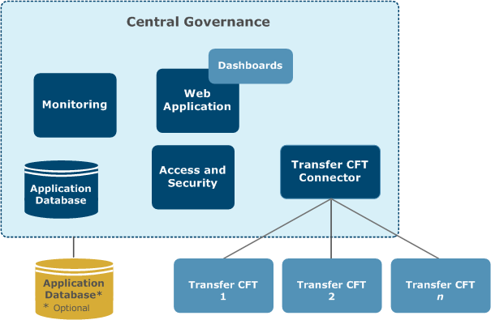

{
    "title": "Governance services",
    "linkTitle": "Governance services",
    "weight": "130"
}Axway Central Governance and Flow Manager are two AMPLIFY management applications that provide a set of services for administering Transfer CFTs. From the Central Governance UI, for example, you can configure, access logs, and perform operational tasks for your Transfer CFT. Central Governance also simplifies the task of creating file transfers definitions, and supports mass deployment of configuration changes to groups of Transfer CFTs.

Central Governance offers the following key features:

-   Automatic recognition and registration of Transfer CFTs on connection
-   Centralized management of Transfer CFT configurations, with processing capabilities for highly distributed environments
-   Centralized start, stop, and log viewing for your Transfer CFTs
-   Global management of user and partner identities and rights
-   Data flow repository, allowing you to create and supervise end-to-end data flow definitions
-   Alert management for tracking Transfer CFT and its data flow processing, including an alert notification option
-   Out-of-the-box dashboards

The following diagram illustrates a simplified view of the Central Governance architecture.



You can deploy a single Central Governance instance with one computer per network. The system supports active/passive resiliency, and can bring another instance of Central Governance online if the primary fails.

<table cellpadding="0" cellspacing="0">
   <col/>
   <col/>
   <col/>
      <tr>
         <td valign="top">         </td>
         <td valign="top"><b>Note</b>
         </td>
         <td data-mc-autonum="&lt;b&gt;Note&lt;/b&gt;" valign="top">Flow Manager offers services that are similar to Central Governance, but with the addition of predefined templates and API functionality in a container setting.         </td>
      </tr>
</table>
